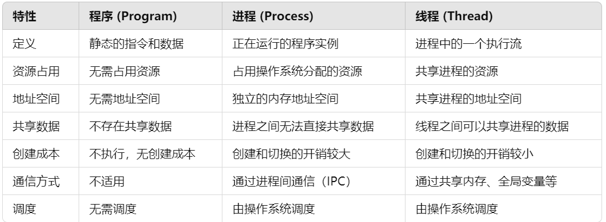
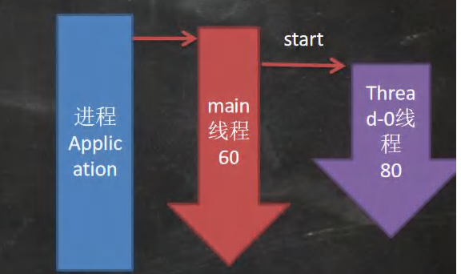
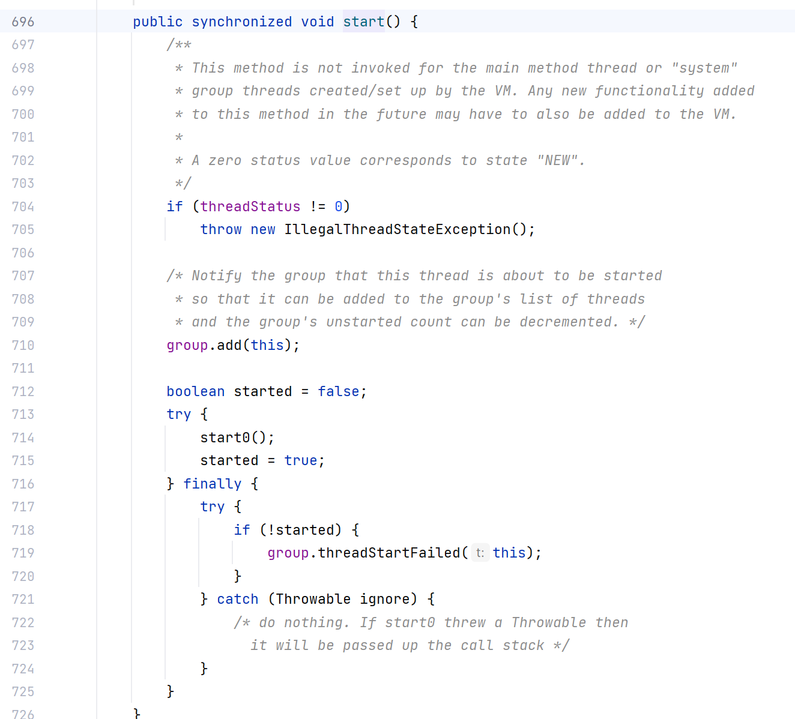

## 线程的概念以及使用
### 线程的相关概念
**程序**
是为完成特定任务 , 用某种语言编写的一组指令的集合, 简单点说就是我们的代码,程序是静态的, 存储在磁盘上,程序本身不执行,只是一份文件或资源
**进程**
进程是指运行中的程序, 比如我们使用QQ, 就启动了一个进程, 操作系统就会为其分配内存空间. 当我们再启动一个游戏 , 就代表着又启动了一个进程 , 操作系统将为迅雷分配新的**内存空间**,进程是动态的,每个进程都有独立地址空间, 代码段, 数据段, 堆栈等
**线程**
线程由进程创建的, 是进程的一个实体, 一个进程可以拥有多个线程. 是**进程的一个执行流**. 线程之间共享进程的内存空间和资源（如堆、全局变量等），但每个线程都有自己的栈和寄存器。


### 线程的基本使用
**创建线程的两种方法**
#### 继承Thread
1.继承`Thread`类,重写`run()`方法, 然后调用`start()`方法启动线程
```java
package ohmygod.project;  
  
import javax.swing.*;  
  
public class main {  
    public static void main(String[] args) {  
        CatThread catThread = new CatThread();  
        DogThread dogThread = new DogThread();  
        catThread.start();  
        dogThread.start();  
    }  
}  
class CatThread extends Thread{  
    public void run(){  
        for(int i=0;i<15;i++){  
            try {  
                Thread.sleep(2000);  
                System.out.println("猫猫数数"+i);  
            } catch (InterruptedException e) {  
                throw new RuntimeException(e);  
            }  
        }  
    }  
}  
class DogThread extends Thread{  
    public void run(){  
        for(int i=0;i<15;i++){  
            try {  
                Thread.sleep(1000);  
                System.out.println("狗狗数数"+i);  
            } catch (InterruptedException e) {  
                throw new RuntimeException(e);  
            }  
        }  
    }  
}
```


细节 , `start()`才是开启真正的线程, 而不是调用普通的`run()`方法


**java是单继承的, 在某些情况下一个类可能已经继承了某个父类, 这时在用继承Thread类方法来创建线程显然不适用. java设计者们提供了另一个方式创建线程, 就是通过实现Runnable接口创建线程**
#### 实现`Runable`接口
```java
package way2;  
public class application {  
    public static void main(String[] args){  
        CatThread catThread = new CatThread();  
        DogThread dogThread = new DogThread();  
        Thread cat_thread = new Thread(catThread);  
        Thread dog_thread= new Thread(dogThread);  
        cat_thread.start();  
        dog_thread.start();  
    }  
}
public class CatThread implements Runnable{  
    @Override  
    public void run() {  
        try {  
            for(int i=0;i<15;i++){  
                System.out.println("猫猫数数="+i);  
                Thread.sleep(1000);  
            }  
        } catch (InterruptedException e) {  
            throw new RuntimeException(e);  
        }  
    }  
}
public class DogThread implements Runnable{  
    @Override  
    public void run() {  
        try {  
            for(int i=0;i<15;i++){  
                System.out.println("狗狗数数"+i);  
                Thread.sleep(1000);  
            }  
        } catch (InterruptedException e) {  
            throw new RuntimeException(e);  
        }  
    }  
}
```
jconsole的使用
**细节**
为什么不是调用`run()`方法, 而是调用`start()`方法
如果你在主线程中直接调用 `run()` 方法，就像调用普通方法一样，`run()` 方法会在当前线程（即主线程）中执行，不会创建一个新的线程去并发地执行它。**`start()` 方法的作用** 是 **启动一个新的线程，并让它在新的线程中执行 `run()` 方法**。当你调用 `start()` 方法时，Java 虚拟机（JVM）会为该线程分配资源，执行操作系统的底层线程管理，创建一个新的线程，然后在这个新的线程中自动调用 `run()` 方法。

这个start方法是由jvm 调用的
#### Thread和Runnable的区别
1.从java的设计来看, 通过继承Thread或者实现Runnable接口来创建线程本质上是没有区别. 他们底层都是实现了Runnable接口
2.实现Runnable接口方式更加适合多个线程共享一个资源的情况, 并且避免了单继承的限制, 建议使用Runnable
## 线程的状态
## 