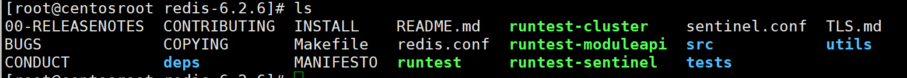
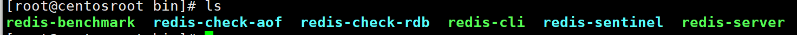
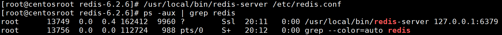

# Redis的简介
**redis的相关资料**
官网: https://redis.io/
中文地址: http://redis.cn/
下载地址: https://redis.io/download

**Redis的特性**
1.高并发 2.高可用 3.高性能 4.海量用户 解决关系型数据库(mysql)的弊端
* mysql数据库存在性能瓶颈: 磁盘IO性能低下
* 扩展瓶颈: 数据关系复杂, 扩张性差 , 不便于大规模集群
Redis的优势
* 内存存储-降低磁盘IO次数
* 不存储关系-仅存储数据-数据间关系(map关系)
总得来说: Redis是用c语言开发的一个开源的高性能键值对(key-value)数据库

**Redis的具体特征**
1.数据间没有必然的关联关系

2.高性能.

3.支持多种数据结构
* 字符串类型 string
* 列表类型 list
* 散列类型 hash
* 集合类型 set
* 有序集合类型 sorted_set

4.持久化支持 , 可以进行数据灾难恢复

5.应用场景非常广泛
1.为高频访问的数据加速查询, 如热点商品 , 热点新闻 , 热点咨询 , 推广等
2.任务队列 , 如秒杀 , 抢购 , 购票排队等
3.即使消息查询, 如排行榜 , 各类网站访问统计
4.时效性信息控制 , 如验证码控制 , 投票控制等
5.分布式数据共享，如分布式集群架构中的session 分离
6.消息队列
7.分布式锁
# NoSQL数据库
Not-Only SQL(泛指非关系型的数据库), 作为关系型数据库的补充

**作用**: 应对在海量用户和海量数据的情况下 , 带来的数据处理问题

**NoSQL数据库的特点**
可扩容，可伸缩
大数据量下高性能
灵活的数据模型
高可用 (高可用的意思是,在数据遇到损坏时,有很好的保护以及恢复机制)

**常见的NoSQL数据库**
Redis  memcache  HBase MongoDB
# Redis的下载和安装
下载地址 :https://redis.io/download
在实际工作中 , Redis都是在linux环境下工作

**安装具体步骤**
1.先让Linux网络环境为外网形式

2.下载安装最新版的gcc编译器
`yum install gcc` 前提可以尝试`ping www.baidu.com`测试一下网络情况
`gcc --version` 测试gcc版本

3.下载redis-6.2.6.tar.gz上传到/opt目录


4.进入到/opt目录 , 执行解压命令: tar -zxvf redis-6.2.6.tar.gz
5.解压完成后 , 进入目录: `cd redis-6.2.6`

6.在redis-6.2.6目录下 , 执行make命令(编译指令)
7.执行: make install , 进行安装

到此 , 安装目录在/usr/local/bin
8.查看安装目录的文件

redis-benchmark:性能测试工具，可以在自己机器运行，看看自己机器性能如何
redis-check-aof：修复有问题的AOF 文件
redis-check-dump：修复有问题的dump.rdb 文件
redis-sentinel：Redis 集群使用
redis-server：Redis 服务器启动命令
redis-cli：客户端，操作入口

**Redis后台启动&使用**
1.拷贝一份redis.conf到其他目录 , 比如/etc目录`cp redis.conf /etc/redis.conf`这个要在opt/redis-6.2.6目录下执行 , 因为**redis.conf一般放**在`/opt/redis-6.2.6/redis.conf`
2.修改`/etc/redis.conf`后台启动设置`daemonize no 改成 yes`,并保存退出(推荐使用vim打开,使用vim的搜索工具)

3.Redis启动.(使用绝对路径,也可以使用相对路径)
启动Redis的指令`/usr/local/bin/redis-server /etc/redis.conf`
当然直接`redis-server /etc/redis.conf`也是可以的 , 因为redis默认是配置了环境变量
查看是否启动成功

5.用客户端访问: redis-cli(也是配置了环境变量,可以直接使用)
6.修改端口
`redis-cli -p 6379`
7==.redis的关闭==
* 单实例关闭: redis-cli shutdown

* 多实例关闭 , 指定端口关闭 `redis-cli -p 6379 shutdown`
* 进入redis再关闭
0a# Redis指令
指令文档: http://redis.cn/commands.html
**基础操作**
1.`set key value` 设置key-value值
2.`get key` 查询key对应的value值
3.`clear` 清屏
4.`quit/exit` 退出客户端(redis服务并没有退出)
5.`help 命令名称` 获取命令帮助文档

**对key(键)操作**
1.`keys *`: 查看当前库中所有的key
2.`exists key`: 判断某个key是否存在
3.`type key` : 查看key是什么类型
4.del key : 删除指定的key数据(对应的值也会删掉),阻塞式(删掉才能进行下一步操作)
5.unlink key :根据value选择非阻塞删除([[仅将keys从keysapce元数据中删除,实际的删除会在后续异步操作]])
6.`expire key 10` : 10秒钟: 为给定的key设置过期时间(非常有用)
7.`ttl key` 查看对应的key-value有多少秒过期(非常有用) `-1`表示永久不过期 , `-2`表示已过期

**对DB(数据库)操作**
1.`select`: 命令切换数据库---redis安装后,默认有16个库 , 0-15,默认操作的是redis的0号库
2.`dbsize`:查看当前数据库的key的数量
3.`flushdb`: 清空当前库
4.`flushall`:清空全部库
# Redis五大数据类型
## Redis五大数据类型的简介
**引言**
redis自身是一个Map , 其中所有的数据都是采用 key:value的形式存储的, 
key是字符串, value是数据 , 数据支持多种类型/结构

**redis五种常用的数据结构**
1.string
2.hash
3.list
4.set
5.sorted_set
## String常用指令
1.`set <key><value>`  添加键值对

2.`get <key>` 查询对应键值`

3.`append key value`将给定的`<value>` 追加到原值的末尾

4.`strlen key` 获得值的长度

5.`setnx key value`  只有在key 不存在时设置key 的值 

6.`incr key` 将key中存储的数字值(字符串)增1 , 只能对数字值操作 , 如果为空 , 新增值为1 

7.`decr key` 将key中存储的数字值(字符串)减1 , 只能对数字值操作 , 如果为空 , 新增值为-1

8.`incrby/decrby key 步长` 将key中存储的数字值增减. 自定义步长

9.`mset key1 value1 key2 value2 ...` 同时设置一个或多个`key-value`对

10.`mget key1 key2 key3...`同时获取一个或多个value

11.`msetnx key1 value1 key2 value2 ...` 同时设置一个或多个`key-value`对 , 当且仅当所有给定key都不存在 , 原子性 , 有一个失败则都失败

12.`getrange key 起始位置 结束位置` 获得值的范围 , 类似java中的substring 起始位置和终止位置是闭区间

13.`setrange key 起始位置 value` 用`<value>`覆写`<key>`所存储的字符串值 , 从`<起始位置>`开始(索引从0开始)

14.`setex key 过期时间 value` 设置键值的同时 , 设置过期时间 , 单位秒

15.`getset key value` , 以新换旧 , 设置了新值同时获取了旧值
## list
**简介**: list类型 , 保存多个数据 , 底层使用双向链表存储结构实现

**list存储结构示意图**
双向链表示意图

1.Redis列表式简单的字符串列表 , 按照插入顺序排序 . 可以添加一个元素到列表的头部(左边)或者尾部(右边)
2.底层是一个双链表 , 对两端的操作性高 , 通过索引下标的操作中间的节点性能差

**commend**
`lpush/rpush key value value2 value3` 从左边/右边插入一个或者多个值

`lpop/rpop key` 从左边/右边吐出一个值

`rpoplpush key1 key2` 从key1列表右边出队 , key2列表左边入队

`lrange key start stop` 按照索引下标获取元素(从左到右) 可negative numbers indicating offsets sart

`lindex key index`按照索引下标获得元素(从左到右)

`llen key`获得列表长度

`linsert key before value newvalue`在value的前面插入newvalue

`lrem key n value`从左边删除n个value(从左到右)

`lset key index value`将列表key下标为index的值替换成value
## set
set提供的功能和list类似是一个列表的功能 , 特殊之处在于set是可以自动去重 , 即值是不允许重复的.
**set指令操作示意图**


**command**
1.`sadd key value1 value2` 将一个或多个元素加入集合key中 , 已经存在的元素会被忽略

`smembers key` 取出集合所有值.

`sismember key value` 判断集合 key 是否含有value , 有 1 , 无 0

`sard key` 返回该集合的元素个数

`srem key value1 value2` 删除key集合中的多个元素

`spop key` 随机从集合中取出元素,取出的值会被删除

`srandmember key n`随机从该集合中读取出n个值 , 不会从集合中删除

`smove source destination value`把集合中一个值从一个集合移动到另一个集合

`sinter key1 key2`返回两个集合的交集元素.

`sunion key1 key2` 返回两集合并集的元素

`sdiff key1 key2` 返回两个集合的差集元素(key1 中的，不包含key2 中的)
## hash
**简介**
Redis hash 是一个键值对集合 , hash适合用于村塾对象 , 类似java里面`Map<String,Object>`

**存储结构示意图**


**command**
`hset hash1 field value` 给hash1中的fied键赋值value

`hget hash1 field` 从hash1集合中取出field对应的值 

`hmset hash1 field1 value1 field2 value2` 批量设置hash1的值

`hmget hash1 field1 field2`批量取出hash1所对应的值

`hexists hash1 field` 查看hash1中 , field键是否存在(1表示真,0表示假)

`hkeys hash1` 列出该hash1集合的所有field(键值)

`hvals hash1` 列出该hash1集合的所有value

`hincrby hash1 field increment` 给hash1表中的field键对应的值加上1

`hsetnx hash1 field value` 将哈希表hash1 中field对应的值设为value(field键不存在)
## 有序集合 Zset(sorted set)
**简写**
1.Redis有序集合zset与普通集合set非常相似 , 是一个没有重复元素的字符串集合.
2.zset与set不同 , zset中的每个元素除了自身的值 , 还带有**权重(score)**(一般是浮点数). 有序集合中的元素是根据他们的分数进行排序的. Redis会根据分数自动维护元素的顺序.
3.能够快速的获取一个范围内的元素
4.访问有序集合的中间元素也是非常快的. 可以把有序集合作为一个没有重复成员的列表

**有序集合示意图**

`zadd set1 score1 value1 score2 value2` 将一个或者多个元素加入到有序集合中

`zrange set1 start stop [WITHSCORES]` 返回有序集set1中 , 返回start-stop之间的元素 , 如果带WITHSCORES , 可以让分数一起和值返回到结果集start和stop是下标 , 从0开始

`zscore set1 value1` 返回有序集中 , 成员value1的score值

`zrangebyscore set1 min max [withscores] [limit offset count]` 返回有序集set1中 , 所有score值介于min和max之间(包括等于min或max)的成员. 有序集成员按score值递增(==从小到大==)次序排列 -- min和max等于score

`zrevrangebyscore set1 max min [withscores] [limit offset count]` 同上 , 不同之处是从大到小排列 ?

`zincrby set1 increment value` 为元素的score加上增量 increment是增量

`zrem set1 value` 删除该集合下指定值的元素

`zcount set1 min max` 统计该集合 , 分数(score)区间内的元素个数

`zrank set1 value` 返回该值在集合中的排名 , 从0开始
# Redis配置
参考文档: https://www.cnblogs.com/nhdlb/p/14048083.html#_label0  重点阅读
Redis配置非常的多 , 这里只是简述常用的配置 , 这些配置在redis.conf文件中
## 常规配置
**设置密码**
**daemonize** : 是否是守护进程
**loglevel**: 日志级别
**logfile** : 日志文件的设置
**设定库的数量** 
## Units单位
**Units单位**是Redis中用于表示特定的计量单位 . 

在Redis中 , 配置参数涉及到内存大小的度量时 , 使用的单位是bytes以及redis定义的衍生单位(k,m,g) , 而不支持bit作为度量单位
bit在内存管理中的应用很少 , 绝大多数操作系统和应用程序都是以**字节(byte)**作为数据的存储**
## `#INCLUDES#`
includes 是配置文件中一种方式. 这种机制允许将多个配置文件组合使用. 可以把配置分开管理 , 保持配置文件清晰整洁 , 同时复用部分配置. 在 Redis 的主配置文件（如 `redis.conf`）中，可以使用 `include` 关键字来包含其他的配置文件，这些文件将会在 Redis 启动时被加载并合并。


在Redis多实例的情况下可以把公用配置提取出来 , 然后include
## `#NETWORK#`
**bind**
这个配置是redis绑定访问地址的. 

2.默认情况 bind=127.0.0.1只能接受本机的访问请求
3.如果服务器需要远程访问的 , 需要将其注释掉 , ==并且在其下一行加上`bind 0.0.0.0`==
4.这个操作后需要查看一下当前的连接情况(重新启动Redis就可查看)


**protected-mode**
是一个与安全相关的配置选项 , 它用于防止Redis在末正确配置的情况下对外开放服务, 避免未经授权的访问

默认是保护模式的 , 如果服务器需要远程访问 , 需要将yes改为No

**port**

Redis 服务默认端口6379

**linux防火墙**
在CentOS7使用命令查看防火墙状态: `firewall-cmd --state`
关闭防火墙: `systemctl stop firewalld`
开启禁止启动防火墙: `systemctl disable firewalld.service`
开启防火墙: `systemctl start firewalld.service`

**timeout**
如图

一个空闲的客户端维持多少**秒**会关闭, 0表示关闭此功能 , 即永不超时

**tcp-keepalive**
1.tcp-keepalive 是对访问客户端的一种心跳检测，每隔n 秒检测一次, 单位为秒
2.如果设置为0，则不会进行Keepalive 检测，建议设置成60
心跳检测机制
* TCP 协议中有长连接和短连接之分。短连接环境下，数据交互完毕后，主动释放连接；
* **长连接**的环境下，进行一次数据交互后，很长一段时间内无数据交互时，客户端可能意外断开，这些**TCP 连接并未来得及正常释放**，那么，连接的另一方并不知道对端的情况，它会一直维护这个连接，长时间的积累会导致非常多的半打开连接，造成端系统资源的消耗和浪费，且有可能导致在一个无效的数据链路层面发送业务数据，结果就是发送失败。所以服务器端要做到快速感知失败，减少无效链接操作，这就有了TCP 的Keepalive(保活探测)机制
## `#GENERAL#`
**daemonize**
此设置表示redis是否以守护进程的方式启动
设置为yes 后, 表示守护进程, 后台启动; 如果设置为no的话 , 那么linux终端界面会被redis的终端界面占用 , 而且还不能退出


**pidfile**
1.这个设置是设置pidfile文件的存放位置
2.pidfile文件是记录Redis服务器的进程id的, 方便系统和管理员管理redis进程

**loglevel**
1.loglevel能够很好的记录信息 , redis日志分为4个级别 , 默认的设置为notice , 开发测试阶段可以用debug(日志内容较多, 不建议生产环境使用) , 生产环境使用notice
2.redis日志4个级别的说明
* debug: 会打印出很多信息，适用于开发和测试阶段
* verbose（冗长的）：包含很多不太有用的信息，但比debug 要清爽一些；
* notice：适用于生产模式；
* warning : 警告信息；

**logfile**
日志信息的输出模式
一般如下图 , 默认控制台打印

logfile "" 就是说，默认为控制台打印，并没有日志文件生成
2.可以设置为以文件的形式保留日志信息

红框框填日志文件的目录 , 如果没有该文件 , 需要创建一个

**databases 16**
数据库数量

数据库数量默认16 , 可以通过`select dbid`切换数据库

## `#SECURITY#`
### 修改配置文件设置密码

如果需要永久性的设置密码 , 需要在redis.conf文件中设置. 设置密码就是把上面的红色框框的配置注释掉 , 密码是requirepass后面的内容
最后重启Redis


**关闭密码**
在Redis.conf文件中把`#requirepass foobared`注释掉

### 通过指令设置密码
这种方式设置的密码是暂时的. 并不具有永久性

## LIMITS限制
**maxclients**
1.如图

2.这个设置是可以让redis同时可以与多少个客户端进行连接.
3.默认情况下是10000个客户端
4.如果达到了此限制 , redis会拒绝新的连请求,并且发出"max number of clients reached"

**maxmemory**\
这个可以用于设置Redis实例最大使用的内存大小. 当达到上限时,会根据淘汰策略来释放内存
如图

了解:在默认情况下, 对32 位实例会限制在3 GB, 因为32 位的机器最大只支持4GB 的
内存，而系统本身就需要一定的内存资源来支持运行，所以32 位机器限制最大3 GB 的可用内存是非常合理的，这样可以避免因为内存不足而导致Redis 实例崩溃
3、在默认情况下, 对于64 位实例是没有限制
4、当用户开启了redis.conf 配置文件的maxmemory 选项，那么Redis 将限制选项的值不能小于1 MB

实际生产中的建议
1, maxmemory 只能根据具体的生产环境来调试，不要预设一个定值，从小到大测试，基本标准是不干扰正常程序的运行。
2、Redis 的最大使用内存跟搭配方式有关，如果只是用Redis 做纯缓存, 64-128M 对一般小型网站就足够了
3, 如果使用Redis 做数据库的话，设置到物理内存的1/2 到3/4 左右都可以
4, 如果使用了快照功能的话，最好用到50%以下，因为快照复制更新需要双倍内存空间，如果没有使用快照而设置redis 缓存数据库，可以用到内存的80%左右，只要能保证Java、NGINX 等其它程序可以正常运行就行了

**maxmemory-policy**
介绍:
在 Redis 的配置文件 `redis.conf` 中，`maxmemory-policy` 配置项用于定义当 Redis 达到内存上限（`maxmemory`）时，应该如何处理新的写入请求。具体来说，`maxmemory-policy` 决定了 Redis 在内存使用超出限制时，采用哪种**淘汰策略**来释放内存空间。

policy一览
1, volatile-lru: 使用LRU 算法移除key，只对设置了过期时间的键；(最近最少使用)
2, allkeys-lru：在所有集合key 中，使用LRU 算法移除key
3, volatile-random：在过期集合中移除随机的key，只对设置了过期时间的键
4, allkeys-random：在所有集合key 中，移除随机的key
5, volatile-ttl：移除那些TTL 值最小的key，即那些最近要过期的key
6, noeviction：不进行移除。针对写操作，只是返回错误信息

**maxmemory-samples**
介绍:
在 Redis 的配置文件 `redis.conf` 中，`maxmemory-samples` 选项用于配置在使用某些内存淘汰策略（如 LRU 或 LFU）时，Redis 用于判断哪几个键应该被淘汰时所采样的键的数量。(决定淘汰key需要多少个样本比较)
1.如图

2.设置建议
设置样本数量 , LRU算法和最小TTL算法都非精确的算法 , 而是估值值 , 所以你可以设置样本的大小 , redis默认会检查这么多个key并非选择其中LRU的那个
3.一般设置3到7的数字 , 数值越小样本越不精确 , 但性能消耗越小
# 发布和订阅
## 发布和订阅的基本了解
**基本概念**
在Redis中 , 发布和订阅是一种消息通信模式 , 可以发布者和订阅者之间通过频道进行消息传递 , 而无需知道彼此的存在. 可以用于实时消息系统 . 比如通知 , 聊天 , 日志系统

**示意图**
1.客户端订阅频道示意图

客户端可以向频道发送消息

2.
当给这个频道发送消息 , 消息就会发送给订阅的客户端

**理解发布和订阅模式**
1.任务队列
在Linux中有相似的作业队列
与任务队列进行交互的实体有两类，一类是**生产者（producer）**，另一类则是**消费者（consumer）**。生产者将需要处理的任务放入任务队列中，而消费者则不断地从任务队列中读入任务信息并执行

2.可以这么比喻
* Subscriber：收音机，可以收到多个频道，并以队列方式显示
* Publisher：电台，可以往不同的FM 频道中发消息
* Channel：不同频率的FM 频道
从这个机制来看 , 它更像是一个广播系统 , 多个订阅者 , 可以订阅多个频道 , 多个发布者可以往多个频道中发布消息
## 发布订阅模式分类
**一个发布者 , 多个订阅者**
* 主要应用于: 通知 , 广告
* 可以作为消息队列或者消息管道
* 示意图

**多个发布者 , 一个订阅者**
* 各应用程序作为Publisher 向Channel 中发送消息，Subscriber 端收到消息后执行相应的业务逻辑，比如写数据库，显示..
* 主要应用: 排行榜 , 投票 , 计数
* 示意图:

**多个发布者 , 多个订阅者**
* 可以向不同的Channel中发送消息 , 由不同的Subscriber接收.
* 主要应用于群聊 , 聊天
* 示意图: 
## 命令行实现发布和订阅
**发布订阅的指令操作**
`PUBLISH channel msg` 将信息msg发送到指定的channel中

`SUBSCRIBE channel ...` 订阅频道, 可以同时订阅多个频道

`UNSUBSCRIBE [channel] ...` 取消订阅频道(客户端取消订阅频道)

`PSUBSCRIBE pattern [pattern ...]` 订阅一个或者多个符合给定模式的频道 , 每个模式以* 作为匹配符，比如it* 匹配所有以it 开头的频道( it.news 、it.blog 、it.tweets 等等)， news.* 匹配所有以news. 开头的频道( news.it , news.global.today 等等)，诸如此类

`PUNSUBSCRIBE [pattern [pattern...]]` 退订指定的规则 , 如果没有参数则会退订所有规则
# Jedis
## 快速入门
Jedis类似于JDBC一样 , Jedis是一个用于java应用的Redis客户端库. 提供简单易用的javaAPI, 让开发者通过java程序于Redis进行交互. 跟JDBC一样 , Jedis封装了很多于Reids服务器通信的所有底层细节

**API文档**: https://www.mklab.cn/onlineapi/jedis/

**示意图**

**快速入门流程**
1.创建maven项目
2.添加依赖
```xml
<dependencies>
	<dependency>
		<groupid>redis.clients</groupid>
		<artifactid>jedis</artifactid>
		<version>3.2.0</version>
	</dependency>
</dependencies>
```
3.获取redis对象
```java
package ohmygod.project;  
  
import org.junit.Test;  
import redis.clients.jedis.Jedis;  
  
import java.util.Set;  
  
public class jedisTest {  
    @Test  
    public void con(){  
        Jedis jedis = new Jedis("192.168.52.130", 6379,10000);  
        String ping = jedis.ping();  
        System.out.println(ping);  
        jedis.close();  
    }  
    @Test  
    public void key(){  
        Jedis jedis = new Jedis("192.168.52.130",6379);  
        jedis.set("k1","v1");  
        jedis.set("k2","v2");  
        jedis.set("k3","v3");  
        Set<String> keys= jedis.keys("*");  
        System.out.println(keys.size());  
        for (String key : keys) {  
            System.out.println(key);  
        }  
    }  
}
```
注意 , 要把[防火墙给打开](#`%20NETWORK%20`)
单独开放6379端口的防火墙
1.设置开放的端口
`firewall-cmd --add-port=6379/tcp --permanent`
2.重启防火墙
`firewall-cmd --reload`
3.查看没有防火墙的端口
`firewall-cmd --list-all`

## Jedis常见API
**1.创建jedis对象**
`Jedis jedis = new Jedis(String ip , String port)`

**2.对键的操作**


**字符串操作**


**整数和浮点数操作**


**列表操作**


**集合(set)操作**


**哈希(Hash)操作**


**有序集合(Zsort)操作**


**排序操作**

## SpringBoot3整合Redis
SpringBoot3整合Redis主要让java程序通过RedisTemplate完成对redis的操作, 包括设置数据/获取数据 , 添加和读取数据
## 具体整合步骤
1.使用idea的快速初始化Spring项目的功能

在pom.xml中引入相关依赖

2.编写配置文件
application.properties
```properties
spring.application.name=springboot_jedis  
#服务器地址  
spring.data.redis.host=192.168.52.130  
#服务器端口号  
spring.data.redis.port=6379  
#Redis数据库索引  
spring.data.redis.database=0  
#链接超时时间  
spring.data.redis.timeout=1800000  
#链接池最大连接数(负数表示没有限制)  
spring.data.redis.lettuce.pool.max-active=20  
#最大阻塞等待时间(负数表示没有限制)  
spring.data.redis.lettuce.pool.max-wait=-1  
#连接池中的最大空闲链接  
spring.data.redis.lettuce.pool.max-idle=5  
#连接池中的最小空闲连接  
spring.data.redis.lettuce.pool.min-idle=0
```

3.提供RedisConfig配置类 , 如果没有提供配置类 , springboot会使用默认配置 , 但是会存在问题 , 比如redisTemplate模糊查找key数据为空. 这是在springboot2会出现的问题 , Springboot3这个问题已经得到修改


3.编写Redis有关的控件
RedisTestController.java
```java
package com.example.springboot_jedis.controller;  
  
import jakarta.annotation.Resource;  
import org.springframework.data.redis.core.RedisTemplate;  
import org.springframework.stereotype.Controller;  
import org.springframework.web.bind.annotation.GetMapping;  
import org.springframework.web.bind.annotation.RequestMapping;  
import org.springframework.web.bind.annotation.RestController;  
  
@RestController  
@RequestMapping("/redisTest")  
public class RedisTestController {  
    @Resource  
    private RedisTemplate redisTemplate;  
    @GetMapping("/t1")  
    public String t1(){  
        redisTemplate.opsForValue().set("key1","value1");  
        String value1 = (String) redisTemplate.opsForValue().get("key1");  
        return value1;  
    }  
}
```

**总结**
上述中 , 熟悉RedisTemplate是核心 
RedisTemplate官方文档: https://docs.spring.io/spring-data/redis/reference/api/java/org/springframework/data/redis/core/RedisTemplate.html
常用API

# Redis持久化-RDB
官方资料: https://redis.io/topics/persistence
主要的持久化方案:
* RDB(Redis Database)
* AOF(Append Of File)
## RDB概念以及流程分析

^d5f01c

RDB的定义
在指定的时间间隔内将内存中的数据集[快照](linux)写入磁盘 , 也就是Snapshot快照 , 恢复时将快照文件读到内存中

RDB持久化流程图

1.redis客户端执行bgsave/save命令或者自动触发bgsave命令
* save: 会阻塞当前Redis进程 , 进行同步保存 . 这种方式不建议在生产环境中使用 , 因为它会暂停所有的请求处理 , 直到持久化完成
* bgsave: 异步保存 , 会在后台创建一个子进程 , 父进程继续处理请求 , 子进程负责将数据保存到磁盘
2.主进程判断当前是否已经存在正在执行的子进程 , 如果存在 , 那么主进程直接返回
3.如果不存在正在执行的子进程 , 那么就fork一个新的子进程进行持久化数据 , fork过程是阻塞的 , fork操作完成后主进程即可执行其他操作. 这个过程使用了 **操作系统的写时复制（Copy-On-Write, COW）** 机制，保证了在快照期间，==内存中数据的修改不会影响到子进程正在持久化的数据。==
4.子进程先将数据写入到临时的rdb 文件中，待快照数据写入完成后再原子替换旧的rdb文件
* 持久化过程完成后，子进程将临时文件重命名为最终的 RDB 文件。通过这种方式，Redis 可以避免在持久化过程中产生损坏的 RDB 文件。
5.同时发送信号给主进程 , 通知主进程rdb持久化完成 , 主进程更新相关的统计信息

**这种设计原理的优缺点**
1.主进程没有进行IO操作 , 相比mysql提高了性能
2.如果需要进行大规模数据的恢复, 且对于数据恢复的完整性不是非常敏感，那RDB 方式要比AOF 方式更加的高效
3.RDB的缺点是最后一次持久化后的数据可能丢失. 正常关闭redis , 仍会进行持久化.如果是异常终止/宕机, 可能造成数据丢失
## 操作系统写时复制
操作系统写时复制详细讲解:https://blog.csdn.net/Code_beeps/article/details/92838520
1.Fork的作用是复制一个与当前进程一样的进程 . 新进程的所有数据(变量 , 环境变量 , 程序计数器等) 数值都和原进程一致 , 但是是一个全新的进程 , 并作为原进程的子进程
2.在Linux程序中 , fork()会产生一个和父进程完全相同的子进程 , 但子进程在此后多会exec系统调用 , 出于效率考虑 , Linux中引入了"写时复制技术"
3.一般情况父进程和子进程会共用同一段物理内存，只有进程空间的各段的内容要发生变化时，才会将父进程的内容复制一份给子进程。
## RDB配置
**dump.rdb文件**
是Redis使用RDB持久化机制生成的二进制文件 , 此文件包含了Redis内存中的数据快照,用于在Redis服务器重启或者崩溃后恢复数据

**如何配置**
配置文件名: 在redis.conf中的dbfilename项
配置文件保存路径: 在redis.conf中的dir 项 , 一般默认是`./` 这表示当前目录. 建议改为绝对路径 , `/root/`目录下

**相关配置&参数&操作**
默认配置,如图

时间段概念的理解

相关细节
如果我们没有开启save的注释 , 那么在退出Redis时 , 也会进行备份. 这是一种安全措施 
* 在Redis启动时 , 如果发现一个旧的demp.rdb文件, 会去加载它 .
* 某些操作系统(例如Redis关闭时 , 手动运行shutdown save/redis-cli命令等)也会触发数据持久化
这种机制使得 Redis 即使在用户没有特别配置持久化选项的情况下，仍然能保存至少一次的快照，防止完全的数据丢失。

**save VS bgsave**
[save](#^d5f01c)
格式: `save 秒钟 操作数` 直接使用`save`就可以立即保存

`last save`可以用来查看最近更新的时间(Unix时间戳) , 可以使用网上的在线监测工具 

**flushall(清理)**
1.执行flushall命令 , **也会产生dump.rdb文件** , 数据为空
2.Redis Flushall命令用于清空整个Redis服务器的数据(删除所有数据库的所有key)


**stop-writes-on-bgsave-error(错误处理)**
配置 , 用来控制当Redis在后台执行快照保存(bgsave)时出现错误时 , 是否停止处理写操作
配置如图

建议yes , 比如磁盘满了 , 直接关掉Redis的写操作是一种不错的做法

**rdbcompression(存储策略)**

1.对于存储到磁盘中的快照，可以设置是否进行压缩存储。如果是的话，redis 会采用LZF 算法进行压缩。但是会消耗CPU来进行压缩

**rdbchecksum(rdb校验策略)**
1.配置如图

2.在存储快照后 , 还可以让redis使用CRC64算法进行数据校验 , 保证文件是完整的
3.这样做会增加大约10%的性能损耗 , 如果希望获得最大的性能 , 尽量关闭这项功能

**动态停止 RDB**
* 动态停止RDB: redis-cli config set save ""
* 说明: save后给空值 , 表示禁用保存策略

**RDB备份&恢复**
1.Redis可以充当缓存 , 对项目进行优化 , 但重要/敏感的数据建议在MySQL保存一份.
2.从设计层面来说 , Redis的内存数据 , 都是可以重新获取的(可能来自程序 , 也可能来自MySQL)
3.因此我们这里说的备份&恢复主要是给大家说明一下Redis启动时 , 初始化数据是从dump.rdb来的 .
备份
* config get dir 查询rdb文件的目录
* 将dump.rdb进行备份 , 如果有必要可以写shell脚本来定时备份(Linux定时备份功能)备份指令`cp dump.rdb dump.rdb.bak`
恢复
* 将备份的文件恢复, 本质就是把备份的rdb文件覆盖掉当前的.`rm dump.rdb`
* 重启redis

**RDB持久化小结**
优势
1.适合大规模的数据恢复
2.对数据完整性和一致性要求不高更合适使用
3.节省磁盘空间
4.恢复速度快

劣势
1.虽然Redis 在fork 时使用了写时拷贝技术(Copy-On-Write), 但是如果数据庞大时还是比较消耗性能。
2.在备份周期在一定间隔时间做一次备份，所以如果Redis 意外down 掉的话(如果正常关闭Redis, 仍然会进行RDB 备份, 不会丢失数据), 就会**丢失最后一次快照**后的所有修改
# Redis持久化-AOF
## AOF概念以及流程分析
**AOF的官方文档** :https://redis.io/topics/persistence

**AOF**: 以日志的形式来记录每个**写**的操作 , 该日志是文件,是可读的Redis命令的文本格式 , Redis在重启时 , 可以通过重新执行这些命令来恢复数据

**AOF执行流程分析**

1.写操作会被记录到(append)AOF缓冲区
2.AOF缓冲区根据AOF持久化策略(always , everysec , no)将操作sync同步到磁盘的AOF文件中
* `always`: 每次写操作立即同步到磁盘
* `everysec`：每秒同步一次。
* `no`：完全依赖操作系统。
3.AOF文件大小超过重写策略或者手动重写时, 会对AOF文件rewrite重写, 压缩AOF文件容量
4.Redis 服务重启时，会重新load 加载AOF 文件中的写操作达到数据恢复的目的
## AOF配置(上)
**AOF开启**
1.在redis.conf中配置项为`appendonly.aof`

2.AOF文件的保存路径 , 同RDB的路径一致
3.AOF和RDB同时开启 , 系统默认取AOF的数据
4.AOF保存的文件名设置 , 在redis.conf中配置项为`appendonly.aof`

**具体实例**


然后再使用linux`ll`指令会发现`aof`文件变化了 , 去查看一下appendonly.aof文件会发现如下图规律

## AOF配置(下)
**AOF备份和恢复**
1.备份
AOF 的备份机制和性能虽然和RDB 不同, 但是备份和恢复的操作同RDB 一样, 都是拷贝备份文件, 需要恢复时再拷贝到Redis 工作目录下，启动系统即加载

2.恢复
正常恢复
* 修改默认的`appendonly no`改为yes
* 将有数据的aof文件定时备份 , 需要恢复时 , 复制一份保存到对应的目录(查看目录: config get dir)
* 恢复: 重启redis , 然后重新加载
异常恢复
* 如果遇到AOF文件损坏 , 通过/usr/local/bin/redis-check-aof --fix appendonly.aof进行修复
* 建议先: 备份被写坏的AOF文件
* 恢复: 重启redis , 然后重新加载
* 示例

使用`quit`退出redis , 然后`shutdown`退出文件
1.`vim appendonly.aof`修改AOF文件 , 故意破坏备份文件
2.进入redis-cli客户端
3.使用`./redis-check-aof --fix appendonly.aof`修复文件
4.重启`./redis-server /etc/redis.conf`

**同步频率设置**
1.`appendfsync always`: 始终同步 , 每次Redis的**写入**都会立即记入日志 : 性能较差但数据完整性比较好
2.`appendfsync everysec`: 每秒同步 , 意外关机 , 本秒的数据会丢失
3.`appendfsync no` :redis 不主动同步,把同步时机交给操作系统

**Rewrite压缩**
1.AOF文件越来越大 , 需要定期对AOF文件进行重写达到压缩
2.旧的AOF文件含有无效命令会被忽略 , 保留最新的数据命令 , 比如
```
set a a1;
set a b1;
set a c1;
```
这里只保留最后一条指令就可以了`set a c1`
3.合并多条写命令 , `set a c1 b b1 c c1`
4.AOF重写降低了文件占用空间
5.更小的AOF文件可以更快的被redis加载

**重写触发配置**
1.手动触发
直接调用`bgrewriteaof`命令 , 在redis-cli客户端使用指令

2.自动触发

`auto-aof-rewrite-min-size`: AOF文件最小重写大小 , 只有当AOF文件大小大于该值时才重写 , 默认64MB
`auto-aof-rewrite-percentage`: 当前AOF文件大小比上最进一次重写后的大小,这个比例值等于或大于指定的增长百分比(比如 , 100表示当前的AOF文件是上次重写的两倍才重写)


**AOF持久化小结**
1.优势
* [备份机制更稳健 , 丢失数据概率更低(频繁写入)]([[]])
* 可读的日志文本 , 人为操作AOF文件 , 可以处理误操作
* 

2.劣势
* 比RDB占用更多的磁盘空间
* 因为指令需要重新执行 , 恢复备份速度慢
* 每次读写都同步的话 , 有一定的性能压力
# RDB和AOF的使用策略
官方文档地址: https://redis.io/topics/persistence

两个都启用 , 如果只是做缓存的话 , 那可以不使用任何持久化方式
# Redis_事务_锁机制_秒杀
## Redis事务的概念和特性
**Redis事务的概念**
Redis事务是一种一次性执行一组命令的机制 , 是一个单独的隔离操作. 事务保证命令的顺序性和独立性: 事务中, 所有命令会被依次执行, 不会被其他客户端的命令打断

**Redis事务的特性**
1.单一性(没有隔离级别的概念): 事务中的命令在提交之前不会被实际执行 . 提交时 , 所有命令都会执行
2.队列化执行: 事务中所有的命令都会序列化 , 按顺序执行. 在此过程中 , 不会被其他客户端发送来的命令请求打断
3.(部分)原子性: 在事务执行过程中 , 如果有指令执行失败 , 其它指令仍然执行 , 并不会回滚--不保证原子性   正常执行保证原子性
## 事务相关指令 Multi , Exec , discard
**Redis事务指令示意图**

对示意图解析
`multi`: 开启事务队列 , 输入的命令都依次进入事务队列 , 但不会执行(类似MySQL的start transaction开启事务)
`exec`: 将事务队列中的命令依次执行 , 并返回每条命令的结果(类似MySQL的commit提交事务)
`discard`: 组队过程中可以通过放弃组队 , 即清空事务队列. (类似于MySQL的rollback回顾事务)
注意: Redis事务和MySQL事务的本质是完全不同的. 举例MySQL只是为了更好的理解


