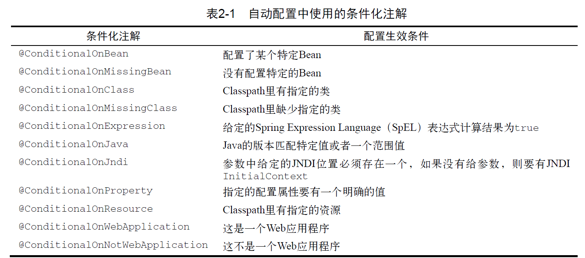
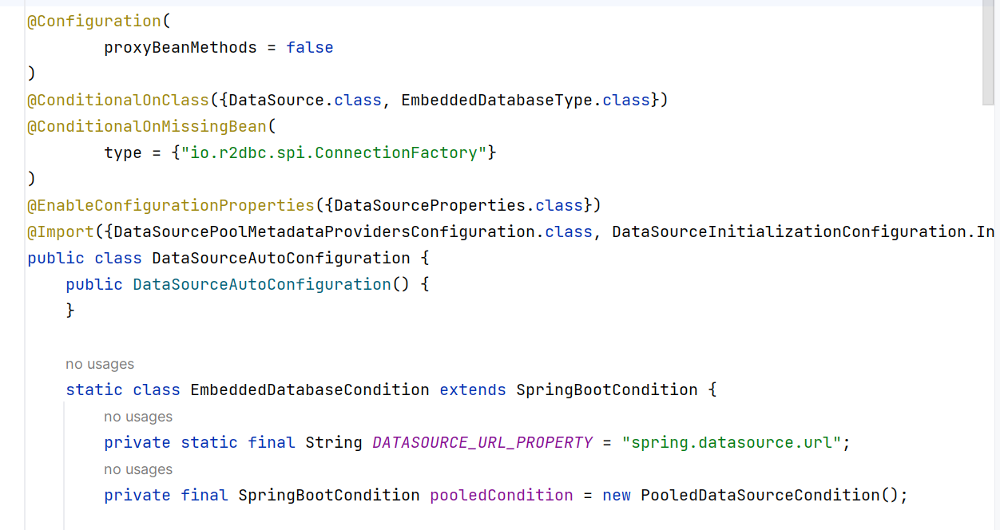
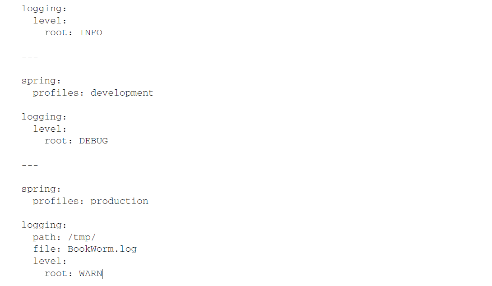

## SpringBoot的概念
**SpringBoot的官方文档**
官网: https://spring.io/projects/spring-boot
学习文档: https://docs.spring.io/spring-boot/docs/current/reference/html/
在线API: https://docs.spring.io/spring-boot/docs/current/api/

**什么是SpringBoot**
Spring Boot 可以轻松创建独立的、生产级的基于Spring 的应用程序 , spring Boot 直接嵌入了Tomcat、Jetty 或Undertow ，可以"直接运行" SpringBoot 应用程序

**Spring SpringMVC SpringBoot的关系**
大概关系是:Spring Boot > Spring > Spring MVC(组件关系)
* Spring的核心是IOC和AOP,IOC提供了依赖注入的容器,AOP提供面向切面编程的特性,Spring接管了Web层,业务层,DAO层,持久性层的组件,并配置各种bean和维护bean相关的关系
* Spring MVC 只是Spring 处理WEB 层请求的一个模块/组件, Spring MVC 的基石是
  Servlet
* SpringBoot是为了简化开发,推出的封神框架(约定优于配置`[COC]`),简化了Spring项目的配置流程.**无需过多关注XML的配置**

**约定优于配置**

## SpringBoot的快速入门
首先要确定,开发环境是jdk8以上, maven在3.5+
1.创建maven项目,引入web项目场景启动器
```xml
<parent>  
  <groupId>org.springframework.boot</groupId>  
  <artifactId>spring-boot-starter-parent</artifactId>  
  <version>2.5.3</version>  
</parent>  
<!-- 导入web 项目场景启动器,会自动导入和web 开发相关依赖,非常方便-->  
<dependencies>  
  <dependency>  
    <groupId>org.springframework.boot</groupId>  
    <artifactId>spring-boot-starter-web</artifactId>  
  </dependency>  
</dependencies>
```
web项目场景启动器,会自动导入web开发相关的依赖.`spring-boot-starter-web`是SpringBoot起步依赖, 使用起步依赖不需要指定版本, Springboot版本会决定的
打开maven关系图
点击一个类或者快捷键`Ctrl+Alt+Shift+U`


2.创建SpringBoot应用主程序 ^8e8b3e
```java
@SpringBootApplication  
public class MainApp {  
    public static void main(String[] args) {  
//启动SpringBoot 应用程序  
        SpringApplication.run(MainApp.class, args);  
    }  
}
```

3.创建控制类
```java
@Controller  
public class HelloController {  
    @RequestMapping("/hello")  
    @ResponseBody  
    public String hello(){  
        return "hello, spring boot";  
    }  
}
```
通过快速入门,SpringBoot比传统的SSM开发,简化整合了很多步骤,提高了开发效率
## SpringBoot的功能
#### 依赖管理
* 依赖管理
	1.技术背景:在快速入门中,原本ssm繁杂的jar包引入在springboot中只需要要引入**父项目**和web场景启动器就完成的所有相关包的引入. 这种功能的实现就靠的是**依赖管理**的实现
	spring-boot-starter-parent 还有父项目(对着前面的id,按住ctrl点击parent), 声明了开发中常用的依赖的版本号
	
	2.==能够进行自动版本仲裁,没有指定某个jar的版本,会以父项目指定的版本为主==
	
	3.可以自己指定某个jar包的版本
	可以是在pom.xml中指定
	
	可以在父类spring-boot-dependencies.pom中改写
	
#### starter场景启动器
1.概念: starter是一个大集合 , 开发中引入了相关场景的starter,那么这个场景中所有的相关依赖都引入进来了. 引入web-starter,就会引入所有web相关的包

2.依赖树

3.第三方starter
第三方starter 不要从spring-boot 开始，因为这是官方spring-boot 保留的命名方式的。
第三方启动程序通常以项目名称开头。例如，名为thirdpartyproject 的第三方启动程序项
目通常被命名为thirdpartyproject-spring-boot-starter。xxx-spring-boot-starter 是第三方为我们提供的简化开发的场景启动器
#### 自动配置
1.自动配置的基本介绍
在ssm中,需要配置Tomcat,、配置SpringMVC、配置如何扫描包、配置字符过滤器、配置视图解析器、文件上传等. 非常的麻烦 , 在SpringBoot中 , 能够自动配置 
SpringBoot自动配置需要考虑很多东西
* Spring的`jdbcTemplate`是不是在Classpath中? 如果是 , 并且有DataSource的Bean , 则自动配置一个JdbcTemplate的Bean
* Spring Security是不是在Classpath里? 如果是, 则进行一个非常基本的Web安全设置
* 每当应用程序启动的时候, SpringBoot自动配置会做将近200个这样的决定, 涵盖安全, 集成, 持久化, Web开发等
2.SpringBoot自动配置了Tomcat,SpringMVC,字符过滤器等.具体如下验证
```java
@SpringBootApplication //开启组件扫描和自动配置
public class MainApp {  
    public static void main(String[] args) {  
        ConfigurableApplicationContext ioc =  
                SpringApplication.run(MainApp.class, args);//负责启动引导应用程序  
//查看容器里面的组件  
        String[] beanDefinitionNames = ioc.getBeanDefinitionNames();  
        for (String beanDefinitionName : beanDefinitionNames) {  
            System.out.println(beanDefinitionName);  
        }  
    }  
}
```
解析这段启动类
1.`@SpringBootApplication`开启了Spring的组件扫描和SpringBoot的自动配置功能 , 实际上`@SpringBootApplication`将三个注解组合在一起
* Spring的`@Configuration`使用Spring基于java的配置
* Spring的`@ComponentScan`启用组件扫描
* Spring Boot 的`@EnableAutoConfiguration`： 这个不起眼的小注解也可以称为@Abracadabra，就是这一行配置开启了Spring Boot自动配置的魔力，让你不用再写成篇的配置了。
这个启动类几乎在整个项目周期中是不用改的 , 如果需要`SpringBoot`自动配置以外的其他Spring配置.一般来说把他写到一个单独的`@Configuration`标注的类中

第二种方式验证(debug)

3.修改自动配置
3.1 SpringBoot还会扫描特定的包 , 不需要像Spring那样要手动在web.xml中配置
	 扫描的包 , ==SpringBoot会自动扫描启动类同一个包和子包==
	自定义扫包 , 增加扫描的包比如(指定的业务类不在特定的包下)
	
	就是在MainApp类下填写注解@SpringBootApplication(scanBasePackages="com.xxx") 这个scanBasePackages指定的是字符串数组

3.2 修改配置文件来更改生产环境
	SpringBoot项目中最重要最核心的配置文件是application.properties,所有框架的配置都可以在这个[配置文件](application)中说明,最终会映射到对应的类中(光标对应属性,然后ctrl+b就能找到,或者通过ioc容器找到)
	查看地址 https://blog.csdn.net/pbrlovejava/article/details/82659702
	3.自定义配置: **application.properties**,增加在springboot中的key-value值,然后应用在bean中 ^bdd5c6
```java
@Controller  
public class HiController {  
    //需求,这里的website的值要从配置文件中获取  
	 @Value("${my.website}")
     private String website;  
       
     @RequestMapping("/hi")  
     @ResponseBody  
     public String hi() {  
         System.out.println("website-" + website);  
         return "hi~, SpringBoot";  
     }  
}
```
在application.properties中添加my.website=https://ww.baidu.com
4.SpringBoot在哪配置和自动配置遵守的加载原则
	
	根据源码可知,SpringBoot在类路径,类路径的config文件下,还有application等等
	2. 自动配置遵守按需加载原则:引入了哪个场景starter 就会加载该场景关联的jar 包，没有引入的starter 则不会加载其关联jar
	SpringBoot所有的自动配置功能都在spring-boot-autoconfigure包里面:这个jar文件包含了很多配置类. 每个**配置类都在应用程序的Classpath**里, 都有机会为应用程序的配置舔砖加瓦
	
	有默认的约定,在SpringBoot 的自动配置包, 一般是XxxAutoConfiguration.java, 对应 XxxxProperties.java,
	
	**总的来说,就是bean的实例会对应一个相关的xxproperties.java  xxAutoConfiguration.java  applicaton.properties. Springboot帮我们实例的bean是有非常多的依赖组件,会去读取application.properties,然后xxproperties.java会关联到bean里面**
#### 条件优化配置
**自定义条件配置类**
Spring4.0引入了条件优化配置这个新特性. 条件优化配置允许配置存在于应用程序中, 但在满足某些特定情况之前都忽略这个配置(根据特定的条件动态地加载或配置Bean)
在Spring里可以很方便地编写你自己的条件，你所要做的就是实现`Condition`接口，覆盖它的`matches()`方法
举例说明: 下面这个简单的条件类只有在Classpath里存在JdbcTemplate时才生效
```java
package org.example.config;  
import org.springframework.context.annotation.Condition;  
import org.springframework.context.annotation.ConditionContext;  
import org.springframework.core.type.AnnotatedTypeMetadata;  
public class JdbcTemplateCondition implements Condition{  
    @Override  
    public boolean matches(ConditionContext conditionContext, AnnotatedTypeMetadata annotatedTypeMetadata) {  
        try {  
            conditionContext.getClassLoader().loadClass("org.springframework.jdbc.core.JdbcTemplate");  
            return true;  
        } catch (ClassNotFoundException e) {  
            return false;  
        }  
    }  
}
```
当用Java来声明Bean的时候 , 可以用这个条件类来决定是否生成
```java
@Conditional(JdbcTemplateCondition.class)
public MyService myService(){
	...
}
```
这个例子里, 只有在Classpath里有JdbcTemplate时才生成这个MyService的实例
**SpringBoot自带的条件配置类**

自动配置类在源码中起到的作用

即可见,DataSourceAutoConfiguration添加了@Configuration注解，它从其他配
置类里导入了一些额外配置，还自己定义了一些Bean。最重要的是DataSourceAutoConfiguration上添加了@ConditionalOnClass注解，要求Classpath里必须要有DataSource和EmbeddedDatabaseType。如果它们不存在，条件就不成立，DataSourceAutoConfiguration提供的配置都会被忽略掉。
#### 容器功能
注意:Spring注入组件的注解 , 在SpringBoot中仍然有效
`@Component @Controller @Service @Repository`
##### 注解功能
1. Configuration
==回顾==一下传统的Spring通过注解或者xml配置文件获取ioc
```xml
<bean id="monster03" class="com.hspedu.springboot.bean.Monster">  
    <property name="name" value="牛魔王~"></property>  
    <property name="age" value="5000"></property>  
    <property name="skill" value="芭蕉扇~"></property>  
    <property name="id" value="1000"></property>  
</bean>
```
然后写使用类
```java
public void setProByDependencyInjection() {  
    ApplicationContext ioc =  
            new ClassPathXmlApplicationContext("beans.xml");  
    Monster monster = ioc.getBean("配置信息中的id", Monster);  
    //使用对象的方法
}
```

==现在==SpringBoot通过@Configuration标识为配置类用来注入组件,被Configuration标识的类等价于配置文件 ^abb332
```java
@Configuration
public class BeanConfig {
	@Bean
	public Monster monster01() {
		return new Monster(100, "牛魔王", 500, "芭蕉扇");
	}
}
```
解释:@Bean是给容器添加组件, monster01是默认的方法名,也是组件的id,返回类型是组件类型, 默认是单例模式(==如果不想要单例模式,那就在Bean的同一个地方加上`@Scope("prototype")`==)的. 也可以自定义id`@Bean(name="id")`
使用MainApp.java,从配置文件/容器中获取bean
```java
public static void main(String[] args) {  
    ConfigurableApplicationContext ioc = SpringApplication.run(MainApp.class, args);  
    Monster monster01 = ioc.getBean("monster01", Monster.class);  
}
```
注意事项: 被@Configuration注解的配置类也是组件,也放在ioc容器中

扩展:使用proxyBeanMethods代理bean方法
示例代码
```java
@Configuration(proxyBeanMethods=false)
public class BeanConfig {
	@Bean
	public Monster monster01() {
		return new Monster(100, "牛魔王", 500, "芭蕉扇");
	}
}
//默认放到约定的包中
public class MainApp{
	public static void main(String[] args){
		ConfigurableApplicationContext ioc = SpringApplication.run(MainApp.class, args);
		BeanConfig beanConfig=ioc.getBean(BeanConfig.class);
		Monster monster02 = beanConfig.monster01();
	}
}
```
1.Full(proxyBeanMethods = true)、【保证每个@Bean 方法被调用多少次返回的组件都是单实例的, 是代理方式】
2.Lite(proxyBeanMethods = false)【每个@Bean 方法被调用多少次返回的组件都是新创建的, 是非代理方式】
3.如果组件有依赖必须使用Full模式(默认).  如果不需要组件依赖,则使用Lite模式(轻量级,需要的时候才加载)
注意:proxyBeanMethods是在调用@Bean方法的,而被@Bean注解的方法在BeanConfig中,因此需要先获取BeanConfig组件 , 然后再调用方法,不然Full方式每次都是新实例的效果是无效的

2. @Import
@Import也是来注入组件的一种
示例
1.先建立几个bean类
 ```java
public class Cat {  
}
public class Dog {  
}
 ```
2.然后编写[配置类](#^abb332) 配置类一般放在config包下
```java
@Import({Dog.class, Cat.class})  
@Configuration(proxyBeanMethods=false)
public class BeanConfig { 
}
```
Import可以传入一个数组，可以一次注入多个组件,源码如下
```java
public @interface Import {
	 Class<?>[] value();
}
```
3.MainApp.java(启用类)
```java
public static void main(String[] args){
	ConfigurableApplicationContext ioc = SpringApplication.run(MainApp.class, args);
	Dog dog = ioc.getBean(Dog.class);
	String[] beanNamesForType = ioc.getBeanNamesForType(Dog.class);
	for (String s : beanNamesForType) {
		System.out.println("s= " + s);
	}
	Cat cat = ioc.getBean(Cat.class);
	System.out.println("dog= " + dog + " cat= " + cat);
}
```
通过@import注入的组件,组件的名字就是全类名

3. @Conditional
`@Conditional` 注解用于根据某些条件来**有选择地启用或禁用配置类**或 Bean。@Conditional是一个跟注解,它有很多扩展性注解

样例,需求,只有在容器中有name=monster_nmw组件时,才注入dog01
1.编写配置类
```java
@Configuration(proxyBeanMethods=false)
public class BeanConfig{
	@Bean
	public Monster monster01(){//等价于xml中的配置
		return new Monster(100,"牛魔王",500,"芭蕉扇");
	}
	@ConditionalOnBean(name="monster_nmw")
	@Bean
	public Dog dog01(){
		return new Dog();
	}
}
```
加上这个注解就说明如果ioc容器中有id为monster_nmw才可以注入Dogbean,对类型是不做约束的
如果注解不是放在方法上,而是配置类上,说明这个类中的所有方法都要进行条件约束
2.启动类省略

4. @ImportResource
在SpringBoot中bean的配置也可以使用xml来配置,就是用@ImportResource, SpringBoot是可以向下兼容Spring的
1.编写beans.xml配置类(放在resource下)
```xml
<?xml version="1.0" encoding="UTF-8"?>  
<beans xmlns="http://www.springframework.org/schema/beans"  
       xmlns:xsi="http://www.w3.org/2001/XMLSchema-instance"  
       xsi:schemaLocation="http://www.springframework.org/schema/beans http://www.springframework.org/schema/beans/spring-beans.xsd">  
    <!--配置了Monster bean-->  
    <bean id="monster03" class="com.hspedu.springboot.bean.Monster">  
        <property name="name" value="牛魔王~"></property>  
        <property name="age" value="5000"></property>  
        <property name="skill" value="芭蕉扇~"></property>  
        <property name="id" value="1000"></property>  
    </bean>  
</beans>
```
2.改写配置类
```java
@ImportResource("classpath:beans.xml")
public class BeanConfig{
}
```
3编写启动类
```java
public static void main(String[] args){
	ConfigurableApplicationContext ioc=new SpringApplication.run(MainApp.class,args);
	System.out.println(ioc.getBean("monster03"));
}
```
##### 应用程序Bean的配置外置
配置绑定的概念:配置绑定是一种机制, 它允许将外部化配置（如 [`application.properties`](#^bdd5c6) 或 `application.yml` 文件中的属性）绑定到 Java 对象
可以更加方便地管理和使用配置属性
示例
需求: 将application.properties 指定的k-v 和JavaBean 绑定
1.改写application.properties
```properties
#默认server.port=8080
server.port=8080
spring.servlet.multipart.max-file-size=10MB
#设置属性k-v
furn01.id=100
furn01.name=soft_chair!!
```
1.1或者这种方法,在配置类中注销@Component(在下面Furn类中),然后配置@EnableConfigurationProperties(Furn.class)在配置类中
```java
@EnableConfigurationProperties(Furn.class)
public class BeanConfig{}
```
从技术上将`@ConfigurationProperties`注解不会生效,除非向`Spring`配置类添加
`@EnableConfigurationProperties`注解. 但是通常不需要这样做. SpringBoot自动配置机制会扫描和处理所有的配置类, 除非你想完全不适用自动配置

在application.properties中如果有中文会出现乱码,那么需要用unicode编码转换工具(网页)
2.编写封装application.properties的类(将配置文件的信息配置到java对象中)
```java
@Component
@ConfigurationProperties(prefix="furn01")
public class Furn {
	private Integer id;
	private String name;
	.... set get 方法
}
```
一定要有set()方法 , 因为注入是靠`set()`方法注入的
3.编写控制类
```java
@Controller
public class HelloController {
	@RequestMapping("/hello")
	@ResponseBody
	public String hello(){
		return "hello,spring boot";
	}
	@Autowired
	Furn furn;
	@RequestMapping("/furn")
	@ResponseBody
	public Furn furn(){
		return furn;
	}
}
```
5[启动启动类](#^8e8b3e)
##### 使用Profile进行配置
在 Spring Boot 中，**Profile（配置文件/环境配置）** 是一种机制，用于根据不同的运行环境（如开发、测试、生产等）加载不同的配置。这种机制允许开发者为不同的环境定义特定的配置文件，确保应用在各个环境中都能以最合适的方式运行。

**Profile的定义**:Profile是一种逻辑分组, 用于区分应用程序在不同环境下的配置. 通过使用Profiles, 开发者可以:
* 隔离环境配置: 为开发, 测试, 生产等不同环境提供不同的配置
* 简化配置管理: 避免在同一个配置文件中混杂不同环境的配置, 提升可维护性.
* 灵活切换环境: 通过简单的配置切换不同的环境配置, 无需修改代码

**使用Profile配置**
在 `src/main/resources` 目录下创建不同的配置文件，文件名遵循 `application-{profile}.properties` 或 `application-{profile}.yml` 的格式。例如：
- `application-dev.properties`（开发环境配置）
- `application-test.properties`（测试环境配置）
- `application-prod.properties`（生产环境配置）

最常用的方法是在application.yml这个文件中使用---分割符号来表示不同生产环境的配置. 比如

这个application.yml文件分为三个部分.第二段属性定义为开发环境,第三段被定义为生产环境
#### 
## SpringBoot的运行机制
### tomcat的启动的机制
问题:当run方法跑起来的时候,SpringBoot怎么就启动了tomcat,然后去实现这种机制
问题环境
```java
public class Dog {  
}
```
config
```java
@Configuration//使Config变成配置类,然后会被扫描  
public class Config {  
    @Bean  
    public Dog dog(){  
       return new Dog();  
    }  
}
```
启动类
```java
@SpringBootApplication  
public class Main {  
    public static void main(String[] args) {  
        ConfigurableApplicationContext ioc = SpringApplication.run(Main.class);  
        System.out.println("hello ioc");  
    }  
}
```
在ioc在那里下断点,然后呢beanFactory-->SinglenObejct-->会发现有dog.class和Config,那到底是怎么注入进入的
仍然是实现Spring容器那一套IO/文件扫描+注解+反射+集合+映射

问题:SpringBoot是怎么启动Tomcat,并可以支持访问@Controller的,以及ioc创建的过程?
本质上Tomcat是一个程序,调用start()方法就可以启动了,这里我们要把他找出来
源码分析(阅读源码的方式:紧抓一条线,就是看tomcat被启动的代码和容器创建,不要啥都看)
追最核心的方法  run方法
1.SpringApplicatoin.java , 断点打到context=createApplicationContext()进入方法然后有个类型选择-->跳出到SpringApplication,断点打到refreshContext(),此时容器还是空的-->断点this.refresh(context)-->断点super.refresh()-->onRefresh()-->断点this.createWebServer()-->this.webServer=factory.getWebServer(new ServletContextInitializer[]{this.getSelfInitializer()})-->断点return this.getTomcatWebServer(tomcat)-->this.initialize()-->this.tomcat.start()

2中着重createApplicatonContext()容器创建, refreshContext(context)刷新上下文(举个实例,准备应用环境,启动tomcat),这里有个特点,当要去创建容器时,采用模板设计模式+动态绑定,体现在refresh方法中
### 创建Tomcat,并启动

^60a438

1.修改pom.xml,把内嵌的tomcat去除掉,然后添加tomcat组件
```xml
<dependencies>  
    <dependency>  
        <groupId>org.springframework.boot</groupId>  
        <artifactId>spring-boot-starter-web</artifactId>  
        <exclusions>  
        <!--    因为我们自己要创建tomcat对象,并启动  
            因此要先排除内嵌的tomcat-->  
            <exclusion>  
                <groupId>org.springframework.boot</groupId>  
                <artifactId>spring-boot-starter-tomcat</artifactId>  
            </exclusion>  
        </exclusions>  
    </dependency>  
   <!-- 要注意版本问题,高版本不行-->  
    <dependency>  
        <groupId>org.apache.tomcat.embed</groupId>  
        <artifactId>tomcat-embed-core</artifactId>  
        <version>8.5.75</version>  
    </dependency>  
    <dependency>  
        <groupId>org.apache.tomcat</groupId>  
        <artifactId>tomcat-jasper</artifactId>  
        <version>8.5.75</version>  
    </dependency>  
</dependencies>
```
2.SpringApplication.java组件(创建端口,启动tomcat),测试写一个启动类,看tomcat是不是在监听
mySpringApplication.java
```java
public static void run(){  
    try {  
        Tomcat tomcat = new Tomcat();  
        //让tomcat可以将亲够转发到分发器  
        tomcat.addWebapp("/myboot","E:\\MyCode\\SpringBootStudy");  
        tomcat.setPort(9090);//设置9090端口  
        tomcat.start();  
        System.out.println("请求等待");  
        tomcat.getServer().await();  
    } catch (LifecycleException e) {  
        throw new RuntimeException(e);  
    }  
}
```
### 容器和Tomcat的关联
创建spring容器
先处理生产环境,主要的类就是myWebApplicaitonInitialize.class
1.创建bean
2.创建config
```java
@Configuration  
@ComponentScan("org.example.myspringboot")  
public class myConfig {  
    @Bean  
    public Monster monster(){  
        return new Monster();  
    }  
}
```
3.创建Controller包中的myWebApplicationInitialize
```java
public class myWebApplicationInitialize implements WebApplicationInitializer {//相当于一个容器  
    @Override//servletContext是配置上下文  
    public void onStartup(ServletContext servletContext) throws ServletException {  
        System.out.println("starut up");  
        AnnotationConfigWebApplicationContext ac = new AnnotationConfigWebApplicationContext();  
        ac.register(myConfig.class);//命令Spring容器扫描哪些包  
        ac.refresh();//完成bean的创建和配置  
        //创建前端控制器  
        //2.让dispatcherServlet注入容器  
        //3.这样就可以进行映射分发  
        DispatcherServlet dispatcherServlet = new DispatcherServlet(ac);  
        ServletRegistration.Dynamic registration = servletContext.addServlet("app", dispatcherServlet);  
        registration.setLoadOnStartup(1);//当tomcat启动时,加载前端控制器  
        registration.addMapping("/");//拦截所有请求,并进行分发处理  
    }  
}
```
这个onStartup方法是tomcat调用的,并把ServetContext对象传入,这个ServetContext是上下文配置对象,包含了很多信息
创建ac等价于创建spring容器, ac.register(myconfig.class)指定ac容器扫描哪些包,
然后ac.refresh()这个方法完成bean的创建和配置
接着像SpringMVC那样,配置DispatcherServlet
## 快速构建项目工具(Spring Initializr)
自主选择需要的开发场景, 自动生成启动类和单元测试代码
两种方式创建 IDEA创建  网站start.spring.io创建
### IDEA创建

## yml
概念:yaml是一种标记性语言.以数据作为中心,而不是以标记语言为重点. 它和传统的标记性语言不一样, 是以数据为中心的标记语言, 它非常合适用来做以数据为中心的配置文件.   html是标记语言的一种
官方文档: https://yaml.org/
中文使用文档: https://www.cnblogs.com/strongmore/p/14219180.html
#### yml基本语法
1.形式为`key: value;` 注意:后面有空格 
2.区分大小写
3.使用缩进表示层级关系
4.缩进不允许使用tab, 只允许空格`有些地方能识别tab,但还是推荐使用空格`
5.缩进的空格数不重要, 只要相同层级的元素左对齐即可
6.**字符串无需加引号**
7.yaml注释使用#
#### yml数据类型
**字面量**
1.字面量: 单个的,不可再分的值. date,boolean,string,number,null
2.保存形式为key:value 如图

**对象**
对象: 键值对的集合, 比如map, hash, set, object
```yaml
k:{k1:v1,k2:v2,k3:v3}
#或
k:
 k1: v1
 k2: v2
 k3: v3
```
**数组**
```yaml
行内写法: k:[v1,v2,v3]
hobby:[打篮球,打兵乒球,踢足球]
#或者
k:
 - v1
 - v2
 - v3
```
这个数组可以描述array,list,queue

**应用**
1.要在pom.xml上配置一个jar包,将yml的信息映射到bean上
```xml
<dependency>  
    <groupId>org.springframework.boot</groupId>  
    <artifactId>spring-boot-configuration-processor</artifactId>  
   <!-- 这里老师配置optional为ture  
    是为了防止将此依赖传递到其他模块-->  
    <optional>true</optional>  
</dependency>
```
这个jar包能够把yml文件中的信息和bean绑定
2.写bean类,并且附上一些必要的注释
```java
@ConfigurationProperties(prefix = "monster")//内容填yml开头的名称  
@Component//将它注入容器  
@Data//一键生成set和get方法  
public class Monster {  
    private String name;  
    private Integer age;  
}
```
## SpringBoot静态资源访问
#### 基本介绍:

^6c0965

1.只要静态资源放在类路径下: /static, /public, /resources, /META-INF/resource,可以被直接访问-对应文件WebProperties.java(源码层面指定要访问的路径)

2.常见静态资源: JS,CSS,图片(.jpg .png .gif .bmp .svg), 字体文件(Fonts)
3.访问的url:项目根路径/静态资源名 比如: `http://localhost:8080/hi.html`-设置WebMvcProperties.java
为什么不像tomcat项目那样有很多的路径呢,原理是WebMvc.用了SpringMVC映射,如果要修改,可以看源码

#### 快速入门
1用maven生成新项目
2.编写启动类
Application.java
```java
@SpringBootApplication  
public class Application {  
    public static void main(String[] args){  
        SpringApplication.run(Application.class,args);  
    }  
}
```
这个SpringBootAppliacation是让容器标识,以便与做处理
3.
在这些包下都可以写静态资源,然后便可直接访问
**注意细节**
1.静态资源访问原理:静态映射是`/**`,也就是对所有的请求进行请求拦截, 请求先进来, 然后看看Controller(动态资源)能不能处理(前提要没有配置视图解析器,不然是以视图解析器优先) , 不能处理的请求交给静态资源处理器, 如果静态资源找不到就响应404页面
2.改变静态资源访问前缀, 比如我们希望`http://loclhost:8080/hspress/*`去请求静态资源. 应用静态资源访问前缀和控制器访问前缀有可能相同,造成路径冲突
3.改变**静态**资源访问前缀(不包括动态)
在resource根路径下添加application.yml文件
```yml
spring:  
  mvc:  
    static-path-pattern: /myweb/**
```
[访问其他包下](#^6c0965)的静态资源
```yml
spring
 web:
  resources:
   static-location: [classpath:/myboot/]             #数组
```
如果配置了location路径, 那么原先的路径就失效了`static,resource` 如果需要保留,需要再指定一下
```yml
spring
 web:
  resources:
   static-location: [classpath:/myboot/,....,...]             #数组
```
注意:访问的时候不用带上面指定的包名了
#### SpringBoot中Rest请求风格
[Rest风格](SpringMVC)支持(使用HTTP请求方式动词来表示对资源的操作)
**示例代码**
```java
@RestController  
public class MonsterController {  
    @GetMapping("/monster")  
    public String getMonster(){  
        return "GET-查询妖怪";  
    }  
    @PostMapping("/monster")  
    public String addMonster(String Monster){  
        return "POST-保存妖怪";  
    }  
    @DeleteMapping("/monster")  
    public String delMonster(){  
        System.out.println("删除书籍");  
        return "delete-删除妖怪";  
    }  
    @PutMapping("/monster")  
    public String putMonster(){  
        return "PUT-修改妖怪";  
    }  
}
```
**Rest风格请求的注意事项**
1.客户端是PostMan 可以直接发送Put,delete等方式请求, 可不设置Filter
2.如果要SpringBoot支持页面表单的Rest功能, 则需要注意如下细节
1. Rest风格请求核心Filter: HiddenHttpMethodFilter, 表单请求会被拦截器拦截,获取到表单_method的值(隐藏域), 再判断是PUT/DELETE/PATCH(PATCH方法是新引入的,是对PUT方法的补充, 用来对已知资源进行局部更新)
2. 如果要SpringBoot支持页面表单的Rest功能,需要在application.yml启用filter功能,否则无效(启用过滤器)
```yml
spring:  
  mvc:  
    static-path-pattern: /myweb/**  
    hiddenmethod:  
      filter:  
        enabled: true
```
3. 修改appliacation.yml启用filter功能
这里注意一下,在上段的代码中,为什么返回的不是像SpringMVC那样的结果,静态资源,而是字符串.原因是没有经过视图解析器
@RestController是一个复合注解, 含有@ResponseBody,所以springboot底层(springmvc),在处理return "xxx"时,会以@ResponseBody注解进行解析处理,返回字符串"xxx",而不是使用视图解析器来处理.
如果用@Controller,那么就会因为找不到xxx.html而报错,但是在application.yml文件上配置解析器就可以了
```yml
spring:
 mvc:
  view:
   suffix: .html
   prefix: /
```
如果是`/`的话那么在application.yml文件中`static-path-pattern`的值要为空,或者不被定义
#### 接受客户端提交数据/参数的相关注解
@PathVariable @RequestHeader @ModelAttribute @RequestParam @CookieValue @RequestBody
**PathVariable**
```java
@RestController  
public class ParameterController {  
    @GetMapping("/monster/{id}/{name}")  
    public String pathVariable(@PathVariable("id")Integer id,  
                               @PathVariable("name") String name,  
                               @PathVariable Map<String,String> map  
                               ){  
        System.out.println("id_"+id);  
        System.out.println("name-"+name);  
        System.out.println("map_"+map);  
        return "success";  
    }  
}
```
PathVariable可以把url中的参数提取出来,然后兑入方法的请求参数中,类似于占位符的作用

**RequestHeader**
```java
@GetMapping("/requestHeader")
public String requestHeader(@RequestHeader("Host") String host,  
                            @RequestHeader Map<String,String> header)  
{  
    return "success";  
}
```
RequestHeader获取Http请求头的所有信息 上面方法参数中是获取Http请求中的请求头的信息,这个Map是获取请求头的所有信息

**RequestParam**
与[[SpringMVC]]的用法一样

**CookieValue**
```java
@GetMapping("/cookie")  
public String cookie(@CookieValue(value = "cookie_key",required=false) String cookie_value,  
                    @CookieValue(value="username") Cookie cookie,required=false){  
    return "success";  
}
```
1.value="cookie_key" 表示接受名为cookie_key的cookie,拿到cookie后,如果参数是String那么则将cookie中的value注入进去
2.如果后面的参数是cookie,那么后面的参数是Cookie, 则接受到的是封装好的对应的cookie
3.测试的时候手动添加cookie


**RequestBody**
能够接受请求过来的json数据 , 从http请求体中获取数据,并将这些数据转换为java对象(获取Http中请求体的内容)
```java
@PostMapping("/save")  
public String postMethod(@RequestBody String content){  
    return "success";  
}
```

**@RequestAttribute**
RequestAttribute可以用来获取请求域中的信息
```java
@GetMapping("/login")
@ResponseBody
public String login(HttpServletRequest request){  
    request.setAttribute("user","yyds");  
    return "forward:/ok";//请求转发到 /ok上  
}  
@GetMapping("/ok")  
@ResponseBody  
public String ok(@RequestAttribute(value="user",required = false) String username){  
    //获取到request域中的数据  
    return "success";  
}
```
通过注解,能够让方法获取在Http请求中的数据,并且参入在形参中

**@SessionAttribute**
```java
@GetMapping("/ok")  
@ResponseBody
public String ok(@RequestAttribute(value="user",required = false) String username,  
                 @SessionAttribute(value="ip",required = false)String website){  
    //获取到request域中的数据  
    System.out.println("username"+username);  
    System.out.println("website"+website);  
    return "success";  
}
```
通过注解获取session的数据然后封装到参数中,或者用原生的api输出,ResponseBody能让原本的返回值要经过视图解析器的,改为纯纯字符串返回
#### 接受复杂数据
**基本介绍**
1.在开发中,SpringBoot在响应客户端请求时,也支持复杂参数
2.Map,Model,Errors/BindingResult,RedirectAttributes,ServletResponse,SessionStatus,UriComponentsBuilder,ServletUriComponentsBuilder,HttpSession
3.Map,Model数据会被放在request域
4.RedirectAttributes重定向携带数据
```java
@GetMapping("/register")  
public String register(Map<String ,Object> map,  
                       Model model,  
                       HttpServletResponse response){  
    //一个注册请求,会将注册数据封装到map或者model中  
    //map中的数据和model的数据,会被放入到request中  
    map.put("user","xiaoming");  
    map.put("job","javabody");  
    model.addAttribute("sal",119);  
    //请求转发  
    return"forward:/registerOk";  
}  
@GetMapping("/registerOk")  
@ResponseBody  
public String registerOk(HttpServletRequest request){  
    System.out.println("user "+request.getAttribute("user"));  
    System.out.println("job "+request.getAttribute("job"));  
    System.out.println("sal "+request.getAttribute("sal"));  
    return "success";  
}
```
参数里面的数据会自动放入到请求域中

创建cookie,并通过response添加到客户端/浏览器
```java
@GetMapping("/ok")  
@ResponseBody  
public String ok(@RequestAttribute(value="user",required = false) String username,  
                 @SessionAttribute(value="ip",required = false)String website){  
    //获取到request域中的数据  
    System.out.println("username"+username);  
    System.out.println("website"+website);  
    return "success";  
}  
@GetMapping("/register")  
public String register(Map<String ,Object> map,  
                       Model model,  
                       HttpServletResponse response){  
    //一个注册请求,会将注册数据封装到map或者model中  
    //map中的数据和model的数据,会被放入到request中  
    map.put("user","xiaoming");  
    map.put("job","javabody");  
    model.addAttribute("sal",119);  
    Cookie cookie = new Cookie("email", "qq.com");  
    response.addCookie(cookie);  
    //请求转发  
    return"forward:/registerOk";  
}  
@GetMapping("/registerOk")  
@ResponseBody  
public String registerOk(HttpServletRequest request){  
    System.out.println("user "+request.getAttribute("user"));  
    System.out.println("job "+request.getAttribute("job"));  
    System.out.println("sal "+request.getAttribute("sal"));  
    return "success";  
}
```
重点是`Cookie cookie=new Cookie()和response.addCookie(cookie)`这两句
#### 对象参数-自动封装-转换器
**基本介绍**
1.在开发中,SpringBoot在响应客户端请求时,也支持自定义对象参数\
2.完成自动类型转换和格式化
3.支持级联封装
级联的对象属性都是先前端表格中都是对象名.属性名
Car.java
```java
@Data  
public class Car {  
    private String name;  
    private Double price;  
}
```
Monster.java
```java
@lombok.Data  
public class Monster {  
    private Integer id;  
    private String name;  
    private Integer age;  
    private Boolean isMarried;  
    private String birth;  
    private Car car;  
}
```
ParameterContorller
```java
@PostMapping("/savemonster")
@ResponseBody
public String saveMonster(Monster monster){  
    System.out.println(monster);  
    return "success";  
}
```
前端
```html
<!DOCTYPE html>  
<html lang="en">  
<head>  
    <meta charset="UTF-8">  
    <title>Title</title>  
</head>  
<body>  
<form action="/savemonster" method="post">  
    <input name="id" value="100"><br/>  
    <input name="name" value="牛魔王"><br/>  
    <input name="age" value="100"><br/>  
    <input name="isMarried" value="true"><br/>  
    <input name="birth" value="2000/11/11"><br/>  
    <input name="car.name" value="法拉利"><br/>  
    <input name="car.price" value="10021"><br/>  
    <input type="submit" value="保存"/>  
</form>  
</body>  
</html>
```
**转换器**
1.SpringBoot在响应客户端请求时, 将提交的数据封装成对象时,使用了内置转换器
转换器在GenericConverter类中的ConvertiblePair中
2.SpirngBoot也支持自定义转换器.

对于上面的级联数据请求,我们采用自定义转换器处理
```html
<!DOCTYPE html>  
<html lang="en">  
<head>  
    <meta charset="UTF-8">  
    <title>Title</title>  
</head>  
<body>  
<form action="/savemonster" method="post">  
    <input name="id" value="100"><br/>  
    <input name="name" value="牛魔王"><br/>  
    <input name="age" value="100"><br/>  
    <input name="isMarried" value="true"><br/>  
    <input name="birth" value="2000/11/11"><br/>  
	<input name="car" value="猪骑士,222"><br/>
    <input type="submit" value="保存"/>  
</form>  
</body>  
</html>
```

编写自定义转换器
1首先启用proxyBeanMethods中的lite模式,用来提速. 然后重写addFormatters方法,
2增加一个自定义的转换器String-->car
3增加的自定义转换器会注册到converters容器中
4converters底层结构是ConcurrentHashMap 内置有124个转换器 ^21355b
```java
@Configuration(proxyBeanMethods = false)//表示使用了Lite模式  
public class webconfig {  
    //这个注解表示这个类是配置类,可以处理bean对象  
    @Bean  
    public WebMvcConfigurer webMvcConfigurer(){  
        return new WebMvcConfigurer() {  
            @Override  
            public void addFormatters(FormatterRegistry registry) {  
                registry.addConverter(new Converter<String, Car>() {  
                    @Override  
                    public Car convert(String s) {//这个s是将来前端打过来的数据这里是猪骑士,222  
                        //这里加入自己的转换逻辑  
                        if(!ObjectUtils.isEmpty(s)){  
                            Car car=new Car();  
                            String[] split=s.split(",");  
                            car.setName(split[0]);  
                            car.setPrice(Double.parseDouble(split[1]));  
                            return car;  
                        }  
                        return null;  
                    }  
                });  
            }  
        };  
    }  
}
```
这里涉及到  了内部类,然后重写特定的方法,接受参数后,把参数进行分割然后封装给对象
重要的是参数到底怎么进入,使用bebug模式找出参数怎么获取
在public Car convert(String s)这条代码下断点,

选中蓝色的线程部分-->然后打开this-->converters-->converters-->table,然后就能发现自定义的converters
**换一种方法写自定义转换器**
```java
Converter<String,Car> Converter=new Converter<String, Car>() {  
    @Override  
    public Car convert(String s) {  
        if(!ObjectUtils.isEmpty(s)){  
            Car car=new Car();  
            String[] split=s.split(",");  
            car.setName(split[0]);  
            car.setPrice(Double.parseDouble(split[1]));  
            return car;  
        }  
        return null;  
    }  
};
registry.addConverter(Converter);
```
如果出现400的状态码,那么首先是客户端提交的数据出现了问题,大概率是提交的数据类型不匹配

#### 处理json
使用注解`@ResponseBody`会自动返回json数据
```java
@Controller  
@ResponseBody  
public class ResponseController {  
    //返回monster数据-要求以json数据形式返回  
    @GetMapping("/get/monster")  
    public Monster getMonster(){  
        Monster monster = new Monster();  
        monster.setAge(100);  
        monster.setName("sdjkfj");  
        monster.setBirth("2024");  
        monster.setId(100);  
        monster.setIsMarried(true);  
        Car car = new Car();  
        car.setPrice(10000.0);  
        car.setName("小秘密");  
        monster.setCar(car);  
        return monster;  
    }  
}
```
本质还是用到了类型转换器
debug
(先找到AbstractJackson2HttpMessageConverter.java)->
找到writeInternal方法outputMessage.getHeaders().getContentType()下断点->
在类的返回值下断点`return monster`

这个contentType是要求程序要返回的类型是什么 , 这个要求返回的类型是`application/json`是通过[内容协商](#^a20e18)这种机制带到代码上的

然后通过工厂模式,生成处理json的流式api

这个Object就是monster,然后这个monster就会交给上面generator处理成json数据
#### 内容协商

^a20e18

1.根据客户端接受能力不同,SpringBoot返回不同媒体类型的数据
2.比如:客户端Http请求 Accept: application/xml则返回xml数据,客户端Http请求 Accept:application/json则返回json数据
可以用postman进行测试
注意:如果想要处理
```xml
<dependency>  
    <groupId>com.fasterxml.jackson.dataformat</groupId>  
    <artifactId>jackson-dataformat-xml</artifactId>  
</dependency>
```
按上面处理debug
**主要是看请求头中Accept有哪些要求,
1.只有xml 
2.是只有json 
3.是xml和json都有只不过有权重权衡,意思就是如果可以json那就json,如果没有json那就xml**
比如
`### text/html,application/xhtml+[xml](https://so.csdn.net/so/search?q=xml&spm=1001.2101.3001.7020),application/xml;q=0.9,*/*;q=0.8`
q是权重系数, `*/*`是所有类型. 优先xml,如果xml不行,那就返回json

在上面的案例中,如果服务端两个都能解析,那么无论怎么样,都是返回xml,但是需求偏偏需要json.
解决方案: 开启基于请求参数的内容协商功能
1.修改application.yml, 开启基于请求参数的内容协商功能
yml的关键字`contentnegotiation`  
#### Thymeleaf
Thymeleaf的简介
1.Thymeleaf是一个跟Velocity,FreeMarker类似的模版引擎,可以完全替代JSP
2.Thymeleaf是一个Java类库,他是一个xml/xhtml/html5的模版引擎,可以作为mvc的web应用的view层

Thymeleaf的优点
1.实现了JSTL,OGNL表达式效果, 语法相似, 上手快
2.Thymeleaf模版页面无需服务器渲染,也可以被浏览器运行, 页面简洁
3.SpringBoot支持FreeMarker,Thymeleaf,veocity

Thymeleaf的缺点
1.并不是一个高性能的引擎,使用单体应用
## 拦截器
基本介绍:
1.在SpringBoot项目中,拦截器是开发中常用手段, 要做**登录验证,性能检查,日志记录**等
2.基本实现步骤
* 编写一个拦截器 , 实现HandlerInterceptor接口
* 拦截器注册到配置类中(实现WebMvcConfigurer的addInterceptors)
* 指定拦截规则(对哪些路径生效)

**快速入门**
1.编写拦截器 , 这里的模版跟[[SpringBoot]]一样,自定义拦截器
2.拦截器的配置, 没配置会起不了作用
* 可以用注册[转换器](#^21355b)的方法来注册拦截器
* 第二种方法,直接去实现对应的接口,然后注册拦截器
```java
@Configuration  
public class WebConfig01 implements WebMvcConfigurer {  
    @Override  
    public void addInterceptors(InterceptorRegistry registry) {  
        registry.addInterceptor(new LoginInterceptor()).addPathPatterns("/**")  
                .excludePathPatterns("/","/login","/images/**");//add表示拦截哪些请求,ex表示哪些请求能通过  
    }  
}
```
第二种实现方法
```java
@Configuration  
public class WebConfig02 {  
    @Bean  
    public WebMvcConfigurer webMvcConfigurer(){  
        return new WebMvcConfigurer() {  
            @Override  
            public void addInterceptors(InterceptorRegistry registry) {  
                registry.addInterceptor (new LoginInterceptor())  
                        .addPathPatterns("/**")  
                        .excludePathPatterns("/","login","/images/**");  
            }  
        };  
    }  
}
```
注意细节
1.URI和RUL的区别
URI=Universal Resource Identifier(已经到了服务器内部,然后查看要查的资源路径)
URL=Universal Resource Locator
```java
URI=/ohmygod/config
URL=localhost:8080/hi.html
```
Identifier: 标识符, Locator: 定位符 从字面上来看, URI可以唯一标识一个资源, URL可以提供找到该资源的路径
拦截器在请求转发的过程中,也能起到拦截作用 , 简单点说就是进入服务端,然后请求转发出去的时候也要经过拦截器
## 文件上传
前端代码
```html
<body>  
<form action="/upload" method="post" enctype="multipart/form-data">  
    图片:<input type="file" name="header"><br/>  
    <input type="submit" value="注册">  
</form>  
</body>
```
multipart/form-data这个是不能少的,如果少了,那么提交了,就只剩表单的数据
第一种写法(写死的,要先预定好文件路径)
```java
@Controller  
@Slf4j  
public class UploadController {  
    @PostMapping("/upload")  
    @ResponseBody  
    public String uploadPage(@RequestParam("header")MultipartFile file) throws IOException {  
        if(!file.isEmpty()){  
            String originalFilename = file.getOriginalFilename();  
            file.transferTo(new File("d:\\temp_upload\\"+originalFilename));  
        }  
        return "forward:/upload";  
    }  
}
```
第二种写法是动态的获取类路径然后把保存的文件放进去,这种需求是最常见的,因为正常来说服务器是会变化的 , 通过通过`ResourceUtils.getUR().getPath()`获取[类路径](类路径和Java相对路径) 
```java
public class UploadController {  
    @PostMapping("/upload")  
    @ResponseBody  
    public String uploadPage(@RequestParam("header")MultipartFile file) throws IOException {  
        String path = ResourceUtils.getURL("classpath:").getPath();  
        File file1 = new File(path + "static/");  
        if(!file1.exists()){  
            file1.mkdirs();  
        }  
        if(!file.isEmpty()){  
            String originalFilename = file.getOriginalFilename();  
            file.transferTo(new File(file1.getAbsoluteFile()+"/"+originalFilename));  
            //注意路径的`/`问题  
        }  
        return "forward:/upload";  
    }  
}
```
**修改上传文件大小的上限**
 修改application.yml文件即可
```yml
spring:  
  servlet:  
    multipart:  
      max-file-size: 10MB  
      max-request-size: 50MB
```
## SpringBoot异常处理
**介绍**
1.默认情况下,SpringBoot提供`/error`处理所有错误的映射,简单点说,当发生错误时,底层会**请求转发**到`/error`这个映射(处理要返回什么界面)
2.比如,访问不存在的接口(路径映射), 响应一个`whitelabel`错误视图,以html格式呈现给用户

3.SpringBoot底层默认由DefaoutErrorViewResolver处理错误
在debug过程中,1.先去找自己定义的404的界面 , 如果找不到 ,就去找4xx的界面,如果找不到 2.就去找默认的404界面

找是不是有自定义404界面的html,对resources进行估值运算,发现有保存需扫描的页面地址

#### 自定义异常页面
自定义页面的存放位置,如果只是单纯的html那么放在resources/static目录下,如果用了渲染技术比如themleaf或者jsp,那么要把页面放在resources/templates/error目录下 , debug跟上面差不多
#### 全局异常器
1.@ControllerAdvice+@ExceptionHandler处理全局异常
2.底层是ExceptionHandlerExceptionResolver支持的(debug12)
**全局异常处理器的应用实例**
需求:当发生ArithmeticException , NullPointerException时, 不使用默认异常机制匹配的xxx.html , 而是通过全局异常机制指定的错误页面
1.编写处理全局异常的处理器
```java
@ControllerAdvice//使用它可以标识一个全局异常处理器,会被注入到容器中  
public class GlobalExceptionHandler {  
    //1.Exception e:表示异常发生后,传递的异常对象,异常发生后有什么  
    //2.Model model:可以将我们的异常信息,放入model,并传递给显示页面  
    @ExceptionHandler({ArithmeticException.class,NullPointerException.class})  
    public String handlerAritException(Exception e, Model model){  
        System.out.println("算术异常");  
        model.addAttribute("msg",e.getMessage());//把异常信息传递给页面  
        return "/error/global";  
    }  
}
```
**注意细节**
全局异常处理优先级>默认异常处理机制
#### 自定义异常
1.如果SpringBoot提供的异常不能满足开发需求,程序员也可以自定义异常
2.@ResponseStatus+自定义异常
3.底层是ResponseStatusExceptionResolver , 底层调用response.sendError(statusCode,resolvedReason):
4.当抛出自定义异常后,仍然会根据状态码, 去匹配使用xxx.html显示
```java
@ResponseStatus(value = HttpStatus.FORBIDDEN)  
public class AccessException extends RuntimeException{  
    public AccessException(String message){  
        super(message);  
    }  
    public AccessException(){  
  
    }  
}
```
模版解析(debug流程)
1.他是跟java基础中异常处理是差不多的,都要继承Exception或者RuntimeException来实现功能
2.着重的关键是注解@ResponseStatus(value=状态对象),也是返回状态信息的关键
**注意细节**
1.如果把自定义异常类型, 放在全局异常处理器, 那么仍然走全局异常处理机制
2.看显示效果, 并Debug, 也可以自己设置异常信息 ,  总的来说,就是一旦发生异常,异常一定会先传到ExceptionHandlerException,在这个类中,会找是否有对应的异常处理器,如果有那就执行,如果没有执行默认的异常处理器
## web组件和SpringBoot
#### 拦截器和过滤器的区别

^c5fc8e

1.使用范围不同
1. 过滤器实现的是javax.servlet.Filter接口, 而这个接口在Servlet规范中定义的,也就是说过滤器Filter的使用要依赖Tomcat容器, Filter只能在web程序中调用
2. 拦截器(Intereptor)他是一个Spring组件, 并由Spring容器管理, 不依赖于tomcat等容器,是可以单独使用的. 不仅能应用于web,还能应用到其他环境
2.过滤器和拦截器的触发时机也不同

这里的Servlet可以理解为前端控制器就是接受前端请求的servlet层
1. 过滤器Filter是在请求进入容器后,但在进入servlet之前进行预处理 , 请求结束是在servlet处理完以后
2. 拦截器Interceptor是在请求进入servlet后, 在进入Controller之前进行预处理的, Controller中渲染对应的视图之后请求结束
3.==过滤器不会处理请求转发 拦截器会处理请求转发==
debug流程

#### 注入Servlet,Filter,Listener
基本介绍
1.考虑到实际开发业务非常复杂和兼容, Spring-Boot支持将Servlet, Filter , Listener注入Spring容器 , 成为Spring bean
2.也就是说明Spring-Boot开放了和原生web组件(Servlet , Filter , Listener)的兼容

**WebServlet注入Servlet**
1.在启动类添加扫描包的注解, 被扫描的类的包或者父包
```java
@ServletComponentScan(basePackages = "org.example")  
@SpringBootApplication  
public class Application {  
    public static void main(String[] args){  
  
        ConfigurableApplicationContext ioc = SpringApplication.run(Application.class,args);  
        System.out.println("hello");  
    }  
}
```
2.添加servlet
```java
@WebServlet(urlPatterns = {"/servlet01","/servlet02"})  
public class Servlet_ extends HttpServlet {  
    @Override  
    protected void doGet(HttpServletRequest req, HttpServletResponse resp) throws ServletException, IOException {  
        resp.getWriter().write("hello,Servlet");  
    }  
  
    @Override  
    protected void doPost(HttpServletRequest req, HttpServletResponse resp) throws ServletException, IOException {  
        doGet(req, resp);  
    }  
}
```
对模版样例的解释
@WebServlet表示提供对外的url , 并且也将servlet注入容器
**注意细节**\
[注入的原生的Servlet不会被springboot的拦截器拦截](#^c5fc8e)
对于开发的原生的Servlet, 需要使用@ServletComponentScan指定要扫描的原生Servlet,才会注入到spring容器中

**WebFilter注入Filter**
```java filter
@Slf4j  
@WebFilter(urlPatterns = {"/tmp/*"})  
public class Filter implements javax.servlet.Filter {  
    @Override  
    public void init(FilterConfig filterConfig) throws ServletException {  
        log.info("--Filter_init--");  
    }  
  
    @Override  
    public void doFilter(ServletRequest servletRequest, ServletResponse servletResponse, FilterChain filterChain) throws IOException, ServletException {  
        log.info("--Filter_ doFilter--");  
        HttpServletRequest httpServletRequest=(HttpServletRequest)servletRequest;  
        filterChain.doFilter(servletRequest, servletResponse);  
    }  
  
    @Override  
    public void destroy() {  
        log.info("--Filter_ doFilter--");  
    }  
}
```
对模版样例的解释(已在启动类做了处理,加扫包)
@WebServlet表示指定要拦截的url , 并且也将servlet注入容器
**注意细节**
过滤器配置的urlPatterns也会经过SpringBoot拦截器()
在servlet匹配全不是/* , 在Spirngboot是/**

**WebListener注入Listener**
```java listener
@Slf4j  
@WebListener  
public class Listener_ implements ServletContextListener {  
    @Override  
    public void contextInitialized(ServletContextEvent sce) {  
        //业务代码  
        log.info("Listener_初始化被调用");  
    }  
  
    @Override  
    public void contextDestroyed(ServletContextEvent sce) {  
        //业务代码  
        log.info("Listener_销毁被调用");  
    }  
}
```
监听器的作用比较小,
#### RegistrationBean方式注入
简介:就是不用注解的情况下把自己写的原生组件注入容器
**注入servlet**
模版解析
```java
@Configuration  
public class RegisterConfig_ {  
    @Bean  
    public ServletRegistrationBean servlet_(){  
        Servlet_ servlet = new Servlet_();  
        return new ServletRegistrationBean(servlet,"/servlet01");  
    }  
}
```
1.RegisterConfig是一个配置类,应该被Configuration注解, 里面可以使用@Bean注入容器
2.`return new ServletRegistrationBean(servlet,"/servlet01");` 这句话是把servlet对象关联到ServletRegistrationBean对象
**注入filter**
```java
@Bean  
public FilterRegistrationBean filter_(){  
    Filter filter = new Filter();  
    FilterRegistrationBean filterRegistrationBean = new FilterRegistrationBean();  
    filterRegistrationBean.setUrlPatterns(Arrays.asList("tmp/*"));  
    return filterRegistrationBean;  
}
```
模板解析
1.他和注入servlet有些不同, 这个filter要先new出新对象,然后再设置url属性
**注入ListenerRegistrationBean**
模版解析
```java
@Bean  
public ServletListenerRegistrationBean listener_(){  
    Listener_ listener = new Listener_();  
    return new ServletListenerRegistrationBean(listener);  
}
```

**请求Servlet时,为什么不会到达拦截器**
1.请求Servlet时, 不会到达DispatherServlet, 因此也不会达到拦截器
2.原因
* 注入的Servlet会存在Spring容器
* DispatherServlet也存在Spring容器

* Tomcat中有Servlet url匹配的原则, 多个servlet都能处理到同一层路径 , 精确优先原则/最长前缀匹配原则.(debug28)
## 内置Tomcat配置和切换
**基本介绍**
1.SpringBoot支持的webServer: Tomcat, Jetty , Undertow
2.配置是在application.yml完成配置的 , 和ServerProperties.java关联 , 通过源码可以查看有哪些属性
**通过yml配置Tomcat**
```yml
server:  
  port: 9999  
  tomcat:  
    threads:  
      max: 10  
      min-spare: 5  
    accept-count: 100  
    max-connections: 200  
    connection-timeout: 10000
```
max(最大工作线程) min-spare(最小工作线程) accept-count(tomcat接受的最大排队数) max-connections(最大连接数,并发数) connection-timeout(建立连接的超时时间)
**通过类配置Tomcat**
```java
@Component  
public class TomcatConfig implements WebServerFactoryCustomizer<ConfigurableServletWebServerFactory> {  
    @Override  
    public void customize(ConfigurableServletWebServerFactory factory) {  
        factory.setPort(10000);  
        //.....  
    }  
}
```
**切换webServer**
[排除tomcat](#^60a438)
引入Undertow
```xml
<dependency>  
    <groupId>org.springframework.boot</groupId>  
    <artifactId>spring-boot-starter-undertow</artifactId>  
</dependency>
```
## SpringBoot数据库操作
#### JDBC+HikariDataSource
**应用实例**
1.要进行数据库开发, 首先要引入`data-jdbc-starter`和数据库驱动`driver`
```xml
<dependency>  
    <groupId>org.springframework.boot</groupId>  
    <artifactId>spring-boot-starter-data-jdbc</artifactId>  
</dependency>  
<dependency>  
    <groupId>mysql</groupId>  
    <artifactId>mysql-connector-java</artifactId>  
</dependency>
```
模版解析
这里data-jdbc引入HikariDataSource相关的包
mysql使用了版本仲裁,及使用springboot中默认的版本
2.配置数据源的相关信息
```xml
spring:  
  datasource:  
    url: jdbc:mysql://localhost:3306/home_furnishing?useSSL=true&rewriteBatchedStatements=true&serverTimezone=Asia/Shanghai  
    username: root  
    password: zhouxinji.119  
    driver-class-name: com.mysql.cj.jdbc.Driver
```
3.编写测试类
```java
@SpringBootTest(classes= Application.class)  
public class ApplicationTests {  
    @Resource  
    private JdbcTemplate jdbcTemplate;  
    @Test  
    public void contextLoads(){  
        BeanPropertyRowMapper<Furn> rowMapper = new BeanPropertyRowMapper<>(Furn.class);  
        List<Furn> furns = jdbcTemplate.query("SELECT * FROM furn", rowMapper);  
        for (Furn furn : furns) {  
            System.out.println(furn);  
        }  
    }  
}
```
注意细节:
`classes=Application.class`是去指定启动类是哪个
为什么springboot默认用hikarDataSource
* HikariCP:目前市面上非常优秀的数据源, 是springboot2默认数据源
* Druid: 性能优秀, Druid提供性能卓越的连接池功能外, 还集成了SQL监控, 黑名单拦截等功能 , 强大的监控特性  , 通过Druid提供的监控功能, 可以清楚的知道连接池和SQL的工作情况.
#### 整合Druid到Spirng-Boot
官方网站: https://github.com/alibaba/druid
**自定义方式整合Druid**
1.引入Druid依赖
```xml pom
<dependency>  
    <groupId>com.alibaba</groupId>  
    <artifactId>druid</artifactId>  
    <version>1.2.6</version>  
</dependency>
```
2.编写配置类
```java
@Configuration  
public class DruidDataSourceConfig {  
    @Bean  
    @ConfigurationProperties("spring.datasource")  
    public DataSource dataSource() throws SQLException {  
        DruidDataSource druidDataSource = new DruidDataSource();
        druidDataSource.setFilters("stat,wall");  
        return druidDataSource;  
    }  
}
```
模版解析
1.new出来的DataSource要和配置文件建立联系`@ConfigurationProperties("spring.datasource")`
2.为什么配置了上段代码, 就能读取到配置文件中的信息(debug38)
注入了DruidDataSource , 默认的HikariDataSource就失效了
3.主要是在`DataSourceAutoConfiguration.class` 的`@ConditionalOnMissingBean({DataSource.class, XADataSource.class})`
判断如果容器有DataSource Bean就不注入默认的DataSource
4.`druidDataSource.setFilters("stat,wall");`加入监控功能,加入防火墙功能

**Druid监控功能-SQL监控**
配置Druid的监控功能, 包括SQL监控, SQL防火墙, Web应用, Session监控
可以用web.xml配置,也可以用本笔记中的RegistrationBean方式注入
1.编写配置类DruidDataSourceConfig.java
配置druid的监控页功能(放在上面的那个类中)
```java
@Bean  
public ServletRegistrationBean servletRegistrationBean(){  
    StatViewServlet statViewServlet = new StatViewServlet();  
    ServletRegistrationBean<StatViewServlet> registrationBean = new ServletRegistrationBean<>(statViewServlet, "/druid/*");  
    registrationBean.addInitParameter("loginUsername","druid");  
    registrationBean.addInitParameter("loginPassword","testadmid");  
    return registrationBean;  
}
```
模版解析
* .`registrationBean`关联到对应的视图解析(返回Druid对应的界面)
* .`registrationBean.addInitParameter("loginUsername","druid");`前一个参数要看官方文档, 后一个参数随便,这个方法都是类似的
2.dataSource方法中(上上面)添加`druidDataSource.setFilters("stat")`
3.创建DruidSqlController.java模拟DB操作
```java
@Controller  
public class DruidSqlController {  
    @Resource  
    private JdbcTemplate jdbcTemplate;  
    @ResponseBody  
    @GetMapping("/sql")  
    public List<Furn> crudDB(){  
        BeanPropertyRowMapper<Furn> rowMapper = new BeanPropertyRowMapper<>(Furn.class);  
        List<Furn> furns = jdbcTemplate.query("select * from furn", rowMapper);  
        for (Furn furn : furns) {  
            System.out.println(furn);  
        }  
        return furns;  
    }  
}
```
**SQL防火墙功能**
在`DruidDataSourceConfig`这个类中的dataSource方法加入`druidDataSource.setFilters("stat,wall");`着重是wall方法

**Druid监控-Web关联监控**
写相应的配置方法
```java
@Bean  
public FilterRegistrationBean webStatFilter(){  
    WebStatFilter webStatFilter = new WebStatFilter();  
    FilterRegistrationBean<WebStatFilter> registrationBean = new FilterRegistrationBean<>(webStatFilter);  
    registrationBean.setUrlPatterns(Arrays.asList("/*"));  
    registrationBean.addInitParameter("exclusions","*.js");  
    return registrationBean;  
}
```
对配置方法的解析
`registrationBean.setUrlPatterns(Arrays.asList("/*"));`默认对所有的url请求进行监控
`registrationBean.addInitParameter("exclusions","*.js");`对特定的url进行过滤
这个方法是查看网站的url请求情况的

**Session监控**
不需要配置,能够直接使用, 使用教程(47)

**引入start方式整合druid**
不仅能够快速整合druid而且监控功能也能跟着被自动配置
1.把先前做的工作撤销, 避免冲突(pom.xml的引入,DruidDataSource配置类)
然后呢,引入pom.xml的依赖
```xml
<dependency>  
    <groupId>com.alibaba</groupId>  
    <artifactId>druid-spring-boot-starter</artifactId>  
    <version>1.1.17</version>  
</dependency>
```
2.在配置文件中写相应的配置信息
```yml
spring:  
  datasource:  
    url: jdbc:mysql://localhost:3306/home_furnishing?useSSL=true&rewriteBatchedStatements=true&serverTimezone=Asia/Shanghai  
    username: root  
    password: zhouxinji.119  
    driver-class-name: com.mysql.cj.jdbc.Driver  
    #配置druid和监控功能  
    druid:  
      stat-view-servlet:  
        enabled: true  
        login-username: admin  
        login-password: 555  
        reset-enable: false  
      web-stat-filter:  
        enabled: true  
        url-pattern: /*  
        exclusions: '*.js,*.gif'  
      filter:  
        stat:  
          slow-sql-millis: 1000  
          log-slow-sql: true  
          enabled: true  
        wall:  
          enable: true  
          config:  
            drop-table-allow: false
```
解析
1.`stat-view-servlet`配置的是开启druid的监控功能 
2.`web-stat-filter:`配置web监控
3.`filter:`配置sql监控 , `stat`慢查询功能, `wall`防火墙功能 看文档
#### 整合MyBatis
##### springboot的方式配置mybatis
1.引入mybaits依赖(部分)
```xml
<dependency>  
    <groupId>org.mybatis.spring.boot</groupId>  
    <artifactId>mybatis-spring-boot-starter</artifactId>  
    <version>2.2.2</version>  
</dependency>
<dependency>  
    <groupId>org.springframework.boot</groupId>  
    <artifactId>spring-boot-configuration-processor</artifactId>  
</dependency>
```
模版解析
`spring-boot-configuration-processor`可以在编写springboot配置文件时自动完成和提示信息, 这个配置文件特指application.yml
2.编写bean类
3.编写Mapper接口和Mapper映射文件
```java
@Mapper
public interface FurnMapper {  
    public Furn getFurnById(Integer id);  
}
```
如果不行频繁写@Mapper,那么在启动类上使用`@MapperScan`(basePackages={" "})
FurnMapper.xml(放在resource.mapper包下)
```xml
<?xml version="1.0" encoding="UTF-8" ?>  
<!DOCTYPE mapper  
        PUBLIC "-//mybatis.org//DTD Mapper 3.0//EN"  
        "http://mybatis.org/dtd/mybatis-3-mapper.dtd">  
<mapper namespace="org.example.mapper.FurnMapper">  
    <select id="getFurnById" resultType="org.example.bean.Furn">  
        select * from furn where id=#{id}    </select>  
</mapper>
```
解析
* `<mapper namespace="org.example.mapper.FurnMapper">`映射的mapper接口的全类名
* `resultType="org.example.bean.Furn"` 可简写但需要配置
* 将Mapper接口后面代理实现的实例放入容器中使用@Mapper注解
4.指定扫描Mapper.xml映射文件,在yml文件配置
```yml
mybatis:  
  mapper-locations: classpath:mapper/*.xml
```
解析
* `classpath:mapper/*.xml`表示类路径下
5.使用 , 在使用前 , 要引入furnMapper
```java
@Resource  
private FurnMapper furnMapper;
@Test  
public void getFurnById(){  
    Furn furnById = furnMapper.getFurnById(1);  
    System.out.println("yyyy");  
}
```
##### 用传统的方式配置mybaits
方式一spirngboot配置文件中说明一下mybatis-config.xml文件的位置
```yml
config-location:mybaits-config.xml
```
解析
1.`config-location: mybaits-config.xml`说明配置文件的位置, 但是配置文件要放在类路径下

方式二:直接在yml文件中配置mybatis,代替mybatis-config.xml
举例,配置类型别名包
```yml
mybatis:  
  mapper-locations: classpath:mapper/*.xml  
  #config-location: mybaits-config.xml  
  type-aliases-package: org.example.bean
```
注意事项
1.如果配置简单,那建议使用方式一, 如果配置比较多 , 就使用方式二
##### CRUD实例
1.按照上面的步骤 , 先把mapper接口和mapper.xml文件配置写好
2.然后根据ssm规范, 写一个Service包去写对应的crud服务api
FurnService.interface
```java
public interface FurnService {  
    public Furn getFurnById(Integer id);  
}
```
这个接口有很大的特点, 那就是没有使用注解
FurnServiceImpl.java
```java
@Service  
public class FurnServiceImpl implements FurnService {  
    @Resource  
    private FurnMapper furnMapper;  
    @Override  
    public Furn getFurnById(Integer id) {  
        return furnMapper.getFurnById(id);  
    }  
}
```
`private FurnMapper furnMapper;`引入能进行crud的直接操作的方法
`@Service`确保FurnServiceImpl被注入到容器中
3.引入,然后使用
ApplicationTest.java
```java
@Resource  
private FurnService furnService;

@Test  
public void getFurnById(){  
    Furn furnById = furnService.getFurnById(3);  
    System.out.println("furn"+furnById);  
}
```
`Resource`这个不能少 , 是装配mapper接口实例的关键
4.编写对外的服务组件
```java
@Controller  
public class FurnController {  
    @Resource  
    private FurnService furnService;  
    @ResponseBody  
    @GetMapping("/furn")  
    public Furn getFurnById(@RequestParam(value="id") Integer id){  
        Furn furnById = furnService.getFurnById(id);  
        return furnById;  
    }  
}
```
注意事项
1.时区问题,在bean文件中, 时间属性加`@JsonFormat`注解
```java
@JsonFormat(pattern="yyyy-MM-dd",timezone="GMT+8")
private Data birthday;
```
`yyyy-MM-dd`这是年月日 , `HH:mm:ss`这是时分秒
## MyBatis-Plus
### 基本介绍
官方文档: https://baomidou.com
1.MyBatis-Plus(简称MP)是一个MyBatis的增强工具, 在MyBatis的基础上只做增强不做改变, 为简化开发, 提高效率而生
2.强大的CRUD操作, 内置通用的Mapper, 通用的Service, 通过少量的配置即可实现单表大部分CRUD操作, 更有强大的条件构造器, 满足各种类使用需求
### 快速使用
1.引入相关依赖, 这个前提要引入数据源
```xml
<dependency>  
    <groupId>com.baomidou</groupId>  
    <artifactId>mybatis-plus-boot-starter</artifactId>  
    <version>3.4.3</version>  
</dependency>
```
2.编写mapper接口
```java
@Mapper  
public interface MemberMapper extends BaseMapper<member> {  
    //自定义方法  
}
```
解析
* `extends BaseMapper<member>` 这个接口声明了很多方法(crud相关)

* 如果BaseMapper提供的方法不能满足业务需求, 我们可以再开发新的方法,并在MemberMapper.xml进行配置实现
2.编写测试方法,测试MyBatis-plus的查询
```java
@SpringBootTest(classes= Application.class)  
public class ApplicationTest {  
    @Resource  
    private MemberMapper memberMapper;  
    @Test  
    public void testMemberMapper(){  
        member member = memberMapper.selectById(1);  
        System.out.println(member);  
    }  
}
```
3.配置日志方面和以前的MyBatis是一样的

4.编写Service接口
MemberService.interface
```java
public interface MemberService extends IService<member> {  
    //自定义方法``  
}
```
解析
* .传统方式 在接口中定义方法,然后会有一个实现类与之对应
* .在mybaits-plus中,可以继承父接口IService
* .这个IService接口声明了很多方法, 比如curd都有

* .如果默认提供的方法不够,可以自定义
5.编写实现类
```java
@Service
public class MemberServiceImpl extends ServiceImpl<MemberMapper, member> implements MemberService {  
    //实现自定义接口的方法  
}
```
解析
1.传统的mybatis是需要实现对应的接口的, 在mybatis-plus中 , 开发Service实现类,需要继承ServiceImpl
2.ServiceImpl类实现了IService接口

6.编写对外提供url的controller组件
```java
@Controller  
public class MemberController {  
    @Resource  
    private MemberService memberService;  
    @ResponseBody  
    public member getMemberById(@RequestParam(value="id")Integer id){  
        member byId = memberService.getById(id);  
        return byId;  
    }  
}
```
### 注意事项
1.@TableName作用
```java
@Data  
@TableName("member")
public class member {  
    private Integer id;  
    private String username;  
    private String password;  
    private String email;  
}
```
解析
如果这个类名member和表名member一致, 可以映射上, 则@TableName可以省略
如果这个类名member和表名不一致 , 则可以通过@TableName指定
底层的映射, 默认都是先转换成小写, 然后进行映射的, 所以在mysql建表的时候, 阿里开发规范指定,任何表的首字母不能是大写 , @TableName里面的内容要指定表名
 2.MyBatisX快速开发插件
 