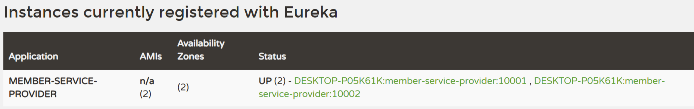

# SpringCloud的基本介绍
## 基本定义
官方文档: https://spring.io/projects/spring-cloud
SpringCloud是一个基于SpringBoot的微服务架构工具集, 帮助开发者构建和管理分布式系统 , 提供了一整套组件和工具, 简化微服务架构中的常见问题 , 如服务发现 , 配置管理 , 负载均衡 , 熔断 , 分布式追踪等. Spring Cloud 可以定义为一个**微服务架构解决方案**
示意图

**SpringCloud的全面说明**
1.SpringCloud是源于Spring的 , 是更高层次和架构视角的大型项目, 宗旨在于构建一套标准化的微服务解决方案, 让架构师在使用微服务理念构建系统时, 面对各种环节的问题可以找到相对应的组件来处理
2.Spring Cloud 是Spring 社区为微服务架构提供的一个"全家桶" 套餐。套餐中各个组件之间的配合， 可以减少在组件的选型和整合上花费的精力，可以快速构建起基础的微服务架构系统，是微服务架构的最佳落地方案
3.高效解决与**分布式系统**相关的复杂性问题-网络问题 , 延迟开销 , 宽带问题 , 安全问题
4.拥有[[服务发现]]的能力-服务发现系统允许集群中的进程和服务找到彼此并进行通信
5.解决冗余问题-冗余问题经常发生在分布式系统中
6.解决负载均衡- 改进跨多个计算资源(例如计算集群 , 网络链接 , 中央处理单元)的工作负载分布
## 系统架构演变过程
.在没有SpringCloud时 , 程序员对大型项目进行模块划分 , 然后针对各个模块进行实现, 模块之间通过API调用, 耦合度高 , 不利于扩展和维护.
.后来将这种解决类似问题的方案统一了 . 分解成不同的服务比如(搜索服务/网关服务/配置服务/存储服务/发现服务等等). 各个服务通过分布式方式进行工作, 高效快速.稳定的完成复杂任务.
1.单机架构

2.[[动静态分离]]架构: 静态缓存+文件存储

3.分布式架构: 业务拆分+负载均衡

4.微服务架构: 使用SpringCloud

解读
* "微服务"来源于Martion Fowler的一篇名为Microservices的博客 . 微服务是系统架构中的一种设计风格. 它的宗旨是将一个原本独立的系统拆分成多个小型服务,这些小型服务都在独立的进程中运行, 服务之间通过基于HTTP的RESTfulAPI进行通信
* 被拆分成的每一个小型服务都围绕着系统中的某一些*耦合度*较高的业务功能进行构建, 并且每个服务都维护着自身的数据存储、业务开发、自动化测试案例以及独立部署机制。因为有轻量级的通信协作基础， 所以==这些微服务可以使用不同的语言来编写==, 这里我们使用java
## SpringCloud的核心组件图

springcloud Alibaba文档地址:https://github.com/alibaba/spring-cloud-alibaba
spring cloud Netflix 文档地址:https://github.com/Netflix

Nacos借用了很多Eureka的设计理念
## SpringCloud分布式示意图
**文档**: https://spring.io/microservices
示意图

这是一个非常简洁的分布式微服务架构示意图. 但包含了大多主要的功能.
1.SpringCloud是微服务的落地
2.SpringCloud体现了微服务的弹性设计
3.微服务的工作方式一般是基于分布式的. SpringCloud仍然是Spring家族一员 , 可以解决微服务的分布式工作带来的各种问题
4.SpringCloud提供很多组件 , 如服务发现 , 负载均衡 , 链路中断 , 分布式追踪和监控. API gateway功能

**SpringCloud和SpringBoot的版本对应关系**
地址: https://spring.io/projects/spring-cloud

## Spring Cloud组件选型
带`√`表示目前流行的 , 且功能强大的 , 时常更新的
带`×`表示目前不流行的 , 更新缓慢或者停止更新的
# Spring Cloud Alibaba基本介绍
**官方文档以及基本介绍**
官方文档; https://github.com/alibaba/spring-cloud-alibaba
中文文档: https://github.com/alibaba/spring-cloud-alibaba/blob/master/README-zh.md


**主要功能**

**SpringCloud Alibaba核心组件**

**选择SpringCloud Alibaba组件的原因**
1.SpringCloud部分组件停止维护和更新 , 给开发带来不便
2.SpringCloud部分环境搭建复杂 , 没有可视化界面 , 需要大量的二次开发和定制
3.SpringCloud配置复杂.

所以: 这里以Spring Cloud Alibaba组件为主 , Spring Cloud为辅.
# 微服务基础环境搭建
## 创建父工程, 聚合子微服务模块
创建一个父项目 , 然父项目区管理多个微服务模块

1.创建父项目 , --选择灵活配置方式


2.项目的编码设置

3.设置编译器

这个`Target bytecode version` , 选择的版本会影响编译器生成的字节码版本 . 例如选择java8 , 编译器会生成与java8兼容的字节码. 确保这些`.class`文件可以在java8或者更高版本的JVM上运行.
一般用来匹配项目的需求 , 性能优化 , 向后兼容
4.然后删除`src`保留一个纯净的环境
父项目一般只用来管理子模块 , 并不需要编写源码 , 所以把src文件删掉是最为合适的

5.然后编写对应的pom.xml文件
这里使用到了maven的聚合工程的功能
`<packaging>pom</packaging>`: 表名这是一个父工程 .
`<dependencyManagement>` :
* 一种管理依赖版本号的方式 , 通常在项目`packaging`为POM的xml中使用.
* 使用`pom.xml`中的`dependencyManagement`元素能让所有的子项目中引用一个依赖 , Maven会沿着父子层次向上走 , 直到找到拥有`dependencyManagement`元素的项目, 然后会使用该配置文件指定的版本号
* 好处: 如果有多个子项目都引用同一样依赖 , 则避免了子项目还要声明版本号 , 当升级或者切换到另一个版本时 , 只需要在带有`<packaging>pom</packaging>`的容器里更新.
* 这个和`<dependency>`不一样 , 它不会直接引入依赖. 只负责管理依赖版本
* 只有子项目声明了对应的依赖并且没有指定具体版本 , 才会从父项目中继承下来. 这个体现在pom.xml文件中`<scope>`标签中
## 会员中心微服务模块
模块名: `member-server-provider-10000`
名字的含义: member-server表示人员服务 . `provider`表示生产者 , `10000`表示端口

**具体操作步骤**
1.创建子模块

注意看父工程是否正确

2.查看父工程的pom.xml文件,看他掌管的子模块是否是刚刚创建的

3.编写子模块的pom.xml文件
* `<parent>`标签 , 指明该子模块对应的父工程
* `<groupId>` 在子工程继承父工程的前提下,`groupId`不用写
* 发现,子模块springboot元素并没有指定版本 , 而且父模块也没有指定版本. 这个原因是 , 父模块指定了`spring-boot-dependencies`的版本 , 这个元素里面又指定了boot的版本
* [[`spring-boot-starter-actuator`]]: springboot程序的监控系统 , 可以实现系统的健康检测
* `spring cloud sleuth`:分布式系统中,生成和传递链路追踪信息的工具
* `spring cloud zipkin`:分布式链路追踪系统 , 用于收集,存储,==可视化==来自Sleuth的追踪信息

4.启动springboot程序
注意端口是否被占用 , 可以通过cmd指令只看端口情况`netstat -ano | findstr :8080` net是network , stat是statistics
`-a`: 显示所有活动的连接和监听端口
`-n`: 以数字的形式显示地址和端口号
`-o`:显示每个连接的进程号ID(PID)
```php
TCP    0.0.0.0:8080    0.0.0.0:0    LISTENING    <PID>
```
然后通过pid(进程号)在任务管理系统进行操作

**编写dao数据层**
定义: 全名Data Access Object, 主要用于处理数据访问逻辑. 主要是一组与数据库或其他数据源交互的类或接口 
这里采用`MyBatis`: 在resources/mapper下编写对应的xml配置文件
确定要保证mapper文件在target目录下有


**编写entiy类**
这里多个个工具类[Result](杂记). entity主要是用于编写数据单元的. 一般使用到[`lombok`](MyBatis)快速编写javabean 

**编写service层**
service层和dao层是完全不一样的 , 不可替代. service层面向业务逻辑. 是业务的核心, 负责将多个dao操作组合在一起, 并为上层的控制层(Controller)提供服务接口.service层中的方法往往会调用多个dao方法.

**编写controller层**
定义: 该层是应用程序中负责接受并处理客户端请求的层. 
细节: 注意常用的注解
1.类级别
* `@Controller`: 要配合视图解析器
* `@RestController`: 返回数据(json/xml)
* `@RequestMapping`: 用于类,指定URL映射 等等......
## 微服务消费模块
英文名为 `service consumer`
**微服务消费模块说明**
以前是浏览器直接调用`服务提供微服务模块` 
现在一般采用通过`微服务消费模块`去调用`服务提供者微服务模块`
定义:
1.服务提供者微服务模块是处理业务逻辑的核心微服务
2.`微服务消费者模块`也叫`网关`或`聚合服务`
这种转变的原因:降低客户端复杂性,增强安全性和集中管理

这里服务消费模块在接受到请求后,怎么把请求打给服务提供微服务模块,这里使用RestTemplate

**配置pom.xml和application.yml**
注意 , 在配置xml中时, 这个子模块没有涉及到对数据库层的操作 , 所以不需要引入Mybatis或者 , jdbc之类的

**创建启动类**
[`@SpringApplication`](SpringBoot)

**实现entity层**
Member.java+Result.java(上面有详细解释)

**配置层config**
定义: config包通常用于放置项目的配置信息和配置类. 里面常见的内容有`@Configuration`注解的配置类. Bean初始化. AOP配置. 属性读取,如读取`application.properties`. 安全配置: 

这里的话是注入RestTemplate
* 官网: https://docs.spring.io/spring-framework/docs/5.2.2.RELEASE/javadoc-api/org/springframe
work/web/client/RestTemplate.html
* 定义: RestTemplate是spring提供用于访问Rest服务的模版类,可以说是简易的客户端 ^e5b65d
* 调用外部RESTfulAPI, 在微服务架构中, 服务间往往相互调用
* 第三方API集成,调用外部服务的API,如获取天气信息,调用支付接口
常用方法
```java
getForObject(url,responseType,uriVariables)//发送get请求,返回java对象
postForObject(url, request, responseType, uriVariables)//发送 POST 请求，返回响应数据。
put(url, request, uriVariables)//发送 PUT 请求，更新资源。
delete(url, uriVariables)//发送 DELETE 请求，删除资源。
```
方法解释
1.在`RestTemplate`中,`uriVariables`是一个用来填充URI模版变量的参数. 可以在URI中定义占位符. 并在请求时通过`uriVariables`来替代这些占位符
比如

2.URI 模板是一种 URL 格式，其中包含带有花括号的变量名称, 例如`String url = "https://example.com/users/{userId}";` 
`{userId}` 就是一个占位符。使用 `RestTemplate` 时，你可以传入 `uriVariables` 参数来替换占位符

3.`String response = restTemplate.getForObject(url, String.class, uriVariables);`

4.他可以支持的数据结构有Map, Object..(可变参数)

**控制层Controller**
```java
@RestController  
@Slf4j  
public class MemberConsumerController {  
    public static final String  
            MEMBER_SERVICE_PROVIDER_URL = "http://localhost:10001";//?  
    @Resource  
    private RestTemplate restTemplate;  
    @PostMapping("/member/consumer/save")  
    public Result<Member> save(Member member){  
        return restTemplate.postForObject(MEMBER_SERVICE_PROVIDER_URL+"/member/save",member,Result.class);  
    }  
    @GetMapping("/member/consumer/get/{id}")  
    public Result<Member> getMemberById(@PathVariable("id") Long id){  
        return restTemplate.getForObject(MEMBER_SERVICE_PROVIDER_URL  
                + "/member/get/" + id, Result.class);  
    }  
}
```
跟之前的controller大体不差 , 但是这里要注意RestTemplate的使用
重要细节
restTemplate打过去的HTTP请求是以对象的形式的 , 所以提供服务微服务模块在controller层接收参数需要以**json格式**,使用`@RequestBody`. 而且整个过程member都是以序列化的形式进行传播的, 所以member要实现`Serializable` 

**整个开发过程的细节**
启动报错: springBoot 启动If you want an embedded database (H2, HSQL or Derby), please put it on the classpath. 这个原因是在pom.xml引入了Mybatis但是没有配置数据库相关的
2.数据库添加为Null. 


**开启Run DashBoard**
用于在运行和监控多个应用程序时提供实时,便捷的控制台管理. 通过Run Dashboard, 可以集中查看并管理项目中的多个运行配置, 尤其使用于在微服务架构
1.在/.idea/workspace.xml文件中添加下面的代码

2.重新启动idea, 就能看到如下界面

如果没有看到这个Service. 百度一下即可
## 微服务共用模块
**共用模块的介绍**
1.定义: 共用模块是指在多个微服务之间共享的功能或资源, 一般包含可复用代码. 统一应用的核心逻辑或配置. 共用模块独立于具体的业务逻辑, 提供跨微服务的通用功能
2.常见的共用模块类型
* 工具类模块: 如日期处理, 字符串处理 , 文件读写 , 加密解密
* 基础配置模块: Spring配置 , 数据库配置 , 安全配置, 统一REST API响应格式
* DTO 和 VO 模块：定义所有服务**公用的数据传输对象**（DTO）和**视图对象**（VO），用于各服务之间的交互数据格式保持一致。
* 异常处理模块：包含通用的异常类和处理逻辑，确保各个服务处理异常的方式一致。
* 基础实体类模块：定义公共实体（Entity），如用户、角色、权限等，也可以包括对数据库模型的映射。
3.使用这种模块的优点
* 减少代码重复：将所有共用逻辑放在公共模块中，避免在各微服务中重复实现。
* 统一管理和维护：便于统一管理通用功能的更新或优化，提高各服务一致性。
* 便于扩展：如果需求发生变化，只需在共用模块中进行修改，其他服务会自动引用最新版本。

**需求分析**

这里的解决方法就是创建一个模块去囊括entity

**实现步骤**
1.创建子模块命名为`E_commerce_center-common-api`

2.引入maven依赖
这里目前只需要引入`lombok` , 细节:`<optional>true</optional>`表明不允许该依赖传递到其他模块, 也体现了微服务共用模块的独立性. 
注意是否出现了自己引入自己的Maven导出的包奇怪引入方式 , 导致依赖关系混乱

3.使用maven打包成jar


4.工程重构
* 在**各个**模块引入刚刚制造的jar包
* 删除原来的entity包, 修改pom.xml
```xml
<dependency>
	<groupId>com.hspedu.springcloud</groupId>
	<artifactId>e_commerce_center-common-api</artifactId>
	<version>${project.version}</version>
</dependency>
```

5.完成测试
# Eureka服务注册与发现
## 基本介绍
Eureka是一个==服务注册与发现工具== , 主要功能是帮助各个微服务之间自动找到彼此.

**核心概念(组件)**
1.Eureka Server: 服务注册中心,微服务启动会注册到这里. Eureka Server保存自身位置信息(ip,端口,服务名)
2.Eureka Client：指各个微服务（消费者和提供者）在启动时会向 Eureka Server 注册自身的服务，同时还可以从 Eureka Server 获取其他服务的地址，从而实现服务之间的调用。

**作用**
**去中心化**：Eureka 可以实现多个服务实例的自动注册和发现，无需手动指定服务位置。
**自动负载均衡**：Eureka 与 Ribbon、Feign 等组件一起使用，可以实现负载均衡，提高系统稳定性。
**故障隔离**：通过心跳机制，Eureka 只保留活跃服务，避免了消费者调用失效服务的风险。

Eureka是一个老的组件 , 后面出的服务注册技术和组件都参考了Eureka的设计理念,比如Nacos

服务注册中心的必要性

在企业级的项目中 , 服务消费者访问,可能会出现高并发 , 如果只有一个提供服务微服务模块, 是往往不够的.
所以, 服务提供微服务往往是一个集群.  这个时候就产生一个问题, 服务消费模块怎么去发现可以使用的服务
当服务消费方，发现了多个可以使用的服务后 , 又存在一个问题就是到底调用A
服务，还是B 服务的问题，这就引出了服务注册和负载均衡)

**引入Eureka项目架构解析**

1.Eureka Server和注册服务都是可以集群的.
2.Eureka Server 提供注册服务, 各个微服务节点通过配置启动后，会在Eureka Server 中进行注册，这样EurekaServer 中的服务注册表中将会存储所有可用服务节点的信息，服务节点的信息可以在界面中直观看到。
3.EurekaClient 向注册中心进行访问, 是一个Java 客户端，用于简化Eureka Server 的交互，客户端同时也具备一个内置的、使用==轮询(round-robin) 负载算法==的负载均衡器。在应用启动后，将会向Eureka Server 发送心跳(默认周期为30 秒)。如果Eureka Server 在多个心跳周期内没有接收到某个节点的心跳，EurekaServer 将会从服务注册表中把这个服务节点移除(默认90 秒)

**服务治理介绍**
在传统的rpc远程调用框架中 , 管理每个服务与服务之间依赖关系比较复杂 , 管理困难 , 所以需要治理服务之间依赖关系
服务治理是一个抽象的概念 , 是一个在分布式微服务实现服务注册, 发现和管理. 保证各个服务在微服务框架下的稳定通信.
详细介绍: https://jingyan.baidu.com/article/46650658def479f549e5f83e.html

**总结**
* Eureka采用了CS`[client-server-java一个多人聊天项目]`的设计架构，Eureka Server 作为服务注册功能的服务器，它是服务注册中心。
* 系统中的其他微服务，使用Eureka的客户端连接到Eureka Server并维持心跳连接，通过Eureka Server 来监控系统中各个微服务是否正常运行。
* 当服务器启动的时候，会把当前自己服务器的信息比如服务地址通讯地址等以别名方式注册到注册中心上。
* 服务消费者或者服务提供者，以服务别名的方式去注册中心上获取到实际的服务提供者通讯地址，然后通过[==RPC==](#^e5b65d)调用服务(RestTemplate中的方法就是rpc)
## 创建单机Eureka Server
**创建e-commerce-eureka-server-9001微服务模块**

**编写pom.xml文件和application.yml**
1.pom.xml文件
```xml
<dependency>  
    <groupId>ohmygod.project</groupId>  
    <artifactId>E_commerce_center-common-api</artifactId>  
    <version>1.0-SNAPSHOT</version>  
</dependency>  
<dependency>  
    <groupId>org.springframework.cloud</groupId>  
    <artifactId>spring-cloud-starter-netflix-eureka-server</artifactId>  
</dependency>
```
第一个依赖是通用模块微服,基本每个依赖都会引用
2.application.yml
```yml
eureka:  
  instance:  
    hostname: localhost #eureka服务端实例主机名,status项中  
  client:  
    register-with-eureka: false #不向注册中心注册自己  
    #表示自己就是注册中心，职责是维护服务实例，并不需要去检索服务  
    fetch-registry: false  
    service-url:  
      #设置与eureka server 交互的模块,查询服务和注册服务都需要依赖这个地址  
      defaultZone: http://${eureka.instance.hostname}:${server.port}/eureka/
```
`hostname`:服务实例主机名
`register-with-eureka: false`就是说该微服务不注册到服务注册中心避免自己或其他的`EurekaServer`被注册到服务中心,true就是要把自己注册到注册列表
`fetch-register`:决定Eureka客户端是否能从`Eureka`服务端获取注册列表

3.创建启动类
该类要被`@EnableEurekaServer`注释 , 表示该程序作为EurekaServer

**将member-service-provider-10001作为EurekaClient注册到e-commerce-eureka-server-9001成为服务提供者**

1.引入client依赖
```xml
<dependency>
	<groupId>org.springframework.cloud</groupId>
	<artifactId>spring-cloud-starter-netflix-eureka-client</artifactId>
</dependency>
```
注意 , 这里是client而不是上面的server
2.修改application.yml文件
```yml
eureka:  
  client:  
    register-with-eureka: true #将自己注册到EurekaServer  
    #是否从从EurekaServer 抓取注册信息，默认为true, 单节点无所谓  
    
    #集群必须设置为true 才能配合ribbon 使用负载均衡  
    fetchRegistry: true  
    service-url:  
      defaultZone: http://localhost:9001/eureka
```
当前Eureka客户端会定期从服务端拉取服务注册表信息.用于集群模块相互监视对方
3.在启动类加上`@EnableEurekaClient` , 将该服务标识为Eureka Client
结果如图


**Service Consumer,Service Provider,EurekaServer的维护机制**


**Eureka自我保护模式**
* 默认情况下EurekaClient定时向EurekaServer端发送心跳包, 并且在一定时间内(90)没收收到EurekaClent的心跳包,便会直接从服务注册列表中删除服务
* 如果开启了自我保护模式,在短时间（90秒中）内丢失了大量的服务实例心跳,不会剔除该服务(该现象可能出现在网络不通或阻塞),保护机制是为了解决此问题而产生的
* [自我保护是属于CAP 里面的AP 分支， 保证高可用和分区容错性](杂记)
参考博客:https://blog.csdn.net/wangliangluang/article/details/120626014

Eureka自我保护模式的启动
```yml
server:
	enable-self-preservation: false #禁用自我保护
	eviction-interval-timer-in-ms: 2000 #间隔时间2秒,2秒收不到心跳就认为超时
```
## 搭建EurekaServer集群
微服务PRC==远程服务调用==最核心的是实现高可用, 如果注册中心只有1个 , 它出现故障, 会导致整个服务环境不可用. 解决办法就是搭建Eureka注册中心集群, 实现负载均衡+故障容错

**搭建EurekaServer集群**
1.创建子模块`e-commerce-eureka-server-9002`加入对应依赖
2.创建application.yml
```yml
server:  
  port: 9002  
  
eureka:  
  instance:  
    hostname: eureka9002.com #eureka服务端实例的名字  
  client:  
    register-with-eureka: false #不向注册中心注册自己  
    #表示自己就是注册中心，职责是维护服务实例，并不需要去检索服务  
    fetch-registry: false  
    service-url:  
      #设置与eureka server 交互的模块,查询服务和注册服务都需要依赖这个地址  
      defaultZone: http://eureka9001.com:9001/eureka/
```
这里defaultZone的地址要对应另一个eureka-server-9001(各个eureka-server相互注册)
3.创建启动类EurekaApplication9002.java
4.修改另一个`e-commerce-eureka-server-9001`中的`application.yml`中的`defaultZone`
5.将`127.0.0.1 eureka9001.com`和`127.0.0.1 eureka9002.com`加入`C:\Windows\System32\drivers\etc\host`中
设置文件权限: 属性->安全->高级->所有者->把文件加入`Administrator`, 然后点击属性->权限编辑 . 然后刷新dns`ipconfig /flushdns`
6.启动`e-commerce-eureka-server-9001`和`9002`模块.
7.`eureka.instance.hostname`指定服务实例注册到EurekaServer的主机名, 其它服务通过主机名来访问此实例,不设置,默认主机名
**将client-eurekaclient加入EurekaServer加入集群中**
比如:将member-service-provider-10001和member-service-consumer-801加入EurekaServer集群中
只要修改`application.yml`
```yml
defaultZone: http://eureka9001.com:9001/eureka,http://eureka9002.com:9002/eureka
```
`defaultZone`表示将自己注入到哪个`eurekaServer`中 , 如需注册到多个eurekaServer, 使用`,`隔开


**搭建会员中心微服务模块**

1.参考member-service-provider-10001来创建member-service-provider-10002
2.源码和配置替换member-service-provider-10002生成的代码
3.不要到磁盘整体拷贝, 不然会出现问题. 一般创建好新项目的包, 然后再拷贝对应包下的文件.
4.不要忘记拷贝xxx.xml文件
5.修改启动类类名和yml文件中的端口

**配置服务消费端,让其获取服务中心信息**
1.修改MemberConsumerController.java. ==修改`MEMBER_SERVICE_PROVIDER_URL`让其指向在eureka中的服务别名==, 服务别名会受到`application.yml`文件中`spring.application.name`的影响, ==application的名字是要一样的 , 因为这是微服务的唯一标识. 如果不同的服务模块有不相同名字, 消费模块中获取服务就不知道怎么写==
* 这个时候的`MEMBER_SERVICE_PROVIDER_URL+"/member/save"`等价于`http://localhost:10000/member/save`

2.在消费者微服务模块(member-service-consumer-80)修改配置模块,在RestTemplate加上`@LoaBalanced`
*  注解`@LoadBalanced`底层是`Ribbon`支持算法. `Ribbon`和`Eureka`整合后,`consumer`直接调用服务而不再关心地址和端口号(就是在RestTemplate中不用写明端口和地址了), 而且该服务有负载功能.
* 负载均衡的方式默认是轮询算法,也可以自己配置均衡算法
3.测试`/member/comsumer/save`和`/member/consumer/get/id` , 这里id直接添数字
通过观察msg发现, 是交替访问服务的.

**获取EurekaServer服务注册信息**
如图

1.服务消费方获取Eureka Server的==服务注册==信息
修改`member-service-consumer-801`,
```java
@Resource
private DiscoveryClient discoveryClient;
```
`DiscoveryClient` 是 Spring Cloud 框架提供的一个接口，用于==服务注册==和==发现==。它主要是用来与服务注册中心（如 Eureka、Consul、Zookeeper 等）交互的组件。
* 服务注册: 将服务实例注册到服务注册中心, 使其他服务可以发现
* 服务发现: 可以获取注册中心中所有服务实例的信息(如实例地址,端口), 方便进行负载均衡 , 调用等操作
在`member-service-consumer-80`添加`DiscoveryClient`的使用
```java
@Resource
private DiscoveryClient discoveryClient;
public Object discovery(){  
    List<String> services=discoveryClient.getServices();  
    for (String element : services) {  
        System.out.println("====服务名"+element+"====");  
        List<ServiceInstance> instances=discoveryClient.getInstances(element);  
        for (ServiceInstance instance : instances) {  
            System.out.println(instance.getServiceId()+"\t"+instance.getHost()+"\t"+instance.getPort()+"\t"+instance.getUri());  
        }  
    }  
    return this.discoveryClient;  
}
```

修改启动类
加上`@EnableDiscoveryClient`这个注解. 

2.在服务提供方也是类似上面这样处理

细节:
在引入DisconveryClient时, 不要引入错误的包
正确: import org.springframework.cloud.client.discovery.DiscoveryClient;
错误: import com.netflix.discovery.DiscoveryClient;
# Ribbon
## Ribbon的基本介绍
**Ribbon是什么**
Ribbon 是一个 Netflix 开源的客户端负载均衡器
官网: https://github.com/Netflix/ribbon
目前Ribbon进入维护模式 , 未来替换方案是SpringCloud LoadBalancer

简单了解`LoadBalancer`策略
1.集中式LB
* 即在服务的消费方和提供方之间使用独立的LB设施(可以是硬件, 如F5(负载均衡设备),也可以是软件,如Nginx), 由该设施负责把访问请求通过某种策略转发至服务的提供方
* 当客户端发送请求时，先发送到负载均衡器,负载均衡器根据定义好的策略,把请求转发给服务端的某个实例. 特点就是==客户端不需要知道有多少个可用服务==
* 这种方式更适合大型企业和跨平台服务
2.进程内LB
* 将LB逻辑集成到消费方, 消费方从==服务注册中心==获知有哪些服务地址可用,然后再从这些地址中选择出一个合适的服务地址。
* Ribbon就属于进程内LB，它只是一个类库，集成于消费方进程，消费方通过它来获取到服务提供方的地址

**Ribbon的主要功能**
* 提供客户端负载均衡算法和服务调用, 例如轮询,随机,权重,来均匀分配请求负载
* 提供一系列完善的配置项如连接超时,重试等.
* 大部分应用场景是: 负载均衡+RestTemplate调用
## Ribbon的原理以及应用
**Ribbon架构图**

Ribbon的运行机制
* 先选择EurekaServer,它优先选择在同一个区域内负载较少的server
* 再根据用户指定的策略, 在从server取到的服务注册列表中选择一个地址
* ribbon在客户端拦截到请求,会直接通过策略后转发到服务地址,不需要借助额外的负载均衡设备,比如(Nginx)
* 在从Eureka中拉取服务列表时存在缓存, 并不是每次查询都会拉取,一般是每隔30秒

**Ribbon常用的算法**


**Ribbon的应用**
1.在消费者模块`member-service-consumer-80`的`config`目录下创建RibbonRule.java
```java
@Configuration  
public class RibbonRule {  
    @Bean  
    public IRule myRibbonRule(){  
        return new RandomRule();  
    }  
}
```
这个RandomRule()这个方法就是选择的算法方式
2.然后修改对应模块的启动类
添加对应的注解`@RibbonClient(name="MEMBER_SERVICE_PROVIDER_URL",configuration=RibbonRule.class)` 用于为指定的微服务自定义Ribbon的负载均衡配置, 使用它可以指定自定义的负载均衡策略.这个name是服务注册ID.
3.测试.
浏览器输入`http://localhost/member/consumer/get/1`
然后观察到访问的10001/10002端口的服务是随机的
# SpringCloud OpenFeign
## OpenFeign基本介绍
**OpenFeign定义**
OpenFeign是个声明式WebService客户端 , 用于简化HTTP客户端调用的声明式REST客户端工具库.
官网:https://github.com/spring-cloud/spring-cloud-openfeign

**OpenFeign的基本功能**
* 声明式调用, 不需要编写复杂的HTTP请求代码, 只需定义接口并用注解声明远程服务的URL
* 支持可插拔式的编码器和解码器(可切换不同的编译器和解析器去适应不同的数据格式和协议要求)
* 与SpringCloud集成,支持SpirngMVC注解和HttpMessageConverters
* OpenFeign 可以与Eureka 和Ribbon 组合使用以支持负载均衡,支持与Eureka集成进行服务发现

**Feign和OpenFeign区别**
1.Feign
* Feign是Spring Cloud组件中的一个轻量级RESTful的HTTP服务客户端
* Feign内置了Ribbon，用来做客户端负载均衡，去调用服务注册中心的服务。
* Feign的使用方式是：使用Feign的注解定义接口，调用服务注册中心的服务,不支持SpringMVC的注解
```xml
<dependency>
	<groupId>org.springframework.cloud</groupId>
	<artifactId>spring-cloud-starter-feign</artifactId>
</dependency>
```
2.OpenFeign
* OpenFeign是Spring Cloud 在Feign的基础上支持了Spring MVC的注解
* OpenFeign的@FeignClient可以解析SpringMVC的@RequestMapping注解下的接口(简而言之,可以使用springmvc)
* OpenFeign通过动态代理的方式产生实现类, 实现类中做负载均衡并调用其他服务
```xml
<dependency>
	<grouId>org.springframework.cloud</groupId>
	<artifactId>spring-cloud-starter-openfeign</artifactId>
</dependency>
```
## OpenFeign的应用
**示意图**

**创建服务消费模块**
1.参考`member-service-consumer-801`创建`member-service-consumer-openfeign-80`
2.将之前的消费模块的pom.xml文件copy到新的消费模块, 然后添加openfeign依赖
```xml
<dependency>
	<groupId>org.springframework.cloud</groupId>
	<artifactId>spring-cloud-starter-openfeign</artifactId>
</dependency>
```
3.编写application.yml
```yml
server:  
  port: 801  
spring:  
  application:  
    name: member-service-consumer-openfeign  
eureka:  
  client:  
    register-with-eureka: true  
    fetchRegistry: true  
    service-url:  
      defaultZone: http://eureka9001.com:9001/eureka,http://eureka9002.com:9002/eureka
```
fetchRegistry: 用于配置Eureka客户端是否需要拉取Eureka服务器的注册列表
4.编写启动类
```java
@SpringBootApplication(exclude = DataSourceAutoConfiguration.class) 
@EnableEurekaClient  
@EnableFeignClients  
public class MemberConsumerOpenfeignApplication801 {  
    public static void main(String[] args) {  
        SpringApplication.run(MemberConsumerOpenfeignApplication801.class,args);  
    }  
}
```
其它不变, 多了`@EnableFeignClients`这个注解, 用于启用`SpringCloud`的OpenFeign客户端功能. 加上这个注解后, SpringBoot应用可以自动扫描并识别使用`@FeignClient`注解的接口, 并生成代理对象.
`@SpringBootApplication(exclude = DataSourceAutoConfiguration.class)`排除自动配置
5.编写Feign客户端接口.
```java
@Component  
@FeignClient(value="MEMBER-SERVICE-PROVIDER")  
public interface MemberFeignService {  
    @GetMapping(value="/member/get/{id}")  
    public Result<Member> getMemberById(@PathVariable("id") Long id);  
}
```
`@FeignClient(value="MEMBER-SERVICE-PROVIDER")`声明一个Feign客户端, 用于调用名为`"MEMBER-SERVICE-PROVIDER"`的服务
6.编写controller层
```java
@RestController  
public class MemberConsumerFeignController {  
    @Resource  
    private MemberFeignService memberFeignService;  
    @GetMapping(value = "/member/consumer/openfeign/get/{id}")  
    public Result<Member> getMemberById(@PathVariable("id") Long id){  
        return memberFeignService.getMemberById(id);  
    }  
}
```
注意事项和细节
* Openfeign的使用特点是微服务调用接口+@FeignClient , 使用接口进行解耦
* 接口方法上： value是不能乱写, 远程调用的url 为
`http://MEMBER-SERVICE-PROVIDER/member/get/{id}`

Maven查看版本快捷键
对准`<artifactId>`然后ctrl+b

**日志配置以及超时设置**
1.基本介绍
Feign提供了日志打印功能, 可以通过配置来调整日志级别, 从而对Feign接口的调用情况进行监控和输出
2.日志级别
* NONE∶默认的，不显示任何日志
* BASIC∶仅记录请求方法、URL、响应状态码及执行时间;
* HEADERS∶除了BASIC中定义的信息之外，还有请求和响应的头信息;
* FULL: 除了HEADERS中定义的信息外, 还有请求和响应的正文及元数据.
3.在config目录下编写配置类
```java
@Configuration  
public class OpenFeignConfig {  
    @Bean  
    Logger.Level loggerLevel(){  
        return Logger.Level.FULL;  
    }  
}
```
4.配置日志
application.yml
```yml
logging:  
  level:  
    ohmygod.project.service.MemberFeignService: debug
```

设置超时
当服务提供模块的controller层处理时间过长, 会出现意外错误
原因: OpenFeign默认超时时间1秒, 即等待返回结果1秒
在某些情况下，一个服务调用时间可能要超过1 秒，就需要重新设置超时时间
操作:
修改`member-service-consumer-openfeign-801`的application.yml
```xml
ribbon:
	ReadTimeout: 8000
	ConnectTimeout: 8000
```
**ReadTimeout**：这是读取超时时间，以毫秒为单位。指的是客户端从服务端**开始读取数据**到完成数据读取的最大等待时间。在上面的配置中，`ReadTimeout` 设置为 `8000` 毫秒，即 8 秒。如果在 8 秒内没有完成数据读取，则请求会超时并抛出异常。
**ConnectTimeout**：这是连接超时时间，也以毫秒为单位。指的是客户端**与服务端建立连接**的最大等待时间。在上面的配置中，`ConnectTimeout` 也设置为 `8000` 毫秒。如果在 8 秒内无法建立连接，则会超时并抛出异常。
# SpringCloud Gateway
## Gateway的介绍
**技术背景**
没有网关服务引发的问题

使用网关服务就能解决上面的四个问题
**Gateway是什么**
Gateway是在spring生态系统之上构建的API网关服务. 提供一种简单而有效的方式来对API进行路由, 以及提供一些些强大的过滤器功能, 如∶熔断、限流、重试等.
官网: https://cloud.spring.io/spring-cloud-static/spring-cloud-gateway/2.2.1.RELEASE/reference/html/

**Gateway核心功能**
* 鉴权(安全性)
* 流量控制(限流)
* 熔断(故障处理)
* 日志监控
* 反向代理

**Gateway VS Zuul**
1.SpringCloud Gateway 作为Spring Cloud 生态系统中的网关，目标是替代Zuul
2.SpringCloud Gateway 是基于Spring WebFlux 框架实现的
3.Spring WebFlux 框架底层则使用了高性能的Reactor 模式**通信框架Netty** ， 提升了网关性能
4.Gateway基于Spring Framework(支持SpringWebFlux) , Project Reactor和Spring Boot进行构建. 有如下特点
* 动态路由
* 可以对路由指定Predicate(断言)和Filter(过滤器)
* 集成Hystrix的断路器功能
* 集成Spring Cloud 服务发现功能(Eureka)
* 请求限流功能
* 支持路径重写
## Gateway基本原理
**Gateway核心组件**

对上图解析
* web 请求，通过一些匹配条件，定位到真正的服务节点/微服务模块，在这个转发过程的前后，进行一些精细化控制。
* predicate:就是匹配条件
* filter: 网关的过滤机制 , predicate+filter, 再加上目标URL, 就可以实现具体的[路由](杂记)
1.路由(Route):路由是构建网关的基本模块, 由ID, 目标URI , 断言和过滤器组成, 如果断言为true则匹配该路由

2.断言(Predicate):对HTTP请求中的属性进行匹配 , 如果请求与断言匹配则进行路由

3.过滤器可以在请求被路由前或之后对请求进行处理, Http请求断言匹配后, 可以通过网关的过滤机制, 对Http请求处理
比如`
```yml
filters:
	AddRequestParameter=color,blue #在请求头上加一对，名称为color 值为blue
```
比如原来的http 请求是http://localhost:10000/member/get/1 过滤器处理后变为
`http://localhost:10000/member/get/1?color=blue`

**工作机制**
示意图

组件介绍
* GatewayClient: 客户端
* Gateway Handler Mapping: 是网关的路由匹配器, 根据配置的路由规则来判断当前请求应该路由到那个服务. 它的依据是请求头,路径,参数
* Gateway Web Handler: Web处理器, 负责执行与请求相关的所有过滤器, 并最终讲请求转发给目标服务
* Filters(过滤器): 在Gateway Web Handler中, 请求会经过一系列过滤器处理.过滤器可分为前置过滤器和后置过滤器.分别在请求被转发到目标服务之前和响应返回给客户端之前执行
     pre类型过滤器 做参数校验、权限校验、流量监控、日志输出、协议转换等
     post类型过滤器做响应内容、响应头的修改，日志的输出，流量监控
执行流程
* 客户端向网关发起请求然后在Gateway Handler Mapping 中找到与请求相匹配的路由，将其发送到Gateway Web Handler。
* Handler执行过滤器链将请求发送到我们实际的服务执行业务逻辑，然后返回。
## 搭建Gateway微服务
**框架示意图**

通过网关暴露的接口,实现调用真正的服务, 网关是一个微服务模块. 再近一点说,网关其实就是微服务消费模块的升级
官方文档:https://cloud.spring.io/spring-cloud-static/spring-cloud-gateway/2.2.1.RELEASE/reference/html/#spring-cloud-circuitbreaker-filter-factory
**具体实现**
1.创建`e-commerce-gateway-20000`子模块

2.复制`member-service-consumer-80`的`pom.xml`文件.因为两模块的功能都非常相似,调用远程服务.
```xml
<!-- 引入cloud gateway -->
<dependency>  
    <groupId>org.springframework.cloud</groupId>  
    <artifactId>spring-cloud-starter-gateway</artifactId>  
</dependency>
```
引入`gateway`网关服务需要删除`starter-web`和`starter-actuator`依赖, 因为`Spring Cloud Gateway`是基于`WebFlux`的, 不是传统的SpringMVC.Gateway 则是基于 **Spring WebFlux** 的异步、响应式框架。如果同时引入 `spring-boot-starter-web` 和 `spring-boot-starter-webflux`，会导致两者的运行机制冲突。

3.创建`application.yml(核心)`
```yml
server:  
  port: 20000  
spring:  
  application:  
    name: e-commerce-gateway  
  cloud:  
    gateway:  
      routes:  
        - id: member_routh01  
          uri: http://localhost:10001  
          predicates:  
            - Path=/member/get/**  
        - id: member_routh02  
          uri: http://localhost:10001  
          predicates:  
            - Path=/member/save  
eureka:  
  instance:  
    hostname: e-commerce-service  
  client:  
    service-url:  
      register-with-eureka: true  
      fetch-register: true  
      defaultZone: http://eureka9001.com:9001/eureka
```
* `predicates`(断言),,对请求进行匹配,如果失败,直接返回, 是gateway返回的,而不是服务层返回的
* `uri`匹配后转发到服务的路由地址.

4.创建主启动类
加上`@EnableEurekaClient`

**第二种路由方式**
通过配置类实现
## 动态路由
**动态路由的概念**
动态路由是指可以在运行时根据配置或某种逻辑规则来动态地调整或添加网关的路由, 无需重新启动服务. 这种功能在微服务架构中非常有用，可以灵活地管理路由规则，支持服务的动态扩展、灰度发布等场景。

示意图

只需要在`application.yml`中配置即可
```yml
spring:  
  application:  
    name: e-commerce-gateway  
  cloud:  
    gateway:  
      discovery:  
        locator:  
          enabled: true  
      routes:  
        - id: member_routh01  
          uri: lb://member-service-provider  
          predicates:  
            - Path=/member/get/**  
        - id: member_routh02  
          uri: lb://member-service-provider  
          predicates:  
            - Path=/member/save
```
`enabled: true`表示的是开启DiscoveryClient服务发现, 将服务实例动态地映射为网关的路由
`uri: lb`: 这个lb是协议名 , member-service-provider是服务名. 这里不要用大写,否则会失败 , lb默认支持轮询算法

**细节**
1.配置好动态路由后Gateway会根据注册中心上微服务名, 为请求创建动态路由. 实现动态路由功能
2.使用的lb协议支持负载均衡-轮询算法, 也可以配置自己的负载算法.在该模块下创建一个config包 , 然后编写配置类
```java
@Configuration  
public class RibbonRule {  
    @Bean  
    public IRule myRibbonRule(){  
        return new RandomRule();  
    }  
}
```
## Predicate/断言
**Predicate的介绍**
1.定义
Predicate是用于定义请求路由条件的组件. 谓词是一种函数式接口, 对请求的特定属性进行条件判断. 匹配成功就执行对应的Route, 匹配失败, 放弃处理/转发

2.Route Predicate Factories
官方文档:https://springdoc.cn/spring-cloud-gateway/#gateway-request-predicates-factories
* Spring Cloud Gateway包括许多内置的Route Predicate工厂, 所有这些Predicate都与HTTP请求的不同属性匹配, 可以==组合使用==.
* Spring Cloud Gateway 创建Route 对象时，使用RoutePredicateFactory 创建Predicate对象，Predicate 对象可以赋值给Route。
* 所有这些谓词都匹配HTTP请求的不同属性 , 多种谓词工厂可以组合

**Predicate的使用**
1.After
需求: 只有2024-11-05 20:40:50 之后的请求才进行匹配/转发, 不满足该条件的，不处理.
只要配置`application.xml`文件即可
* 在predicates数组下, 加上`- After=时间格式`
* 获取时间格式
```java
public class nowTime {  
    public static void main(String[] args){  
        ZonedDateTime now = ZonedDateTime.now();  
        System.out.println(now);  
    }  
}
```
2.Before
3.Between
4.Cookie
需求: 请求带有cookie键: user  值:ok 才predicate成功
* 在predicates数组下, 加上`- Cookie=user, ok`. 这个ok也可以是正则表达式
* 用postman测试

5.Header Route Predicate
6.Host Route Predicate 请求host是ohmygod才匹配成功
7.Method Route Predicate 请求是Get方式才成功
8.Path Route Predicate 一开始就用过的
9.Query Route Predicate 请求有参数email,并且满足电子邮件的基本格式, 才能匹配成功
## 过滤器 
**简介**
路由过滤器可用于修改进入的HTTP请求和返回的HTTP响应, 常用于请求验证, 修改请求和响应 , 流量控制 , 日志记录等操作

**GatewayFilter**
开发直接使用GatewayFilter比较少, 一般使用自定义过滤器
```xml
routes:
	filters:
		- AddRequestParameter=color,blue
		- AddRequestParameter=age,18
```
1.过滤器工厂会在匹配的请求头加上一堆请求头,名称为color值为blue
2.过滤器工厂会在匹配的请求头上加上一对请求头,名称为age值为18
这个是在请求前对请求头.
这种配置`AddRequestParameter`过滤器是在请求到达目标服务之前处理的,即请求前阶段

**自定义GlobalFilter**
需求: 如果请求参数user=ok , pwd=123456则方行, 否则不能通过验证
这种是通过编写配置类
```java
@Component  
public class CustomGateWayFilter implements GlobalFilter, Order {  
    @Override  
    public Mono<Void> filter(ServerWebExchange exchange, GatewayFilterChain chain) {  
        System.out.println("====CustomGateWayFilter");  
        String uname=exchange.getRequest().getQueryParams().getFirst("user");  
        String pwd=exchange.getRequest().getQueryParams().getFirst("pwd");  
        if(!("ok").equals(uname)&&"123456".equals(pwd)){  
            System.out.println("===非法用户====");  
            exchange.getResponse().setStatusCode(HttpStatus.NOT_ACCEPTABLE);  
            return exchange.getResponse().setComplete();  
        }  
        return chain.filter(exchange);  
    }  
    @Override  
    public int value() {  
        return 0;  
    }  
    @Override  
    public Class<? extends Annotation> annotationType() {  
        return null;  
    }  
}
```
1.`ServerWebExchange` 是 Spring WebFlux 中用于处理 HTTP 请求和响应的核心对象。它封装了当前请求的所有信息 , 非常类似于HttpServerRequest
2.`Order`表示过滤器的执行优先级, 数字越小优先级高.
3.filter是核心方法 , 核心过滤业务
# Sleuth+Zipkin
## 简单介绍
**Sleuth/Zipkin是什么**
**Sleuth** 和 **Zipkin** 是分布式系统中用于**分布式追踪**的工具

**技术背景**
1.在微服务框架中，一个由客户端发起的请求在后端系统中会经过多个不同的的服务节点调用, 来协同产生最后的请求结果，==每一个请求都会形成一条复杂的分布式服务调用链路.==
2.链路中的任何一环出现高延时(一般不能超过1s)或错误都会引起整个请求最后的失败, 因此对整个服务的调用进行链路追踪和分析就非常的重要


**Sleuth和Zipkin的简单关系图**

Sleuth提供了一套完整的服务跟踪的解决方案, 并兼容Zipkin. Sleuth做链路追踪,Zipkin做数据搜集/存储/可视化

**工作原理**
1.Span和Trace在一个系统中使用Zipkin的过程-图形化

* Trace ID: 标识一次完整的请求链路,在所有服务中保持不变 , span标识发起的请求信息，各span通过parent id(前一个span的id)关联起来
* Span ID: 标识请求链路的单个操作, 每个服务会生成新的Span ID. span是一次请求信息

2.spans的parent/child关系图形化

后一个span节点的parentId 指向/记录了上一个Span , 多个Span集合就构成了一条调用链
## Sleuth/ZipKin-搭建链路监控
**需求**
对`http://localhost/member/consumer/get/1`这个请求进行监控
通过Sleuth和ZipKin可以对服务调用链路进行监控, 并在Zipkin进行显示

**下载Zipkin-server**
然后再cmd执行`java -jar zipkin-server-2.12.9-exec.jar`

1.服务提供方集成Sleuth/Zipkin
* 修改`member-service-provider-10000`的pom.xml,增加引入`sleuth+zipkin`
```xml
<dependency>  
    <groupId>org.springframework.cloud</groupId>  
    <artifactId>spring-cloud-starter-zipkin</artifactId>  
</dependency>
```
这里的starter-zipkin包含了Sleuth
修改application.yml.指定Zipkin
```xml
spring:  
  application:  
    name: member-service-conumer-801  
  zipkin:  
    base-url: http://localhost:9411  
  sleuth:  
    sampler:  
    # 采样率在0-1 之间，1 表示全部采集  
    probability: 1  
    #eureka 客户端配置
```
`base-url`: Sleuth/Zipkin的访问地址

2.服务消费方集成Sleuth/Zipkin
配置和修改过程和上面一样

**查看监控和分析结果**
登录zipkin平台
选择查看服务

查看一次调用链路的深度, 以及该链路包含请求 , 各个请求耗时, 找到请求瓶颈, 为优化提供依据

查看服务调用的依赖关系

# Nacos
## Nacos的基本介绍
介绍
他是一款集中了服务发现, 配置管理和服务管理为一体的服务平台.Nacos 就是注册中心`[替代Eureka]`+配置中心`[替代Config]`
* 英文名Dynamic Naming and Configuration Service
* 架构理论基础: CAP 理论(支持AP 和CP, 可以切换)

**下载以及使用**
下载:https://github.com/alibaba/nacos/releases/tag/1.2.1
环境要求: Java8/Maven 3.2.x+
解压，使用运行bin/startup.cmd
服务网址: http://localhost:8848/nacos
用户名和密码默认: nacos
## 将服务注册到Nacos
**需求分析**
示意图

创建服务到注册中心

1.创建member-service-nacos-provider-10004并注册到NacosServer8848
将代码置换过来即可. 不要忘了mapper文件
2.修改父项目的pom.xml文件 , 引入`cloudalibaba`
```xml
<dependency>  
    <groupId>com.alibaba.cloud</groupId>  
    <artifactId>spring-cloud-alibaba-dependencies</artifactId>  
    <version>2.1.0.RELEASE</version>  
    <type>pom</type>  
    <scope>import</scope>  
</dependency>
```
3.修改本模块`member-service-nacos-provider-10004`的pom.xml
```xml
<dependency>  
    <groupId>com.alibaba.cloud</groupId>  
    <artifactId>spring-cloud-starter-alibaba-nacos-discovery</artifactId>  
</dependency>
```
引入nacos的功能
4.在application.yml文件中, 删除eureka的配置(yml依赖). 
增加`spring.cloud.nacos.discovery:server-addr: localhost: 8848`
* 服务发现的服务器地址. 指定Nacos服务的地址
增加`management.endpoints.web.exposure.include`
* 定义了 Actuator 端点的暴露范围，通过该配置可以指定允许哪些 Actuator 端点在 Web 上公开。`*`表示暴露所有端点
5.修改启动类名,application.yml的端口名, 修改返回信息. 添加`@EnableDiscoveryClient`注解
6.启动Nacos Server 8848

**在创建一个provider-server形成集群**
端口10006

**将服务消费者注册到Nacos**
1.将`provider-service`的代码拉到`member-service-nacos-consumer-80`
2.修改pom.xml,去除eureka,添加nacos
3.修改启动类(类名),添加nacos客户端的注解
4.修改对应的application.yml
* 增加`spring.cloud.nacos.discovery:server-addr: localhost: 8848`
* 增加`management.endpoints.web.exposure.include`
5.修改业务层`controller`中的地址指向
```java
public static final String=MEMBER_SERVICE_PROVIDER_URL = "http://member-service-nacos-provider";//
```
把他指向服务别名. nacos不会像eureka一样自动转换为大写.nacos还是使用的是Ribbon(负载均衡器)+RestTemplate(服务调用)
