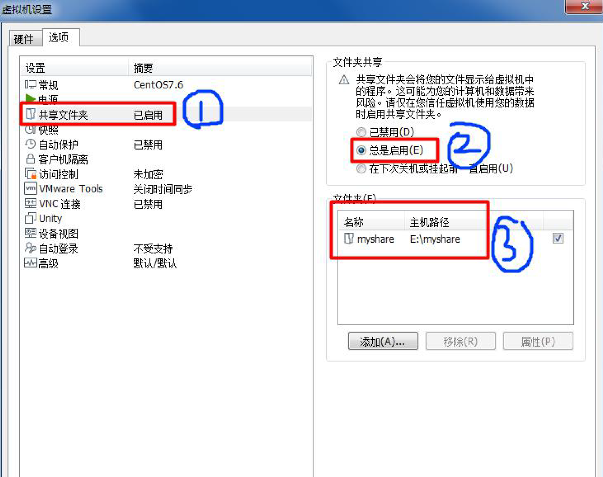

# Linux简介
1.Linux是一个开源, 免费的操作系统, 其稳定性, 安全性 , 处理多并发已经得到业界的认可, 目前很多企业级的项目(c/c++/php/py/java/go)都会部署到Linux/unix系统上
2.常见的操作系统(windows,IOS,android,MacOS,Linux,Unix)

Linux之父: Linux Torvalds , Git创作者 , 世界著名黑客
3.Linux主要的发行版本:
Ubuntu(乌班图), RedHat(红帽), CentOS , Debain(蝶变) , Fedora , SuSE , OpenSUSE
**Linux和Unix的关系**
unix的由来

linux的由来

**Linux和Unix关系图**

# VM和Linux的安装
## CentOS的安装
1.先安装virtual machine 15.5-->Linux(CentOS 7.6/centOS8.1)
原理示意图

**2. 虚拟机安装的步骤**
**创建虚拟机-->生成密码-->网络连接**


CentOS网络连接
* Bridged(桥接模式): 将虚拟机的网络适配器直接连接到主机的物理网络适配器, 虚拟机和宿主机在同一个局域网中，虚拟机会从 DHCP 服务器或手动分配 IP 地址。(容易造成ip冲突). 虚拟机会占用一个同名端ip
* NAT(网络地址转换模式): 虚拟机通过宿主机的网络连接上网, 适合宿主机已连接到网络时使用. 虚拟机会有一个与宿主不同的Ip地址, 但通过宿主机访问外网.
* Host-Only(仅主机模式): 虚拟机和宿主机相互连接, 但无法访问外网 , 仅是主机和虚拟机之间的通讯,类似于与主机构成一个内网
**2.Linux安装设置**

## Linux的硬盘分析
简介: Linux操作系统将硬盘空间划分为多个独立的区域, 每个区域称为一个分区. 分区的作用是将不同类型的数据或系统功能分开管理. 确保数据的安全性和系统的稳定性. 每个分区可以看作是文件系统的一部分. 并被挂载特定的目录.
**分区的作用**
1. 数据隔离: 可以将系统文件和用户文件分开 , 减少因某个分区出错导致系统崩溃
2. 提高性能: 
3. 备份和恢复:
4. 管理不同的文件系统: 每个分区可以使用不同的文件系统类型, 如`ext4`,`xfs`,`btrfs`等.
**常见的Linux分区类型**
1.根分区(`/`)根分区是Linux系统的核心, 他包含系统的所有文件和目录. 所有其他分区(如`/home`或`/var`)都会挂载到根分区中
2./boot分区: 存储启动相关文件, 如内核, 启动加载器(GRUB). 他通常是一个独立的小分区. 确保系统能够正常启动
3./home分区: 专门存储用户信息
4.`/swap`分区: 用户交换空间(虚拟内存), 当物理内存不足时, Linux会使用swap分区作为虚拟内存来存储不常用的数据
## VmWare的常用功能
**虚拟机克隆**
如果你已经安装了一台linux操作系统, 没必要再重新安装, 只需要克隆
1. 方式1: 直接拷贝一份安装好的虚拟机文件
2. 方式2: 使用vmware的克隆操作 , 注意, 克隆时 , 需要先安装Linux系统
**虚拟机快照**
如果在使用虚拟机系统的时候, 想回到原先的某个状态, 处理错误操作造成的系统异常, vmware能处理提供这种功能
**虚拟机迁移和删除**
虚拟机的本质就是一个文件. 因此虚拟系统的迁移很方便, 把安装好的虚拟系统这个文件夹整体拷贝或者剪切到另外位置使用
**数据互通**
先要安装vmtools. vmtools可以设置windows和centos文件共享

# Linux目录结构
**基本介绍**
1.linux的文件系统是采用级层式的树状目录结构, 在此结构中的最上层是根目录`/`,然后在此目录下再创建其它目录

**常见的目录结构**
1. `/bin`:**常用** (/usr/bin , /usr/local/bin)是binary的缩写 , 这个目录存放着最经常使用的命令
2. `/sbin`(/usr/sbin , /usr/local/sbin)
	s就是Super User 的意思 , 这里存放的是系统管理员使用的系统管理程序
3. `/home`常用
	存放普通用户的主目录, 在linux中每个用户都有一个自己的目录 , 一般该目录名是以用户的账号命名
4. `/home`**常用** 
	该目录为系统管理员 , 也称做超级权限者的用户目录
5. `/lib` 
	系统开机所需要最基本的动态连接共享库, 其作用类似于Windows里的DLL文件. 几乎所用的应用程序都需要用到这些共享库
6. `/lost+found` 
	这个目录一般情况下是空的, 当系统非法关机后, 这里就存放一些文件
7. `/etc`
	所有的系统管理所需要的配置文件和子目录, 比如安装mysql数据库 my.conf
8. `/usr` **常用**
	这是一个非常重要的目录 , 用户的很多应用程序和文件都放在这个目录下,类似与windows里面的program files目录.
9. `/boot`**脚本**
	存放启动Linux的一些核心文件, 比如连接文件以及镜像文件
10. `/proc` **不能改动**
	是一个虚拟目录 , 是系统内存的映射 , 访问这个目录来获取系统信息
11. `/srv` **不能动** 
	`service`缩写 , 该目录存放一些服务启动之后需要提供的数据
12. `/sys` **不能改**
	这是Linux2.6内核的一个很大的改变. 该目录有个新的文件系统
13. `/tmp` 这个目录是用来存放一些临时文件的
14. `/dev`
	类似于windows的设备管理, 把所有的硬件用文件的形式存储
15. `/media` **常用** linux系统会自动识别一些设备 , 比如U盘, 光驱. 识别成功后 , 会把设备[[挂载]]到这个`/media`目录下
16. `/mnt` **常用**
	系统提供该目录是为了让用户临时挂载别的文件系统的, 我们可以将外部的存储[[挂载]]在/mnt/上 , 然后进入该目录就可以查看里的内容了. 
17. `/opt` 这是主机额外安装软件所存放的目录 . 如安装ORACLE数据库就可放到该目录下. 默认为空
18. `/usr/local` **常用**
	这是另一个给主机额外安装软件所安装的目录 . 一般是通过编译源码方式安装的程序
19. `/var` **常用**
	这个目录中存放着在不断扩充着的东西 , 习惯将经常被修改的目录放在这个目录下. 包括日志文件
# Linux实操篇
## 远程登录Linux和文件传输
**需要远程登录的原因**
1.linux服务器是开发小组共享的 2.正式上线的项目是运行在公网 3.因此程序员需要远程登录到linux进行项目管理或者开发
远程登录客户端有Xshell6 , Xftp6 等
**Linux-Xshell6**
简介: Xshell是目前最好的远程登录到Linux操作的软件, 流畅的速度并集完美解决了中文乱码的问题 , 是目前程序员的首选
2.Xshell是一个强大的安全终端模拟软件, 它支持SSH1,SSH2,以及Micorosoft Windows 平台的TELNET协议

登录步骤
1.现在Linux服务器中使用`ifconfig`找到ip
2.在主机(windows)的cmd中使用`ping ip`检测是否可以和linux互通

在主机端口填上通过指令得到的ip然后连接
然后要输入linux服务器端的密码

**远程使用Xftp6实现文件互传**

主机填linux服务端的密码. 
## Vi和Vim编辑器
**Vi和Vim的简介**
vi和Vim都是Linux和Unix系统中非常常用的文本编辑器 .  Vim是vi的增强版, Vim具有程序编辑的能力 , 可以主动的以字体颜色辨别语法的正确性 , 方便程序设计. 他还有代码补全, 编辑以及错误跳转等方便编程的功能特别丰富.
### Vi和Vim的使用方式
**三种模式的介绍**
1.正常模式
以vim打开一个档案就直接进入一般模式. 在这个模式中 , 可以上下左右移动光标. 用(删除字符)和(删除整行)来处理档案的内容 . 也可以使用(复制,粘贴)来处理文件数据
2.插入模式
按下i, I, o , O , a , A , r , R等任何一个字幕之后进入编辑模式 , 一般来说按i即可
3.命令行模式
输入`esc`在输入`:` 在这个模式中 , 可以提供相关指令 , 完成读取 , 存盘 , 替换 , 离开vim , 显示行号等动作   
**各种模式的切换**

**基本使用**
1.打开和退出Vim
* 打开文件: `vim filename`
* 退出文件: 
	* `:q` 退出(如果没有修改)
	* `:wa` 或`zz`: 保存并退出
	* `:q!`:不保存退出
* 插入文本
	 **`i`**：在光标前插入文本。
	- **`a`**：在光标后插入文本。
	- **`I`**：在当前行行首插入文本。
	- **`A`**：在当前行行尾插入文本。
	- **`o`**：在当前行下方新建一行并进入插入模式。
	- **`O`**：在当前行上方新建一行并进入插入模式。
* 移动光标：
	- **h**：左移。
	- **j**：下移。
	- **k**：上移。
	- **l**：右移。
	- **0**：移动到行首。
	- **$**：移动到行尾。
	- **w**：移动到下一个单词的开头。
	- **b**：移动到前一个单词的开头。
	- **gg**：移动到文件的开头。
	- **G**：移动到文件的结尾。
* 删除文本：
	- **`x`**：删除光标所在的字符。
	- **`dd`**：删除整行。
	- **`d$`**：删除光标到行尾的内容。
	- **`d^`**：删除光标到行首的内容（不包括缩进）。
	- **`dw`**：删除光标到下一个单词的开头。
* 复制、粘贴：
	- **`yy`**：复制当前行。
	- **`p`**：在光标后粘贴复制的内容。
	- **`P`**：在光标前粘贴复制的内容。
	- **`v`**：进入可视模式，选择文本后按 `y` 复制，或按 `d` 删除（剪切）。
* 撤销与重做：
	- **`u`**：撤销上一次操作。
	- **`Ctrl + r`**：重做撤销的操作
* 查找与替换：
	- **`/pattern`**：查找模式 `pattern`，按 `n` 查找下一个，按 `N` 查找上一个。
	- **`:%s/old/new/g`**：将整个文件中的 `old` 替换为 `new`。
vim操作键盘图

**总结**
常用快捷键
1.拷贝当前行 , 在linux中是yy(一般模式)下 , p是粘贴  5yy表示拷贝5行 , p表示粘贴
2.删除当前行 dd , 删除当前行向下的行 5dd
3.在文件中查找某个单词`/查找单词`(要在命令行下) , 回车查找 , 输入n就是查找下一个
4.`:set nu`设置行号 , `set notnu`取消行号(在命令行下)
## Linux的开机,重启和用户管理
### Linux关机和启动
**关机&重启命令**
shutdown -h now 立即进行关机
shudown -h I hello , 1分钟后关机
shutdown -r now 现在重新启动计算机
halt  关机,作用和上面一样
reboot 现在重新启动计算机
sync  把内存的数据同步到磁盘中
**注意细节**
1.不管是重启系统还是关闭系统 , 首先要运行sync命令.把内存中的数据写到磁盘中
2.目前的shutdown/reboot/halt等命令均已经在关机前进行了同步
### Linux用户管理
**用户登录和注销**
1.登录时尽量少用root账号登录 , 因为它是系统管理员 , 有最大权限 , 避免操作失误. 可以利用用户登录 , **登录后再用"`su - 用户名`" 命令切换成系统管理员身份**

2.在提示符下输入logout即可注销用户(目的是回退到低权限的用户)
使用细节
1.logout注销指令在图形运行级别无效 , 在运行级别3下有效
如果你在 Linux 虚拟机中直接使用的是 **命令行界面**（例如，在虚拟机启动后，直接进入了终端登录界面），那么你可以在任何一个打开的终端会话中执行 `logout` 命令来注销当前用户。

**添加用户**
Linux系统是一个多用户多任务的操作系统 , 任何一个要使用系统资源的用户 , 都必须首先向系统管理员申请一个账号 , 然后以这个账号的身份进入系统
添加用户
基本语法: useradd 用户名
说明: 当创建用户成功后 , 会自动的创建和用户同名的家目录
也可以通过useradd -d 指定目录 新的用户名 , 给新创建的用户指定家目录

**指定/修改密码**
基本语法: `passwd 用户名` 用户名一定要写, 否则是在改当前使用的用户
==常用指令 `pwd` 显示当前目录==

**删除用户**
基本语法: userdel 用户名 (删除用户 , 但是保存家目录)
        userdel -r 用户名(删除用户, 并删除家目录)
细节: 尽量保存家目录,因为会把被删除用户的工作资料也一并删除了

**查看用户信息指令**
基本语法:`id 用户名` 列出所有用户名`cut -d: -f1 /etc/passwd`

**切换用户**
==基本语法==: `su - 切换用户名` , 如果当用户权限不够 , 可以切换成root用户
细节: 从高权限的用户切换到低权限的用户不需要输入密码. 指令`exit/logout`可以直接返回到原来的用户

**用户组**
**Linux 系统可以通过组（Group）和权限系统对具有相同特征、权限或职责的多个用户进行统一管理**。Linux 使用用户和组来组织和管理权限，从而使管理员可以方便地管理多个用户的访问控制和操作权限。方便地给特定组的所有成员统一赋予访问某些资源的权限，或者限制他们的操作权限。
==新增组==: 指令`groupadd 组名`
==删除组==: 指令`groupdel 组名`
==增加用户时顺便带上组的编号==`useradd -g 用户组 用户名`
==修改用户的组==: 指令`usermod -g 用户组 用户名`
==查询所有组==: `cat /etc/group` 一般会加上过滤条件
查询的结果形式为`groupname:x:GID:user1,user2,....`
`groupname`:组名 , `GID`:组名 , `user1,user2,...`:属于该组的用户列表


**用户和组相关的文件**
`/etc/passwd`文件
用户(user)的配置文件 , 记录用户的各种信息
`/etc/shadow`文件
口令的配置文件. 行数据的解释: 
登录名: 加密口令 : 最后一次修改时间 : 最小时间间隔 : 最大时间间隔 : 警告时间 : 不活动时间 : 失效时间 : 标志
`/etc/group`文件
组的配置文件 , 记录Linux包含的组的信息
每行数据解释: 组名 : 口令 : 组标识号 : 组内用户列表
## Linux实用指令
### Linux中指令运行级别的简介
**简介**
是一种定义用户系统运行状态的机制. 每个运行级别表示系统处于不同的状态. 比如系统是否在图形界面模式下运行 , 是否允许用户登录 , 是否只启动基本的服务.
linux实用不同的运行级别来决定系统启动后要加载哪些服务 , 支持哪些功能. 不同的运行级别可以控制系统的启动过程 , 进程启动 , 网络服务的运行等

常用的运行级别是3 , 5

在虚拟机启动的时候 , 默认是5 , 所以不能使用用户登录和注销的指令
**指定运行级别**
指令`init 数字`
`systemctl get-default` 查看运行级别

**通过运行级别找回root密码**
总体流程是: 开机按e --> 进入1运行级别 --> 重置密码

**linux帮助指令**
1.man获得帮助信息
基本语法 `man ls` 意思是解析`ls`指令有哪些用法
2.help指令
基本语法：help命令（功能描述：获得shell内置命令的帮助信息）
### 操控文件的命令
**pwd**命令
基本语法:`pwd` (功能描述: 显示当前工作目录的绝对路径)
绝对路径: 从全局的文件系统开始定位文件
相对路径: 从当前的文件系统开始定位

**ls**命令
基本语法 :`ls [选项] [目录或者文件]`(选项可以组合使用)
常用选项 :
-a : 显示当前目录所有的文件和目录 , 包括隐藏的
-l : 以列表的方式显示信息

**cd**指令\
基本语法 : `cd [参数]` (切换到指定目录)
常用选项
1.`cd~` 或者`cd` 回到自己的家目录 , 比如 用的是root用户 , 那么`cd~`就是切换到`/root`
2.`cd..`回到当前目录的上级目录

**mkdir指令用于创建目录**
基本语法: `mkdir [选项] 要创建的目录`
常用选项
`-p` : 创建多级目录

**rmdir指令删除空目录**
基本语法: `rmdir [选项] 要删除的空目录`
使用细节: 
	rmdir 删除的是空目录 , 如果目录下有内容时是无法删除的
	如果需要删除非空目录 , 需要用 `rm-rf`

**touch指令创建空文件**
基本语法: `touch 文件名称`

**cp指令**
cp指令指拷贝文件到指定目录
基本语法: `cp[选项] source dest`
	source 表示文件资源 , dest表示要放在哪个文件下
常用选项
`-r` 递归复制整个文件夹
强制覆盖不提示的命令`\cp` 

**rm移除文件或目录**
基本语法 ; `rm [选项] 要删除的文件或目录`(记住要加空格)
常用选项
`-r` : 递归删除整个文件夹
`-f` : 强制删除不提示
\
**mv移动文件和重命名指令**
基本语法:
重命名:`mv oldNameFile newNameFile` 前提条件要是在同目录的情况下
移动文件: `mv/temp/movefile/targetFolder`

**cat 查看文件内容指令**
基本语法
`cat [选项] 要查看的文件`
常用选项
`-n:显示行号`
使用细节
cat 只能浏览文件 , 不能修改文件. **为了阅读方便 , 一般会带上管道命令**`|more`
比如`cat -n/etc/profile|more[进行交互]`

**more指令**
more指令是一个基于VI编辑器的文本过滤器, 它以全屏幕的方式按页显示文本文件的内容 . more指令内置了若干快捷键 .
基本语法
`more` 要查看的文件


**echo指令**
echo输出内容到控制台
基本语法
`echo [选项] [内容]`

**head指令**
head用于显示文件的开头部分内容 , 默认情况下head指令显示文件的前10行内容
基本语法
`head 文件`
`head -n5 文件` (功能描述: 查看文件头5行内容, 5可以是任意行数)

**tail指令**
tail用于输出文件中尾部的内容 , 默认情况下tail指令显示文件的前10行内容
基本语法
`tail 文件` (查看文件尾10行内容)
`tail -n 5 文件`(查看文件尾部5行内容 , 5可以是任意行数)
`tail -f 文件`(实时跟踪文档的所有更新)

**>指令和>>指令**
这两个指令都是用于重定向输出的符号 , 简而言之就是将命令的输出结果写到文件中.但又略微有些不同
1.`>重定向符号`
* 作用: 将命令的输出重定向到文件中 , 覆盖文件的原内容
2.`>>重定向符号`
* 将命令的输出追加到文件的末尾 , 保留原有的内容
基本语法
`ls -l>文件` (列表的内容覆写到文件中)
`ls -al>>文件`(列表的内容追加到文件aa.txt的末尾)
`cat 文件1>文件2`(将文件1的内容覆盖到文件2)
`echo "内容">>文件(追击)`

**ln指令**
软链接也称为符号链接,类似于windows里的快捷方式 , 主要存放了链接其他文件的路劲
基本语法
`ln -s[原文件或目录][软链接名]` (给原文件创建一个软链接)

**history指令**
查看已经执行过历史命令 , 也可以执行历史指令
基本语法
`history` (功能描述: 查看已经执行过历史命令)
细节: history后面可以接数字 , 表示显示多少条命令
然后会显示每一条指令 , 并且指令前面会有编号 , 我们可以==通过`!编号`来执行==对应的指令
### 时间相关的指令
**data指令**--显示当前日期
基本语法
`date` 显示当前时间
`date+%Y` 显示当前年份
`date+%m` 显示当前月份
`date+%d` 显示当前时哪一天
date"+%Y-%m-%d%H:%M:%S" 显示年月日时分秒
`date -s 字符串时间` 设置时间

**call指令**
查看日志指令 cal
基本语法
`cal[选项]` (不加选项,显示本月日历)
```
显示当前日历 cal
显示2023年日历 cal 2023
```
### 搜索查找类
**find指令**
find指令将从==指定目录向下递归地遍历其各个子目录== , 将满足条件的文件或者目录显示在终端.
基本语法
`find [搜索范围] [选项]`
解释
按文件名: 根据名称查找`/home`目录下的hello.txt文件
`find /home -name hello.txt`
按拥有者: 查找`/opt`目录下 , 用户名车为nobody的文件
`find /opt -user nobody`
查找整个linux系统下大于200M的文件(+n 大于 , -n 小于 ,n等于 , 单位有k,M,G) `find / -size +200M`

**locate指令**
locate指令可以快速定位文件路径 . locate指令利用事先建立的系统中所有文件名称及路径的locate数据库实现快速定位给定的文件. Locate指令无需遍历整个文件系统. 查询速度较为快. 为了保证查询结果的准确度, 管理员必须定期更新locate
基本语法
`locate 文件`
细节
由于locate指令基于数据库进行查询, 所以第一次运行前, 必须使用updatedb指令创建locate数据库
`which`指令 , 可以查看某个指令在哪个目录下

**grep指令和管道符号**
grep过滤查找 , 管道符 `|` , 表示将前一个命令的处理结果输出传递给后面的命令处理
基本语法
`grep [选项] 查找内容 源文件`
常用选项

### 压缩类和解压类
**gzip/gunzip指令**
gzip用于压缩文件 , gunzip用于解压文件
基本语法
`gzip 文件` (功能描述: 压缩文件, 只能将文件压缩为*.gz文件)
`gunzip 文件.gz` (解压缩文件命令)

**zip/unzip指令**
zip用于压缩文件 , unzip用于解压文件. 这两个在项目打包有非常大的作用
基本语法
`zip [选项]XXX.zip` 将要压缩的内容(压缩文件和目录的命令)
`unzip [选项]XXX.zip` 解压文件
zip常用选项
-r: 递归压缩, 即压缩目录
unzip的常用选项
-d<目录>: 指定解压后文件的存放目录
==细节==
`zip -r myhome.zip/home/`表示将home目录以及包含的文件和子文件夹都压缩

**tar指令**
tar指令 是打包指令 , 最后打包后的文件是 .tar.gz的文件,又叫归档指令
基本语法
`tar [选项] XXX.tar.gz 打包压缩的内容` (打包目录, 压缩后的文件格式.tar.gz)
选项说明

## Linux组管理和权限管理
### Linux组管理
**组的基本能介绍**
**组（Group）** 是 Linux 中用户的集合。每个组都有一个唯一的组名和组 ID（GID），可以将多个用户归属于同一组。这样，通过为某个组分配特定权限，组内的所有用户就都可以访问相应的资源（例如文件、目录、设备等）。在Linux中用户和文件都可以属于组
文件权限管理
* 所有者
* 所在组
* 其它组
* 改变用户所在的组


**文件/目录 所有者**
1.**一般为文件的创建者**, 谁创建了该文件, 就自然的成为该文件的所有者
2.文件的所有者可以==独立设置文件的权限 , 包括读,写,执行权限==.

相关指令
指令 :
`ls -ahl`  (查看文件的所有者)
查询的结果分析 第一列是文件的类型与权限 第二例是硬链接数 第三列是文件的所有者 第四列是文件所在的组
`chown 用户名 文件名` 修改文件的所有者

**文件/目录 所在组**
默认 , 当某个用户创建了一个文件后 , 这个文件的**所在组**就是该==用户==所在的组
* 每个文件或目录都有一个组 , 这个组内所有的用户共享该文件的权限
* 一个文件的所属组可以由文件所有者或系统管理员来指定
* 文件组权限控制的是该文件所属组内的所有用户.
相关指令:
`chgrp 组名 文件名` 修改文件/目录所在的组

**文件/目录 其他组**
除文件的所有者和所在组的用户外 , 系统的其他用户都是文件的其他组
* 不属于文件所有者 , 也不属于文件所在组的其他用户.
* 其它用户的权限与文件的所有者及其所在组的权限互相独立

**改变用户所在组**
在添加用户时 , 可以指定将用户添加到哪个组中 , 同样的用root的管理权限可以改变某个用户所在的组.
指令:
`usermod -g 新组名 用户名`
`usermod -d 目录名 用户名`(改变该用户登录的初始目录. 前提用户需要有进入新目录的权限)
### Linux权限管理
**权限的基本介绍**
在Linux系统中,权限系统是文件和目录安全管理的重要组成部分. 权限可分为三个级别 用户 , 组 , 其他用户. 权限控制又可分为三类 . 读权, 写权 , 执行权限

0-9位说明
第0位确定文件类型(d,-,1,c,b)
* 1是链接,相当于windows的快捷方式
* d是目录, 相当于windows的文件夹
* c是字符设备文件, 鼠标 , 键盘
* b是块设备 , 比如硬盘
* -表示普通文件
第1-3位确定所有者(该文件的所有者) 拥有该文件的权限.  ---User
第4-6位确定所属组(同用户组的) 拥有该文件的权限  ---Group
第7-9位确定其他用户拥有该文件的权限 ---Other

**rwx权限详解**
1.rwx作用到文件
* r代表可读(read): 可以读取 , 查看
* w代表可写(write): 可以修改 , 但是不代表可以删除该文件,删除一个文件的前提条件是对该文件所在的目录有写权限, 才能删除该文件
* x代表可执行(excute): 可以被执行
2.rwx作用到目录(文件和用户同组)
* r代表可读(read): 可以读取 , ls查看目录内容
* w代表可写(write): 可以修改, 对目录内容创建+删除+重命名目录
* x代表可执行(execute): 可以进入该目录
比如`-rwxrw-r-- l root root 1213 Feb 2 09:39 abc`
第0组说明它

**修改权限**
通过`chmod`指令 , 可以修改文件或者目录的权限
u:所有者  g:所有组  o:其他人  a:所有人
第一种方式: `x`,`-`,`=`变更权限
* `chmod u=rwx,g=rx,o=x 文件/目录名`
* `chmod o+w 文件/目录名`  给其他人添加写
* `chmod a-x 文件/目录名`  给所有人减去执行权限

第二种方式: 通过数字变更权限
r=4 , w=2 , x=1         rwx=4+2+1=7
上面的`chmod u=rwx,g=rx,o=x 文件名/目录名` 可以改写为`chmod 751 文件名/目录名`

**修改文件的所有者-chown**
指令
`chown newowner 文件/目录 改变所有者`
`chown newowner:newgroup 文件/目录 改变所有者和所在组`

**修改文件/目录所在组-chgrp**
指令
`chgrp newowner 文件/目录 改变所在组`
## 定时任务调度
### crontab任务调度
**概述**
任务调度：是指系统在某个时间执行的特定的命令或程序
任务调度分类：
* 系统工作：有些重要的工作必须周而复始地执行。如病毒扫描等
* 个别用户工作：个别用户可能希望执行某些程序，比如对mysql数据库的备份

==基本语法==
`crontab [选项]`
常用选项

输出的结果如下
```
* * * * * command_to_execute
- - - - -
| | | | |
| | | | ----- 星期几 (0 - 7) (0 或 7 表示星期天)
| | | ------- 月份 (1 - 12)
| | --------- 一个月的第几天 (1 - 31)
| ----------- 小时 (0 - 23)
------------- 分钟 (0 - 59)
```
特殊符号声明

案例

==crond相关指令==
`crontab -r` 终止任务调度
`crontab -l` 列出当前有哪些任务调度
`service crond restart` 重启任务调度
### at定时任务
**基本介绍**
在 **Linux** 系统中，除了使用 `cron` 来设置定期和周期性的任务外，另一种定时任务工具是 **`at`** 命令。**`at`** 用于调度一次性任务，它可以让你在特定的时间运行某个命令或脚本，而不是像 `cron` 那样周期性执行。

**at命令语法**
`at [选项] [时间]`
选项


**at时间格式**
1.具体时间格式
`at 10:30` 在当天的10:30执行任务
`at 10:30 PM`在当天晚上10:30执行任务
`at 03:00 12/10/2024`：在 2024 年 12 月 10 日上午 3:00 执行任务。

2.相对时间
`at now + 5 minutes`：5 分钟后执行任务。
`at now + 1 hour`：1 小时后执行任务。
`at now + 3 days`：3 天后执行任务。

3.自然语言表达
`at teatime`：在下午 4:00 执行任务（`teatime` 代表下午 4 点）
`at midnight`：在午夜 12:00 执行任务。
`at noon`：在中午 12:00 执行任务。

**at定时任务的工作机制**
1.at命令是一次性定时计划任务, at的==守护进程atd==会以后台模式运行 , 检查==作业队列==来运行
2.默认情况下, atd守护进程每60秒检查作业队列 , 有作业时 , 会检查作业运行时间 , 如果时间与当前时间匹配 , 则运行此作业
3.at命令式一次性定时计划任务 , 当一个作业出队后就不再执行此任务
4.在使用at命令的时候一定要确保守护进程atd在运行中. `ps -ef | grep atd` 这里`ps -ef`表示查找所有的进程 , `| grep atd`表示过滤查找所有进程中查找`grep atd`

## Linux磁盘分区,挂载