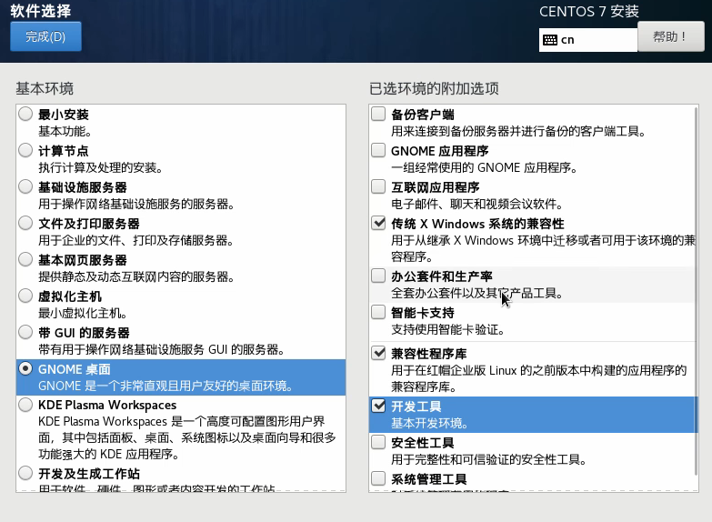

# Linux简介
1.Linux是一个开源, 免费的操作系统, 其稳定性, 安全性 , 处理多并发已经得到业界的认可, 目前很多企业级的项目(c/c++/php/py/java/go)都会部署到Linux/unix系统上
2.常见的操作系统(windows,IOS,android,MacOS,Linux,Unix)

Linux之父: Linux Torvalds , Git创作者 , 世界著名黑客
3.Linux主要的发行版本:
Ubuntu(乌班图), RedHat(红帽), CentOS , Debain(蝶变) , Fedora , SuSE , OpenSUSE
**Linux和Unix的关系**
unix的由来

linux的由来

**Linux和Unix关系图**

# VM和Linux的安装
## CentOS的安装
1.先安装virtual machine 15.5-->Linux(CentOS 7.6/centOS8.1)
原理示意图

**2. 虚拟机安装的步骤**
**创建虚拟机-->生成密码-->网络连接**

CentOS网络连接
* Bridged(桥接模式): 将虚拟机的网络适配器直接连接到主机的物理网络适配器, 虚拟机和宿主机在同一个局域网中，虚拟机会从 DHCP 服务器或手动分配 IP 地址。(容易造成ip冲突)
* NAT(网络地址转换模式): 虚拟机通过宿主机的网络连接上网, 适合宿主机已连接到网络时使用. 虚拟机会有一个与宿主不同的Ip地址, 但通过宿主机访问外网.
* Host-Only(仅主机模式): 虚拟机和宿主机相互连接, 但无法访问外网 , 仅是主机和虚拟机之间的通讯
**2.Linux安装设置**

## Linux的硬盘分析
简介: Linux操作系统将硬盘空间划分为多个独立的区域, 每个区域称为一个分区. 分区的作用是将不同类型的数据或系统功能分开管理. 确保数据的安全性和系统的稳定性. 每个分区可以看作是文件系统的一部分. 并被挂载特定的目录.
**分区的作用**
1. 数据隔离: 可以将系统文件和用户文件分开 , 减少因某个分区出错导致系统崩溃
2. 提高性能: 
3. 备份和恢复:
4. 管理不同的文件系统: 每个分区可以使用不同的文件系统类型, 如`ext4`,`xfs`,`btrfs`等.
**常见的Linux分区类型**
1.根分区(`/`)根分区是Linux系统的核心, 他包含系统的所有文件和目录. 所有其他分区(如`/home`或`/var`)都会挂载到根分区中
2./boot分区: 存储启动相关文件, 如内核, 启动加载器(GRUB). 他通常是一个独立的小分区. 确保系统能够正常启动
3./home分区: 专门存储用户信息
4.`/swap`分区: 用户交换空间(虚拟内存), 当物理内存不足时, Linux会使用swap分区作为虚拟内存来存储不常用的数据