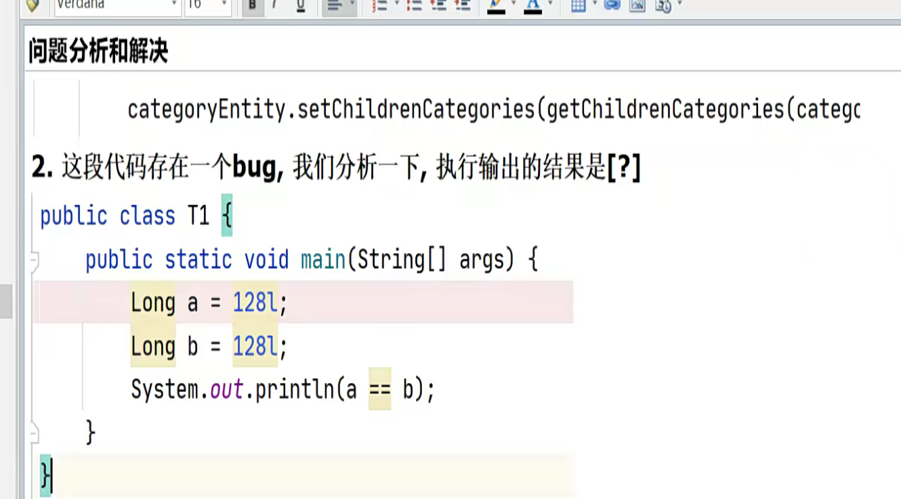

# 返回分类及其子分类的层级信息
**需求分析**
按照前端的要求 , 返回层级数据

每一层都是list数据集,是树型结构.涉及到流式计算和递归操作(这是一个方案)
在设计servlet层的时候考虑用什么数据保存,通过前端的样例数据,可以是List集合装着categoryentity, 但是要再加一个字段表示层级的信息

**细节**
1.返回的数据规范的问题, `R.ok.put("data",Object)`这个"data"到底影响前端的哪个数据信息
实体类和表字段不一致 可用resultMap进行映射处理.也可以用注解
2.在数据库设计的时候要添加表示层级的字段(catLevel)
3.使用list表示层级的数据结构,需要在实体类中写一个list集合,这个集合不能映射到数据库中(效率).
# 逻辑删除和添加信息至数据库
## 逻辑删除家居分类
**需求分析:**
1.考虑实际情况,不能无逻辑的删除.比如在儿子节点的信息还存在的时候,对父节点进行删除操作
2.添加分类也是, 限制用户无节制的进行深度分类,使得后端递归深度太高
3.实现过程中发现的问题, entity类的字段排序会影响发送给前端的展示形式
4.删除的时候要有再次确认的功能

**解决方案**
1.
```js
remove(node, data) { //处理点击删除分类  
  //输出node, data 观察数据的结构  
  console.log("node=>", node, " data=>", data)  
  //这里我们可以参考前面写过的代码来完成删除任务  
  //1. 获取删除的分类的id  
  var ids = [data.id]  
  
  this.$confirm(`是否删除【${data.name}】菜单?`, '提示', {  
    confirmButtonText: '确定',  
    cancelButtonText: '取消',  
    type: 'warning'  
  }).then(() => {  
    //2. 如果点击确认 , 发出请求, 完成删除  
    this.$http({  
      // 请求 url      url: 'http://localhost:9090/commodity/commoditycategory/delete',  
      method: 'post',  
      //发出请求时，携带的数据  
      data: this.$http.adornData(ids, false)  
    }).then(({data}) => { //{data} 是解构了返回数据的data部分  
      //输出  
      //console.log("返回的data= ", data)  
      this.$message({  
        message: '操作成功',  
        type: 'success'  
      })  
      //刷新分类列表  
      this.getCategories()  
      //设置需要展开的菜单  
      this.expandedKey = [node.parent.data.id]  
    })  
  }).catch(() => { //点击取消，就不删除了  
  })  
},
```


2.MyBatisPlus逻辑删除的配置
* 先在数据库有Int型的逻辑删除字段,然后再entity对应的字段加上`@TableLogic`
* 在application.yml文件中配置
```xml
global-config:  
  db-config:  
    id-type: auto #配置主键自增  
    logic-delete-value: 0 #逻辑删除值  
    logic-not-delete-value: 1 #逻辑未删除值
```
* 注释配置
* 本质上就是通过`where`条件过滤(sql语句)

3.批量删除的需求: 点击父节点, 子节点也自动会被选中

分析:找出父节点的级别然后遍历data,小于节点的就选中. 控件自动支持

## 添加信息至数据库
**需求**: 点击某个Append 超链接, 完成添加子分类信息到数据库/表，并能够按照层级关系展开
显示(如图)

需求分析
1.首先要引入弹窗, 从elementui引入.
* 将`<el-dialog>..</el-dialog>`这段代码直接引入到`<template>..</template>` , 然后用`dialogVisible`来表示是否显示,形成弹窗效果
* 写method中的append方法, 弹窗行为. 还有添加信息的行为. 具体看代码
2.在存储信息的过程中是以表单的形式.传到后端. 那么前端也需要有类似于entity的字段来抽象表单
* export default的data数据中category设立初始化字段,在发送信息的时候还是要自己指定,这样只是在写提交数据方式时有提示
```js
data(){
	return {
		category:{
			id: null,
			name: "",
			parentId: 0,
			catLevel: 0,
			isShow: 1,
			icon: "",
			proUnit: "",
			proCount: 0
		}
	}
}
```
3.编写组件方法
* (append方法)搞清楚每一个字段名的来历, 比如它parentId应该来自于当前的id
* (addCategory). 没什么好注意的. 要注意刷新弹窗. 要关心注意返回的data数据的形式
* 将前端修改的数据持久化, 然后打入后端并持久化至数据库. 细节:只提交修改的数据, 如果所有都提交会把没修改的值给覆盖掉
* 将修改分类的信息和添加分类信息的界面同一化
4.先观察一下数据,哪些能抽象成树的层级,添加的时候也一样,哪些数据能决定树的层级
分类控件, 主要看代码. 这个就是为什么有的控件有append有的控件有delete

插槽机制

分类显示出现的小bug, 由java基础引起的`==和equals`

# 文件存储阿里OSS
## OSS的概述
**文件存储解决方案的演变**

解析
1.普通上传并不是分布式，也不是集群，可用性不高
2.普通上传的分布式情况，使用了集群，但是当把文件存储在集群中的某台服务器，当下
次读取时，因为负载均衡，存在读取不到的文件问题. 如果每个服务器都搭建文件存储,成本高,而且出现同步问题
3.文件存储独立成一个服务
* 方案一: 自建服务器，成本高, 也存在技术瓶颈
* 方案二: 使用云存储产品(阿里云等), 是企业优选方案

**阿里云存储对象的介绍**
官网:https://www.aliyun.com/product/oss
概述: 阿里云对象存储OSS（Object Storage Service）是一款海量、安全、低成本、高可靠的云存储服务，提供数据高可用性, 多种存储类型供选择，全面优化存储成本

使用方法(两种上传方式)
1.普通上传方式

* 上传慢: 用户数据需先上传到应用服务器，之后再上传到OSS。网络传输时间比直传到OSS多一倍。如果用户数据不通过服务器中转(文件数据一般比较大),而是直传oss,速度将翻倍
* 扩展性差：如果后续用户多了，应用服务器会成为瓶颈。
* 费用高：需要准备多台应用服务器

2.服务端签名后直传

* Web端向服务端请求签名，然后直接上传，不会对服务端产生压力(请求资源小)，而且安全可靠。
* 但服务端无法实时了解用户上传了多少文件，上传了什么文件。如果想实时了解用户上传了什么文件，可以采用服务端签名直传并设置上传回调

**阿里云对象Bucket的快速上手**
1.进入阿里云官网创建bucket
* 读写权限改为公共读, 文件ACL继承Bucket
* 进入阿里云RAM系统, 创建AccessKey,创建时记住,后面不可查
2.访问控制RAM介绍
概述:访问控制RAM（Resource Access Management）是阿里云提供的一项管理用户身份与资源访问权限的服务. 也就是AccessKey. 点击任务头像即可看见
原生SDK的使用
```java
public R testUpload() throws Exception{  
  log.info("test Upload");  
  String endpoint ="oss-cn-guangzhou.aliyuncs.com";  
  String accessKeyId="LTAI5tCCdu4UZs8MHMaZ6MWr";  
  String accessKeySecret="G8EvBHHVd5VHJqoRFyMnG12hoitJl5";  
  String bucketName="ohmygodcommodity";  
  String objectName="setting.txt";  
  OSS ossClient = new OSSClientBuilder().build(endpoint, accessKeyId, accessKeySecret);  
  FileInputStream fileInputStream = new FileInputStream("D:\\settings.txt");  
  ossClient.putObject(bucketName,objectName,fileInputStream);  
  ossClient.shutdown();//关闭和ossClent的连接  
  return null;  
}
```
## OSS的两种存储方案
1.普通上传方式
```java
@Resource  
private OSSClient ossClient;  
@RequestMapping("/test/oss2")  
public R testUpload2() throws FileNotFoundException{  
  FileInputStream fileInputStream = new FileInputStream("D:\\settings.txt");  
  PutObjectResult putObjectResult = ossClient.putObject("ohmygodcommodity", "newtxt.txt",fileInputStream);  
  ossClient.shutdown();  
  return R.ok("上传成功");  
}
```
这个`FileInputStream fileInputStream = new FileInputStream("D:\\settings.txt");`可以改成springmvc的接收文件,然后再传给oss

2.服务端签名直传
```java
@RestController  
public class OssServiceController {  
    @Resource  
    OSS ossClient;  
  
    @Value("${spring.cloud.alicloud.access-key}")  
    private String accessId;//access-key  
  
    @Value("${spring.cloud.alicloud.oss.endpoint}")  
    private String endpoint;//oss-cn-guangzhou.aliyuncs.com  
  
    @Value("${spring.cloud.alicloud.oss.bucket}")  
    private String bucket;//ohmygodcommodity  
  
    @RequestMapping("/oss/policy")  
    public R policy(){  
        String host="https://"+bucket+"."+endpoint;  
        String format=new SimpleDateFormat("yyyy-MM-dd").format(new Date());  
  
        String dir=format +"/";  
        Map<String,String> respMap=null;  
        try {  
            long expireTime = 30; //默认超时30s  
            long expireEndTime = System.currentTimeMillis() + expireTime * 1000;  
            Date expiration = new Date(expireEndTime);  
            PolicyConditions policyConds = new PolicyConditions();  
            policyConds.addConditionItem(PolicyConditions.COND_CONTENT_LENGTH_RANGE, 0, 1048576000);  
            policyConds.addConditionItem(MatchMode.StartWith, PolicyConditions.COND_KEY, dir);  
  
            String postPolicy = ossClient.generatePostPolicy(expiration, policyConds);  
            byte[] binaryData = postPolicy.getBytes("utf-8");  
            String encodedPolicy = BinaryUtil.toBase64String(binaryData);  
            String postSignature = ossClient.calculatePostSignature(postPolicy);  
  
            respMap = new LinkedHashMap<String, String>();  
            respMap.put("accessId", accessId);//注意,要和前端适配,key值一定要一直不然会出现权限403问题  
            respMap.put("policy", encodedPolicy);  
            respMap.put("signature", postSignature);  
            respMap.put("dir", dir);  
            respMap.put("host", host);  
            respMap.put("expire", String.valueOf(expireEndTime / 1000));  
            // respMap.put("expire", formatISO8601Date(expiration));  
        } catch(Exception e){  
            System.out.println(e.getMessage());  
        }  
        return R.ok().put("data",respMap);  
    }  
}
```
# 整合Nacos+Gateway
## 整合的目的
目前项目创建了多个独立微服模块 , 比如service模块和commodity模块. 但还不是分布式
问题主要是各个微服务模式独立，不能统一的进行管理和调度. 如下图

不能统一管理的体现, 每个模块都需要进行权限校验, 跨域请求的处理

解决方案
引入Nacos + GateWay , 改进成分布式微服务架构

## Gateway和Nacos整合
**1.将service和commodity和renren-fast注入Nacos**

具体操作步骤[[SpringCloud]] 
1.引入依赖管理, 然后再引入`nacos-discovery`服务发现技术